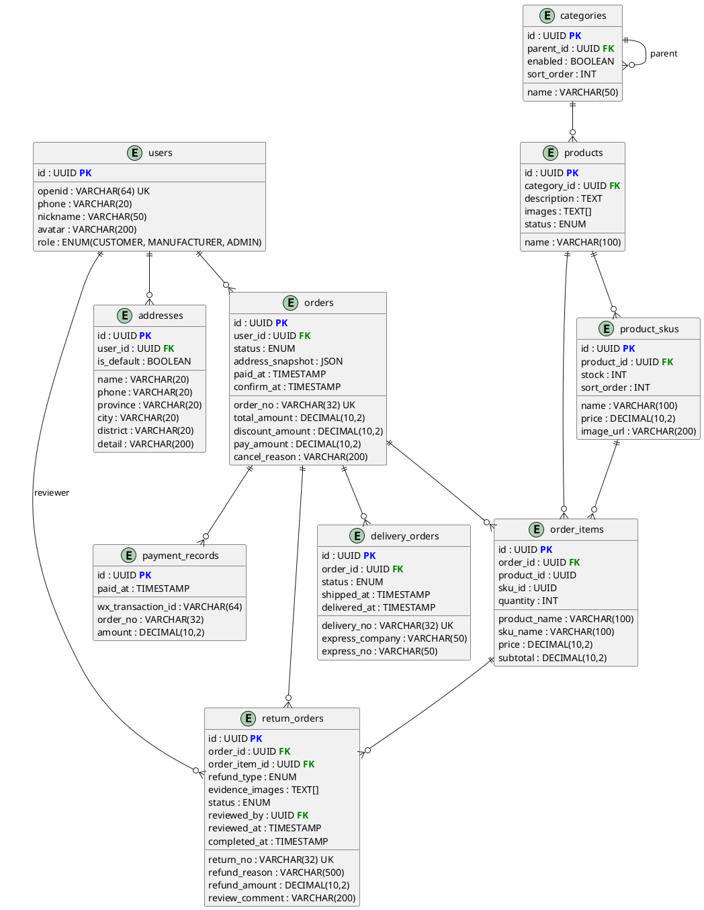

## 5. 接口需求

### 5.1 用户界面

- **消费者端**：微信小程序，移动端竖屏布局，遵循微信小程序设计规范。
- **管理端**：H5 网页，响应式设计（PC 端宽屏布局 + 移动端自适应折叠），支持 PWA manifest 添加到主屏幕。

### 5.2 软件接口

#### 5.2.1 统一规范

- **路径前缀**：所有 API 统一使用 `/api/` 前缀
- **资源命名**：复数名词，kebab-case（如 `/api/order-items`）
- **HTTP 方法**：
    - `GET`：查询（读）
    - `POST`：创建（写）
    - `PUT`：全量更新
    - `PATCH`：部分更新 / 状态变更
    - `DELETE`：软删除
- **管理端接口**：以 `/api/admin/` 为前缀

#### 5.2.2 统一响应格式

```json5
{
  "code": 0,
  "message": "success",
  "data": {
    // ...
  }
}
```

| 字段      | 类型                | 说明                    |
|:--------|:------------------|:----------------------|
| code    | Integer           | 业务状态码，0 表示成功，非 0 表示错误 |
| message | String            | 可读提示信息                |
| data    | Object/Array/null | 响应数据体                 |

**分页响应**：

```json
{
  "code": 0,
  "message": "success",
  "data": {
    "content": [
      ...
    ],
    "page": 0,
    "size": 10,
    "totalElements": 100,
    "totalPages": 10
  }
}
```

**分页通用参数**：

| 参数   | 类型     | 默认值               | 说明                   |
|:-----|:-------|:------------------|:---------------------|
| page | int    | 0                 | 页码，从 0 开始            |
| size | int    | 10                | 每页条数，最大 100          |
| sort | string | "created_at,desc" | 格式 `field,direction` |

#### 5.2.3 错误码体系

| HTTP 状态码 | code | 含义       | 使用场景                |
|:---------|:-----|:---------|:--------------------|
| 200      | 0    | 成功       | 正常响应                |
| 400      | 1001 | 参数校验失败   | 请求体字段不符合约束          |
| 400      | 1002 | 业务规则校验失败 | 商品已下架、分类下有商品无法删除    |
| 400      | 1003 | 登录失败      | 账号或密码错误              |
| 400      | 1004 | 账号已锁定     | 连续 3 次登录失败，账号锁定 15 分钟 |
| 401      | 2001 | 未登录       | 访问需登录接口但未携带有效 token   |
| 401      | 2002 | token 过期  | JWT 过期，需重新登录          |
| 403      | 3001 | 无权限      | 非管理员访问后台接口          |
| 404      | 4001 | 资源不存在    | 订单/商品/用户不存在或已删除     |
| 409      | 5001 | 库存不足     | 下单时 SKU 库存不够        |
| 409      | 5002 | 支付冲突     | 重复支付回调 / 重复发货       |
| 500      | 9999 | 服务器内部错误  | 未预期的异常              |

#### 5.2.4 认证鉴权方案

```
首次访问小程序（无需登录）→ 浏览商品
    ↓
访问需登录页面（下单/我的/地址等）
    ↓ 后端返回 401
前端检测 401 → 引导微信授权登录
    ↓
wx.login() 获取 code
    ↓
POST /api/auth/wx-login { code, phoneCode? }
    ↓
后端 code2session 换取 openid → 创建/查询用户 → 生成 JWT
    ↓
返回 { code: 0, data: { token, user } }
    ↓
前端存入 storage
    ↓
后续请求携带 Header: Authorization: Bearer <token>
    ↓
Spring Security JwtFilter 解析验证 → 注入 SecurityContext
```

**JWT 结构**：

```
Header: { "alg": "HS256", "typ": "JWT" }
Payload: { "sub": "<user_id>", "iat": ..., "exp": ... }
Signature: HMAC-SHA256(header + "." + payload, secret_key)
```

> Payload 不含 `role` 字段。每次请求由 Spring Security `JwtAuthenticationFilter` 解析 `sub`（user_id），从 Redis 或数据库读取用户角色权限注入 `SecurityContext`。Redis 缓存 key 格式 `user:role:{userId}`，TTL 30 分钟。

**角色权限矩阵**：

| 角色               | 可访问接口                                                                                                                                                   |
|:-----------------|:--------------------------------------------------------------------------------------------------------------------------------------------------------|
| 匿名（未登录）          | `/api/products`（GET）、`/api/auth/wx-login`、`/api/auth/login`、`/api/orders/wx-notify`                                                                |
| CUSTOMER         | `/api/user/me`、`/api/addresses/**`、`/api/orders/**`（自己的订单）、`/api/deliveries/**`                                                                         |
| MANUFACTURER（厂家） | `/api/admin/orders/**`、`/api/admin/returns/**`、`/api/admin/stock/**`、`/api/products/**`（POST/PUT/PATCH）、`/api/admin/users`（GET）、`/api/admin/categories/**` |
| ADMIN            | `/api/admin/users`（POST/DELETE，仅厂家用户管理）                                                                                                                        |

#### 5.2.5 API 接口清单

##### 用户中心模块

| 方法     | 路径                            | 说明          | 权限                  | 请求体                                                              | 响应体               |
|:-------|:------------------------------|:------------|:--------------------|:-----------------------------------------------------------------|:------------------|
| POST   | `/api/auth/wx-login`          | 消费者微信登录     | 公开                  | `{ code, encryptedData?, iv? }`                                  | `{ token, user }` |
| POST   | `/api/auth/login`             | 厂家/管理员账号登录  | 公开                  | `{ username, password, captcha? }`                               | `{ token, user }` |
| GET    | `/api/user/me`                | 获取当前用户信息    | 登录                  | —                                                                | `UserDTO`         |
| PUT    | `/api/user/me`                | 更新个人信息      | 登录                  | `{ nickname?, avatar? }`                                         | `UserDTO`         |
| GET    | `/api/addresses`              | 地址列表        | 登录                  | —                                                                | `[AddressDTO]`    |
| POST   | `/api/addresses`              | 新增地址        | 登录                  | `{ name, phone, province, city, district, detail, is_default? }` | `AddressDTO`      |
| PUT    | `/api/addresses/{id}`         | 编辑地址        | 登录                  | 同上                                                               | `AddressDTO`      |
| DELETE | `/api/addresses/{id}`         | 删除地址        | 登录                  | —                                                                | —                 |
| PUT    | `/api/addresses/{id}/default` | 设为默认地址      | 登录                  | —                                                                | —                 |
| GET    | `/api/admin/users`            | 用户列表（后台）    | ADMIN, MANUFACTURER | —                                                                | `Page<UserDTO>`   |
| POST   | `/api/admin/users`            | 创建厂家用户      | ADMIN               | `{ username, password, phone?, nickname? }`                      | `UserDTO`         |
| DELETE | `/api/admin/users/{id}`       | 删除厂家用户（软删除） | ADMIN               | —                                                                | —                 |

##### 商品与分类模块

| 方法     | 路径                           | 说明             | 权限    |
|:-------|:-----------------------------|:---------------|:------|
| GET    | `/api/categories`            | 分类树            | 公开    |
| GET    | `/api/products`              | 商品列表（全部已上架，按上架时间倒序） | 公开    |
| GET    | `/api/products/{id}`         | 商品详情（含规格列表）    | 公开    |
| POST   | `/api/admin/categories`      | 创建分类           | MANUFACTURER |
| PUT    | `/api/admin/categories/{id}` | 编辑分类           | MANUFACTURER |
| DELETE | `/api/admin/categories/{id}` | 删除分类           | MANUFACTURER |
| POST   | `/api/products`              | 创建商品           | MANUFACTURER |
| PUT    | `/api/products/{id}`         | 编辑商品           | MANUFACTURER |
| PATCH  | `/api/products/{id}/enable`  | 上架             | MANUFACTURER |
| PATCH  | `/api/products/{id}/disable` | 下架             | MANUFACTURER |
| GET    | `/api/admin/stock`           | 库存列表           | MANUFACTURER |
| PUT    | `/api/admin/stock/skus/{id}` | 修改规格库存         | MANUFACTURER |

##### 订单系统模块

| 方法   | 路径                                  | 说明               | 权限        |
|:-----|:------------------------------------|:-----------------|:----------|
| POST | `/api/orders/confirm`               | 订单确认页预计算         | 登录        |
| POST | `/api/orders`                       | 创建订单 + 返回支付参数    | 登录        |
| POST | `/api/orders/wx-notify`             | 微信支付回调通知         | 公开（微信服务器） |
| GET  | `/api/orders`                       | 我的订单列表（分页、按状态筛选） | 登录        |
| GET  | `/api/orders/{id}`                  | 订单详情             | 登录        |
| POST | `/api/orders/{id}/confirm-receipt`  | 确认收货             | 登录        |
| POST | `/api/orders/{id}/refund`           | 申请退款             | 登录        |
| GET  | `/api/admin/orders`                 | 后台订单列表           | ADMIN     |
| GET  | `/api/admin/orders/{id}`            | 后台订单详情           | ADMIN     |
| POST | `/api/admin/orders/{id}/deliveries` | 发货               | ADMIN     |
| POST | `/api/admin/returns/{id}/review`    | 退款审核             | ADMIN     |

##### 物流查询模块

| 方法  | 路径                             | 说明     | 权限 |
|:----|:-------------------------------|:-------|:---|
| GET | `/api/deliveries/{id}/express` | 物流轨迹查询 | 登录 |

> **`POST /api/orders` 实现要点**：
> 1. 使用 Redis `DECR` 原子扣减 SKU 库存，判断 `result < 0` 则回滚并返回 HTTP 409
> 2. 扣减成功后才写入 `orders` + `order_items` 记录
> 3. 整个流程包裹在同一事务中，任一步失败则全部回滚（含 Redis `INCR` 回滚）
> 4. 支付超时（30 分钟）由定时任务扫描 `status=待支付 AND created_at < now()-30min` 的订单，批量取消并回滚库存
> 5. 商品信息（名称、规格名、价格）快照到 `order_items`，不受后续调价影响

### 5.3 通信接口

- 协议：HTTPS（TLS 1.2+）
- 认证：JWT Bearer（详见 5.2.4）
- 数据格式：JSON（`Content-Type: application/json`）
- 编码：UTF-8

---

## 6. 数据需求

### 6.1 数据字典

> 所有表均继承 `BaseEntity`，含 `id`（UUID PK）、`is_deleted`（BOOLEAN DEFAULT FALSE）、`created_at`、`updated_at` 字段。以下仅列出业务字段。

#### users（用户表）

| 字段             | 类型           | 约束               | 说明                              |
|:---------------|:-------------|:-----------------|:--------------------------------|
| username       | VARCHAR(50)  | UNIQUE            | 账号（厂家/管理员后台登录用，消费者为 NULL）       |
| password_hash  | VARCHAR(255) |                   | 密码哈希（BCrypt，消费者为 NULL）           |
| openid         | VARCHAR(64)  | UNIQUE            | 微信 openid（消费者必填，加密存储）           |
| phone          | VARCHAR(20)  |                   | 手机号（加密存储）                       |
| nickname       | VARCHAR(50)  |                   | 昵称                              |
| avatar         | VARCHAR(200) |                   | 头像 URL                          |
| role           | ENUM         | NOT NULL          | CUSTOMER / MANUFACTURER / ADMIN |
| login_attempts | INT          | DEFAULT 0         | 连续登录失败次数（后台账号锁定用）               |
| locked_until   | TIMESTAMP    |                   | 账号锁定至（NULL 表示未锁定）               |

#### addresses（收货地址表）

| 字段         | 类型           | 约束                   | 说明          |
|:-----------|:-------------|:---------------------|:------------|
| user_id    | UUID         | FK → users, NOT NULL | 所属用户        |
| name       | VARCHAR(20)  | NOT NULL             | 收货人姓名       |
| phone      | VARCHAR(20)  | NOT NULL             | 收货人电话（加密存储） |
| province   | VARCHAR(20)  | NOT NULL             | 省           |
| city       | VARCHAR(20)  | NOT NULL             | 市           |
| district   | VARCHAR(20)  | NOT NULL             | 区           |
| detail     | VARCHAR(200) | NOT NULL             | 详细地址        |
| is_default | BOOLEAN      | DEFAULT FALSE        | 是否默认地址      |

#### categories（分类表）

| 字段          | 类型           | 约束              | 说明              |
|:------------|:-------------|:----------------|:----------------|
| parent_id   | UUID         | FK → categories | 父分类，NULL 表示一级分类 |
| name        | VARCHAR(50)  | NOT NULL        | 分类名称            |
| description | VARCHAR(200) |                 | 分类描述            |
| sort_order  | INT          | DEFAULT 0       | 排序号             |
| enabled     | BOOLEAN      | DEFAULT TRUE    | 启用/禁用           |

#### products（商品表）

| 字段          | 类型           | 约束                        | 说明                         |
|:------------|:-------------|:--------------------------|:---------------------------|
| name        | VARCHAR(100) | NOT NULL                  | 商品名称                       |
| description | TEXT         |                           | 商品描述（支持富文本）                |
| category_id | UUID         | FK → categories, NOT NULL | 所属叶子分类                     |
| images      | TEXT[]       |                           | 轮播图 URL 数组                 |
| status      | ENUM         | NOT NULL                  | DRAFT / ENABLED / DISABLED |

#### product_skus（商品规格表）

| 字段         | 类型            | 约束                      | 说明            |
|:-----------|:--------------|:------------------------|:--------------|
| product_id | UUID          | FK → products, NOT NULL | 所属商品          |
| name       | VARCHAR(100)  | NOT NULL                | 规格名称（如 500ml） |
| price      | DECIMAL(10,2) | NOT NULL                | 售价            |
| stock      | INT           | NOT NULL, DEFAULT 0     | 库存数量          |
| image_url  | VARCHAR(200)  |                         | 规格专属图片        |
| sort_order | INT           | DEFAULT 0               | 排序号           |

#### orders（订单主表）

| 字段               | 类型            | 约束                   | 说明                                                                              |
|:-----------------|:--------------|:---------------------|:--------------------------------------------------------------------------------|
| order_no         | VARCHAR(32)   | UNIQUE, NOT NULL     | 订单号（业务可读）                                                                       |
| user_id          | UUID          | FK → users, NOT NULL | 下单用户                                                                            |
| status           | ENUM          | NOT NULL             | PENDING_PAYMENT / PAID / SHIPPED / COMPLETED / REFUNDING / REFUNDED / CANCELLED |
| total_amount     | DECIMAL(10,2) | NOT NULL             | 订单总金额（原价合计）                                                                     |
| discount_amount  | DECIMAL(10,2) | DEFAULT 0            | 优惠金额（一期固定为 0，第四期启用第二件打折）                                                        |
| pay_amount       | DECIMAL(10,2) | NOT NULL             | 实付金额（一期 = total_amount - discount_amount）                                       |
| address_snapshot | JSONB         | NOT NULL             | 收货地址快照                                                                          |
| paid_at          | TIMESTAMP     |                      | 支付时间                                                                            |
| confirm_at       | TIMESTAMP     |                      | 确认收货时间                                                                          |
| cancel_reason    | VARCHAR(200)  |                      | 取消原因                                                                            |

#### order_items（订单商品明细表）

| 字段           | 类型            | 约束                    | 说明                        |
|:-------------|:--------------|:----------------------|:--------------------------|
| order_id     | UUID          | FK → orders, NOT NULL | 所属订单                      |
| product_id   | UUID          | NOT NULL              | 商品 ID（快照用）                |
| sku_id       | UUID          | NOT NULL              | 规格 ID（快照用）                |
| product_name | VARCHAR(100)  | NOT NULL              | 商品名快照                     |
| sku_name     | VARCHAR(100)  | NOT NULL              | 规格名快照                     |
| price        | DECIMAL(10,2) | NOT NULL              | 下单时单价（快照）                 |
| quantity     | INT           | NOT NULL              | 数量                        |
| subtotal     | DECIMAL(10,2) | NOT NULL              | 小计 = price × quantity（原价） |

#### return_orders（退款单表）

| 字段              | 类型            | 约束                    | 说明                                        |
|:----------------|:--------------|:----------------------|:------------------------------------------|
| return_no       | VARCHAR(32)   | UNIQUE, NOT NULL      | 退款单号                                      |
| order_id        | UUID          | FK → orders, NOT NULL | 关联订单                                      |
| order_item_id   | UUID          | FK → order_items      | 关联明细（一期可 NULL，整单退款；二期启用）                  |
| refund_type     | ENUM          | NOT NULL              | FULL（整单）/ PARTIAL（部分，二期启用）                |
| refund_reason   | VARCHAR(500)  | NOT NULL              | 退款原因（买家填写）                                |
| refund_amount   | DECIMAL(10,2) | NOT NULL              | 退款金额                                      |
| evidence_images | TEXT[]        |                       | 凭证图片                                      |
| status          | ENUM          | NOT NULL              | PENDING / APPROVED / REJECTED / COMPLETED |
| reviewed_by     | UUID          | FK → users            | 审核人                                       |
| review_comment  | VARCHAR(200)  |                       | 审核意见                                      |
| reviewed_at     | TIMESTAMP     |                       | 审核时间                                      |
| completed_at    | TIMESTAMP     |                       | 退款完成时间                                    |

#### delivery_orders（配送单表）

| 字段              | 类型          | 约束                    | 说明                            |
|:----------------|:------------|:----------------------|:------------------------------|
| delivery_no     | VARCHAR(32) | UNIQUE, NOT NULL      | 配送单号                          |
| order_id        | UUID        | FK → orders, NOT NULL | 关联订单                          |
| express_company | VARCHAR(50) | NOT NULL              | 快递公司                          |
| express_no      | VARCHAR(50) | NOT NULL              | 快递单号                          |
| status          | ENUM        | NOT NULL              | PENDING / SHIPPED / DELIVERED |
| shipped_at      | TIMESTAMP   |                       | 发货时间                          |
| delivered_at    | TIMESTAMP   |                       | 签收时间                          |

#### payment_records（支付记录表）

| 字段                | 类型            | 约束       | 说明     |
|:------------------|:--------------|:---------|:-------|
| wx_transaction_id | VARCHAR(64)   | NOT NULL | 微信支付单号 |
| order_no          | VARCHAR(32)   | NOT NULL | 商户订单号  |
| amount            | DECIMAL(10,2) | NOT NULL | 支付金额   |
| paid_at           | TIMESTAMP     |          | 支付时间   |

> `(wx_transaction_id, order_no)` 唯一复合索引，保证支付回调幂等。

### 6.2 实体关系图

引用于 `docs/diagrams/class.puml`：



**关系说明**：

- **users → addresses**：一对多，一个用户有多个收货地址
- **categories → categories**：自引用，树形结构（parent_id）
- **categories → products**：一对多，一个分类下有多个商品；商品只能挂在叶子分类
- **products → product_skus**：一对多，一个商品有多个规格
- **users → orders**：一对多，一个用户可创建多个订单
- **orders → order_items**：一对多，一个订单包含多个明细行
- **product_skus → order_items**：一个 SKU 可出现在多个订单明细中
- **orders → return_orders**：一个订单可有多条退款记录（一期整单退款）；`order_item_id` 一期可为
  NULL（整单退款时不关联具体明细），二期部分退款时启用
- **orders → delivery_orders**：一个订单对应一条配送单
- **orders → payment_records**：一个订单可有多条支付记录（唯一约束保证幂等）

### 6.3 存储策略

| 数据类型           | 存储引擎           | 策略                                            |
|:---------------|:---------------|:----------------------------------------------|
| 业务数据           | PostgreSQL 15+ | 主数据库，ACID 事务，行级锁                              |
| 缓存 / 会话 / 库存计数 | Redis 7+       | 高性能缓存，TTL 策略，原子操作                             |
| 软删除数据保留        | PostgreSQL     | `is_deleted = true` 的数据保留 ≥ 90 天，之后由 DBA 定期清理 |
| 物流轨迹缓存         | Redis          | TTL 5 分钟（已签收 24 小时）                           |
| 库存缓存预热         | Redis          | 服务启动时全量写入 `SET sku:{id}:stock <value>`        |

