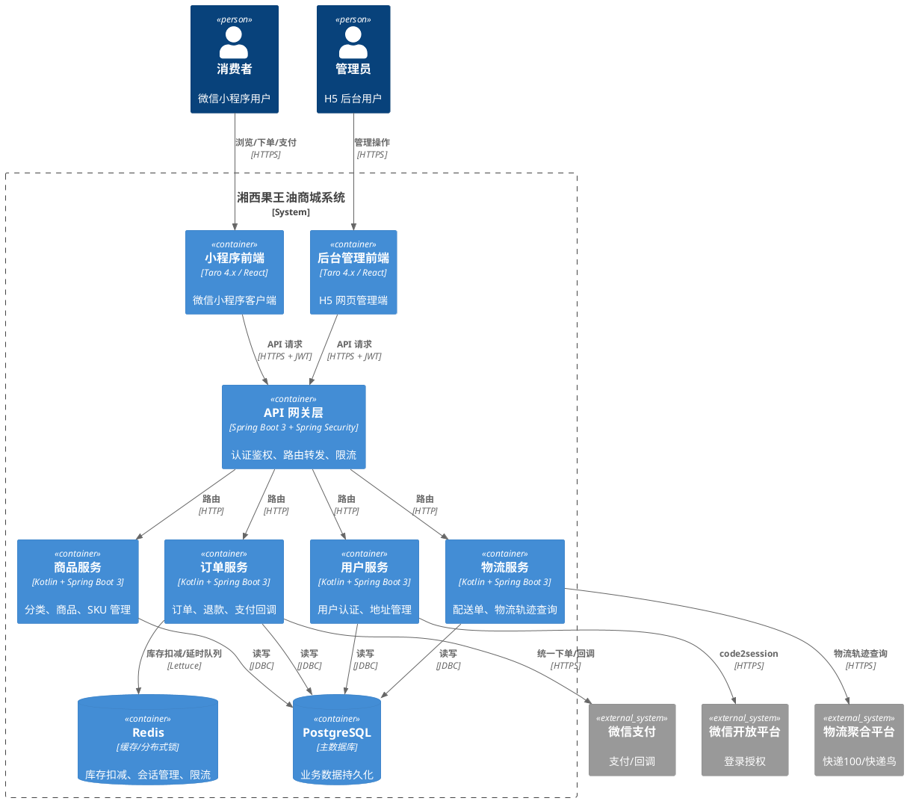
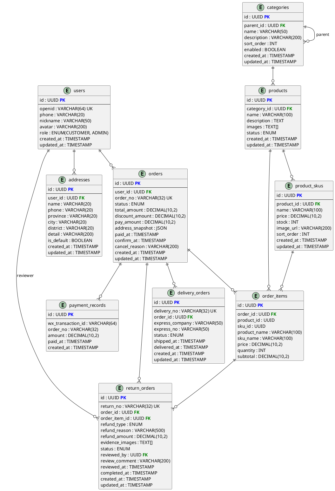
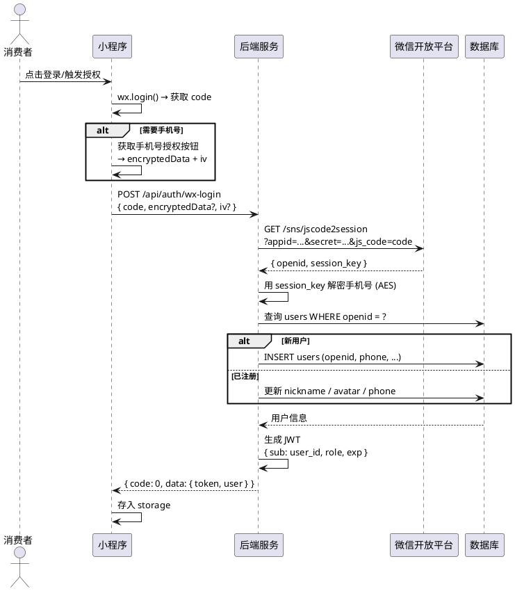
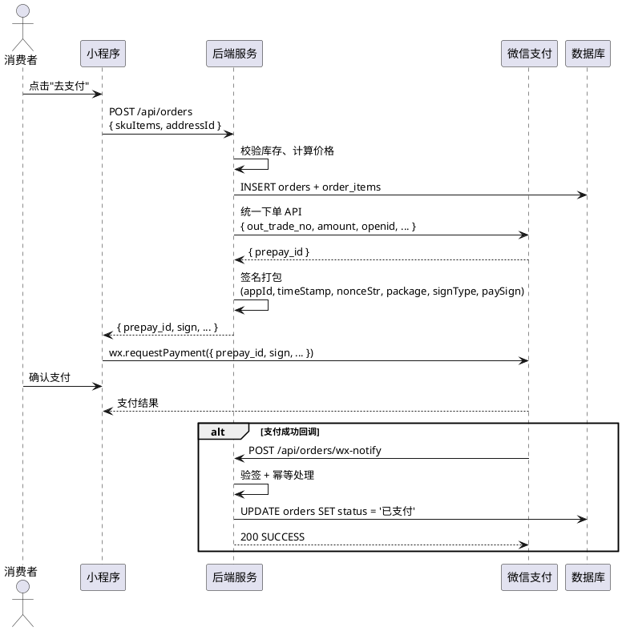

# 概要设计说明书（一期）

## 湘西果王油商城系统

---

## 1. 引言

### 1.1 编写目的

本文档为「湘西果王油商城系统」第一期的概要设计说明书，旨在依据《软件需求规格说明书》中定义的功能与非功能需求，描述系统的整体架构、模块划分、技术选型、数据库设计、API 接口规范、安全策略及非功能设计方案。

**目标读者**：

- 开发人员：理解系统架构和模块职责，指导编码实现
- 项目负责人：把控技术方案和里程碑
- 后续维护者：快速了解系统设计思路与约定

### 1.2 范围

本文档覆盖第一期"交易闭环"的完整范围：

- **用户中心**：微信授权登录、个人信息管理、收货地址管理
- **商品与分类**：树形分类浏览、商品列表/详情、后台商品和分类管理
- **订单系统**：立即购买、订单创建、微信支付、订单状态流转、退款申请与审核
- **物流查询**：发货录入物流单号、买家查询物流轨迹

本期不包含：购物车、拼单、分销体系、佣金计算、Banner/公告、统计报表。

### 1.3 参考文档

| 文档 | 说明 |
|:---|:---|
| 《软件需求规格说明书（一期）》 | 功能与非功能需求定义 |
| 《需求调研问答记录》 | 15 轮 QA 原始对话，业务决策记录 |
| 《湘西果王油软件开发可行性分析》 | 技术/时间/资源可行性自检 |
| `docs/diagrams/class.puml` | 核心数据实体关系图 |
| `docs/diagrams/order-state.puml` | 订单状态机 |
| `docs/diagrams/use-case.puml` | 用例图 |
| `docs/diagrams/order-flow.puml` | 购买流程活动图 |
| `docs/diagrams/payment-sequence.puml` | 支付序列图 |
| `CONVENTIONS.md` | 编码规范（命名、提交、JPA、API 响应、Kotlin 风格） |
| `ARCHITECTURE.md` | 分层架构、模块划分、数据流、安全设计 |

---

## 2. 系统总体架构

### 2.1 分层架构图



### 2.2 模块划分与职责

| 模块 | 包路径 | 核心职责 |
|:---|:---|:---|
| **user** | `com.xxgwy.user` | 微信授权登录、JWT 签发、用户信息管理、收货地址 CRUD |
| **product** | `com.xxgwy.product` | 树形分类管理、商品 CRUD、规格 SKU 管理、库存管理、上下架 |
| **order** | `com.xxgwy.order` | 订单确认预计算、订单创建与库存锁定、微信支付统一下单、支付回调幂等处理、订单状态流转、退款申请与审核、超时取消 |
| **logistics** | `com.xxgwy.logistics` | 配送单创建（发货）、物流轨迹查询（对接第三方聚合平台） |
| **payment** | `com.xxgwy.payment` | 微信支付统一下单、支付回调验签、支付幂等处理（与 order 模块协作）。纯内部服务模块，不对外暴露消费者 API |

> 注：payment 作为独立模块封装微信支付相关逻辑，与 order 模块解耦。

### 2.3 技术选型总览表

| 层次 | 技术 | 版本 | 选型理由 |
|:---|:---|:---|:---|
| 后端语言 | Kotlin | 1.9+ | 静态类型、空安全、与 Java 无缝互操作、语法简洁 |
| 后端框架 | Spring Boot | 3.x | 生态成熟、自动配置、社区活跃 |
| ORM | Spring Data JPA | 3.x | 开发效率高、JPQL/HQL 预编译防注入 |
| 数据库 | PostgreSQL | 15+ | ACID 事务、JSON 支持、行级锁、丰富索引类型 |
| 缓存 | Redis | 7+ | 高性能、原子操作（DECR/INCR）、分布式锁、Lua 脚本 |
| 前端框架 | Taro | 4.x | 一套代码编译微信小程序 + H5 |
| 前端库 | React | 18+ | 生态丰富、组件化开发 |
| 安全框架 | Spring Security | 6.x | 接口级权限控制、JWT 无状态认证 |
| 容器化 | Docker + Compose | 最新稳定版 | 环境一致、快速部署 |

---

## 3. 技术选型说明

### 3.1 后端技术栈

**Kotlin**：选择 Kotlin 而非 Java 的核心原因在于其静态类型系统和空安全特性，能够在编译期消除 NPE，减少运行时崩溃。Kotlin 与 Java 100% 互操作，可复用 Spring 生态全部组件。

**Spring Boot 3**：作为 Java 生态最成熟的微服务框架，Spring Boot 3 提供了自动配置、嵌入式服务器、Actuator 健康检查等开箱即用的能力。Spring Security 6 可无缝集成实现接口级鉴权。

**Spring Data JPA**：基于 Hibernate 实现，通过 JPQL 预编译机制天然防护 SQL 注入。`@SQLRestriction` 注解可全局过滤软删除数据。开发阶段可通过 `ddl-auto=update` 快速迭代表结构。

**PostgreSQL**：选择 PostgreSQL 而非 MySQL 的原因：
- 更好的 ACID 事务支持和行级锁（`SELECT ... FOR UPDATE`），适合库存扣减场景
- 原生 JSON/JSONB 类型，适合存储订单地址快照
- 丰富的索引类型（B-Tree、GIN），支持数组字段查询
- UUID 主键原生支持

**Redis**：用于高性能缓存、原子库存扣减（`DECR`/`INCR`）、分布式锁（`SET NX EX`）、令牌桶限流，未来可扩展为延时队列处理超时取消。

### 3.2 前端技术栈

**Taro 4.x**：一套代码同时编译为微信小程序和 H5 网页，避免维护两套前端代码的痛点。Taro 4.x 对 React 18 的支持已成熟，组件生态丰富。

**React**：相比 Vue，React 的 hooks 模式更适合复杂状态管理（如订单确认页的实时价格计算），且 Taro + React 社区案例更丰富。

### 3.3 中间件选型

| 中间件 | 用途 | 关键能力 |
|:---|:---|:---|
| PostgreSQL | 主数据库 | 事务、行级锁、JSON 支持、UUID 主键 |
| Redis | 缓存 / 分布式锁 / 限流 | 原子操作（DECR/INCR）、Lua 脚本、过期策略 |

---

## 4. 模块概要设计

### 4.1 用户中心模块

#### 核心职责
- 微信静默授权 + 手机号授权登录
- JWT 令牌签发与验证
- 用户个人信息（昵称、头像、手机号）查询与编辑
- 收货地址增删改查、默认地址管理

#### 主要实体类
- `User` — users 表
- `Address` — addresses 表

#### 主要 Service 接口

```kotlin
// AuthService
interface AuthService {
    fun wxLogin(code: String, phoneCode: String?): LoginResult
}

// UserService
interface UserService {
    fun getCurrentUser(): UserDTO
    fun updateProfile(dto: UpdateProfileDTO): UserDTO
}

// AddressService
interface AddressService {
    fun listAddresses(): List<AddressDTO>
    fun createAddress(dto: CreateAddressDTO): AddressDTO
    fun updateAddress(id: UUID, dto: UpdateAddressDTO): AddressDTO
    fun deleteAddress(id: UUID)
    fun setDefault(id: UUID)
}
```

#### 主要 Controller 与路径映射

| Controller | 路径前缀 | 说明 |
|:---|:---|:---|
| `AuthController` | `/api/auth` | 微信登录接口 |
| `UserController` | `/api/user/me` | 当前用户信息 |
| `AddressController` | `/api/addresses` | 收货地址 CRUD |

#### 数据流

```
小程序 → code 换取 openid → 创建/查询用户 → 生成 JWT → 返回 token + 用户信息
     → 后续请求携带 Authorization: Bearer <token>
     → Spring Security Filter 解析 JWT → 注入 SecurityContext
     → Controller 层通过 @PreAuthorize 校验权限
```

---

### 4.2 商品与分类模块

#### 核心职责
- 树形分类管理（增删改查，支持无限层级）
- 商品管理（增删改查、上架/下架、关键字搜索、按分类筛选、按价格/销量排序）
- 规格 SKU 管理（价格、库存、图片、排序）
- 库存管理（后台库存列表、低库存筛选、库存修改）

#### 主要实体类
- `Category` — categories 表
- `Product` — products 表
- `ProductSku` — product_skus 表

#### 主要 Service 接口

```kotlin
// CategoryService
interface CategoryService {
    fun getTree(): List<CategoryDTO>
    fun create(dto: CreateCategoryDTO): CategoryDTO
    fun update(id: UUID, dto: UpdateCategoryDTO): CategoryDTO
    fun delete(id: UUID)
}

// ProductService
interface ProductService {
    fun list(query: ProductQuery): Page<ProductDTO>
    fun getDetail(id: UUID): ProductDetailDTO
    fun create(dto: CreateProductDTO): ProductDTO
    fun update(id: UUID, dto: UpdateProductDTO): ProductDTO
    fun enable(id: UUID)
    fun disable(id: UUID)
}

// StockService
interface StockService {
    fun listSkuStock(query: StockQuery): Page<SkuStockDTO>
    fun updateStock(skuId: UUID, stock: Int)
}
```

#### 主要 Controller 与路径映射

| Controller | 路径前缀 | 说明 |
|:---|:---|:---|
| `CategoryController` | `/api/categories` | 分类树查询（GET，公开访问） |
| `AdminCategoryController` | `/api/admin/categories` | 分类管理（POST/PUT/DELETE，需 ADMIN 角色） |
| `ProductController` | `/api/products` | 商品列表/详情/管理 |
| `StockController` | `/api/admin/stock` | 库存管理 |

#### 数据流

```
类别查询：查询 categories 表 → 组装树形结构 → 返回嵌套 JSON
商品列表：接收筛选参数（category_id, keyword, sort）→ JPA Specification 动态查询 → 分页返回
商品详情：查询 products + product_skus → 组装详情 DTO（含规格列表、库存）
商品管理：管理员提交数据 → 校验（商品关联叶子分类）→ 持久化
```

---

### 4.3 订单系统模块

#### 核心职责
- 订单确认页预计算（收货地址、商品信息、优惠计算、总价）
- 订单创建与库存锁定（Redis 原子扣减 / PostgreSQL 行级锁）
- 微信支付统一下单（调用支付服务，返回 prepay_id 和签名参数）
- 支付回调幂等处理（微信支付单号 + 订单号唯一约束）
- 订单状态流转（待支付 → 已支付 → 已发货 → 已完成）
- 退款申请与管理者审核
- 订单超时自动取消（定时任务扫描 + 库存回滚）

#### 主要实体类
- `Order` — orders 表
- `OrderItem` — order_items 表
- `ReturnOrder` — return_orders 表
- `DeliveryOrder` — delivery_orders 表

#### 主要 Service 接口

```kotlin
// OrderService
interface OrderService {
    fun confirm(dto: OrderConfirmDTO): OrderConfirmVO   // 预计算
    fun create(dto: CreateOrderDTO): CreateOrderResult   // 创建订单 + 返回支付参数
    fun listMyOrders(query: OrderQuery): Page<OrderDTO>
    fun getDetail(orderId: UUID): OrderDetailDTO
    fun confirmReceipt(orderId: UUID)
    fun applyRefund(orderId: UUID, dto: RefundApplyDTO): ReturnOrderDTO
}

// AdminOrderService
interface AdminOrderService {
    fun listAllOrders(query: AdminOrderQuery): Page<OrderDTO>
    fun getDetail(orderId: UUID): OrderDetailDTO
    fun ship(orderId: UUID, dto: ShipDTO): DeliveryOrderDTO
    fun reviewRefund(returnId: UUID, dto: ReviewDTO): ReturnOrderDTO
}

// PaymentService
interface PaymentService {
    fun unifiedOrder(orderNo: String, amount: BigDecimal, openid: String): PrepayResult
    fun handleNotify(requestBody: String): Boolean    // 幂等处理
}
```

#### 主要 Controller 与路径映射

| Controller | 路径前缀 | 说明 |
|:---|:---|:---|
| `OrderController` | `/api/orders` | 订单确认/创建/列表/详情/确认收货/退款 |
| `AdminOrderController` | `/api/admin/orders` | 后台订单管理 |
| `PaymentNotifyController` | `/api/orders/wx-notify` | 微信支付回调（公开） |

#### 数据流

```
订单创建主流程:
  1. 前端提交 SKU 列表 + 数量 + 地址 ID
  2. 服务端查询 SKU 当前价格与库存
  3. 计算优惠金额（第二件打折）
  4. Redis DECR 扣减每个 SKU 库存
     → 若任一 SKU 库存不足（stock < 0），INCR 回滚已扣减的 SKU，返回 409
  5. 库存扣减成功 → INSERT orders + order_items
  6. 调用微信支付统一下单 API → 获取 prepay_id
  7. 签名打包 → 返回支付参数给前端
  8. 前端唤起微信支付弹窗

支付回调流程:
  微信服务器 → POST /api/orders/wx-notify
  → 验签 → 查询 payment 表（微信支付单号唯一约束）
  → 若已处理 → 直接返回 200 SUCCESS
  → 若未处理 → 更新 orders.status = 已支付, orders.paid_at = now()
  → INSERT payment 记录 → 返回 200 SUCCESS

超时取消流程:
  定时任务（每分钟）→ 查询 status=待支付 AND created_at < now()-30min
  → 遍历每条过期订单:
     → 将相关 SKU 库存 INCR 回滚
     → 更新 orders.status = 已取消
```

---

### 4.4 物流查询模块

#### 核心职责
- 发货时创建配送单（关联订单、填写快递公司和单号）
- 买家查询物流轨迹（调用快递聚合平台 API，返回时间线）

#### 主要实体类
- `DeliveryOrder` — delivery_orders 表

#### 主要 Service 接口

```kotlin
// DeliveryService
interface DeliveryService {
    fun createDelivery(orderId: UUID, dto: CreateDeliveryDTO): DeliveryOrderDTO
    fun getExpressTrace(deliveryId: UUID): ExpressTraceVO
    fun getByOrderId(orderId: UUID): DeliveryOrderDTO
}
```

#### 主要 Controller 与路径映射

| Controller | 路径前缀 | 说明 |
|:---|:---|:---|
| `DeliveryController` | `/api/deliveries` | 物流轨迹查询 |

#### 数据流

```
发货:
  管理员填写快递公司 + 快递单号 → 创建 delivery_orders 记录
  → delivery_orders.status = SHIPPED
  → 关联 orders 状态更新为 已发货

物流查询:
  买家端 GET /api/deliveries/{id}/express
  → 查询 delivery_orders 获取 express_company + express_no
  → 调用快递聚合平台 API → 解析轨迹 → 返回时间线 JSON
  → 缓存查询结果（Redis, TTL 5 分钟）
```

---

## 5. 数据库总体设计

### 5.1 实体关系概述

引用 `docs/diagrams/class.puml`：

> **注**：所有实体表均继承 `BaseEntity`，含 `is_deleted` / `created_at` / `updated_at` 字段。以下 PlantUML 图中省略这三个通用字段以突出业务字段。



**关系说明**：

- **users → addresses**：一对多，一个用户有多个收货地址
- **categories → categories**：自引用，树形结构（parent_id）
- **categories → products**：一对多，一个分类下有多个商品；商品只能挂在叶子分类
- **products → product_skus**：一对多，一个商品有多个规格（如 500ml / 1000ml）
- **users → orders**：一对多，一个用户可创建多个订单
- **orders → order_items**：一对多，一个订单包含多个明细行
- **product_skus → order_items**：一个 SKU 可出现在多个订单明细中
- **orders → return_orders**：一个订单可有多条退款记录（一期整单退款）。`order_item_id` 一期可为 NULL（整单退款时不关联具体明细），二期部分退款时启用
- **orders → delivery_orders**：一个订单对应一条配送单
- **orders → payment_records**：一个订单可有多条支付记录（微信支付单号唯一约束保证幂等）

### 5.2 关键索引策略

| 表 | 索引字段 | 索引类型 | 说明 |
|:---|:---|:---|:---|
| users | openid | UNIQUE INDEX | 微信登录快速查询 |
| orders | order_no | UNIQUE INDEX | 订单号唯一，防重复 |
| orders | user_id + status | COMPOSITE INDEX | 买家按状态查询订单列表 |
| orders | status + created_at | COMPOSITE INDEX | 超时取消定时任务扫描 |
| return_orders | return_no | UNIQUE INDEX | 退款单号唯一 |
| return_orders | order_id | INDEX | 按订单查退款记录 |
| delivery_orders | delivery_no | UNIQUE INDEX | 配送单号唯一 |
| delivery_orders | order_id | INDEX | 按订单查配送记录 |
| products | category_id + status | COMPOSITE INDEX | 按分类+状态筛选上架商品 |
| product_skus | product_id | INDEX | 查询商品的规格列表 |
| payment_records | (wx_transaction_id, order_no) | UNIQUE COMPOSITE INDEX | 支付幂等：防重复回调 |

### 5.3 软删除统一方案

所有实体继承统一的 `BaseEntity`：

```kotlin
@MappedSuperclass
@SQLRestriction("is_deleted = false")
abstract class BaseEntity {
    @Id
    @GeneratedValue(strategy = GenerationType.UUID)
    var id: UUID? = null

    @Column(name = "is_deleted", nullable = false)
    var isDeleted: Boolean = false

    @Column(name = "created_at", nullable = false, updatable = false)
    var createdAt: LocalDateTime = LocalDateTime.now()

    @Column(name = "updated_at", nullable = false)
    var updatedAt: LocalDateTime = LocalDateTime.now()

    @PreUpdate
    fun preUpdate() { updatedAt = LocalDateTime.now() }
}
```

**核心约定**：

- 所有 JPA 实体类继承 `BaseEntity`
- `@SQLRestriction("is_deleted = false")` 确保所有 JPQL 查询自动过滤已删除数据
- 需要查询已删除数据时，使用原生 SQL 或 `@Query` 标注的 JPQL 绕过 `@SQLRestriction`
- "删除"操作统一为 `repository.softDelete(id)`（或 `entity.isDeleted = true` 后 `save`）
- 物理删除由后期 DBA 定期执行 `DELETE FROM table WHERE is_deleted = true AND updated_at < now() - INTERVAL '90 days'`

---

## 6. API 接口规范

### 6.1 路径命名规范

- **前缀**：所有 API 统一使用 `/api/` 前缀
- **资源名**：使用复数名词（snake_case 映射为路径 kebab-case），如 `/api/addresses/`、`/api/delivery-orders/`
- **HTTP 方法**：严格遵循 RESTful 语义

| 方法 | 语义 | 示例 |
|:---|:---|:---|
| GET | 查询（读） | `GET /api/products` |
| POST | 创建（写） | `POST /api/orders` |
| PUT | 全量更新 | `PUT /api/products/{id}` |
| PATCH | 部分更新（状态变更） | `PATCH /api/products/{id}/enable` |
| DELETE | 软删除 | `DELETE /api/addresses/{id}` |

- **子资源**：`/api/orders/{id}/confirm-receipt`、`/api/addresses/{id}/default`
- **后台接口**：以 `/api/admin/` 为前缀，如 `/api/admin/orders`、`/api/admin/stock`

### 6.2 认证鉴权方案

```
首次访问小程序（无需登录）→ 浏览商品/分类
     ↓
访问需登录页面（下单/我的/地址等）
     ↓ 后端返回 401
前端检测 401 → 引导微信授权登录
     ↓
wx.login() 获取 code
     ↓
POST /api/auth/wx-login { code, phoneCode? }
     ↓
后端 code2session 换取 openid → 创建/查询用户 → 生成 JWT
     ↓
返回 { code: 0, data: { token, user } }
     ↓
前端存入 storage
     ↓
后续请求携带 Header: Authorization: Bearer <token>
     ↓
Spring Security JwtFilter 解析验证 → 注入 SecurityContext
```

**JWT 结构**：

```
Header: { "alg": "HS256", "typ": "JWT" }
Payload: { "sub": "<user_id>", "role": "CUSTOMER|ADMIN", "iat": ..., "exp": ... }
Signature: HMAC-SHA256(header + "." + payload, secret_key)
```

**角色权限矩阵**：

| 角色 | 可访问接口 |
|:---|:---|
| 匿名（未登录） | `/api/categories`、`/api/products`、`/api/auth/wx-login`、`/api/orders/wx-notify` |
| CUSTOMER | `/api/user/me`、`/api/addresses/**`、`/api/orders/**`（自己的订单）、`/api/deliveries/**` |
| ADMIN | `/api/admin/**`、`/api/products` (POST/PUT/PATCH) |

### 6.3 统一响应格式

所有 API 响应遵循统一结构：

```json
{
  "code": 0,
  "message": "success",
  "data": { ... }
}
```

| 字段 | 类型 | 说明 |
|:---|:---|:---|
| code | Integer | 业务状态码，0 表示成功，非 0 表示错误 |
| message | String | 可读提示信息 |
| data | Object/Array/null | 响应数据体，无数据时为 null |

**分页响应格式**：

```json
{
  "code": 0,
  "message": "success",
  "data": {
    "content": [...],
    "page": 0,
    "size": 10,
    "totalElements": 100,
    "totalPages": 10
  }
}
```

### 6.4 错误码体系

| HTTP 状态码 | code | 含义 | 使用场景 |
|:---|:---|:---|:---|
| 200 | 0 | 成功 | 正常响应 |
| 400 | 1001 | 参数校验失败 | 请求体字段不符合约束（如手机号格式错误） |
| 400 | 1002 | 业务规则校验失败 | 商品已下架、分类下有商品无法删除等 |
| 401 | 2001 | 未登录 | 访问需登录接口但未携带有效 token |
| 401 | 2002 | token 过期 | JWT 过期，需重新登录 |
| 403 | 3001 | 无权限 | 非管理员访问后台接口 |
| 404 | 4001 | 资源不存在 | 订单/商品/用户等资源不存在或已删除 |
| 409 | 5001 | 库存不足 | 下单时 SKU 库存不够 |
| 409 | 5002 | 支付冲突 | 重复支付回调 |
| 500 | 9999 | 服务器内部错误 | 未预期的异常 |

### 6.5 分页通用参数

所有列表类接口统一使用以下分页参数：

| 参数 | 类型 | 默认值 | 说明 |
|:---|:---|:---|:---|
| page | int | 0 | 页码，从 0 开始 |
| size | int | 10 | 每页条数，最大 100 |
| sort | string | "created_at,desc" | 排序字段和方向，格式 `field,direction` |

示例：`GET /api/products?page=0&size=20&sort=price,asc`

---

## 7. 安全设计

### 7.1 认证流程



### 7.2 鉴权实现

#### Spring Security 配置要点

```kotlin
@Configuration
@EnableMethodSecurity
class SecurityConfig {
    // 1. JWT 过滤器在 UsernamePasswordAuthenticationFilter 前注册
    // 2. 白名单路径: /api/auth/**, /api/categories (GET), /api/products (GET), /api/orders/wx-notify
    // 3. 其余路径 requireAuthenticated
    // 4. /api/admin/** require role ADMIN
    // 5. 禁用 session (STATELESS)
}
```

#### 方法级鉴权

```kotlin
@RestController
@RequestMapping("/api/admin/orders")
class AdminOrderController {

    @PreAuthorize("hasRole('ADMIN')")
    @GetMapping
    fun listAllOrders(...) { }

    @PreAuthorize("hasRole('ADMIN')")
    @PostMapping("/{id}/deliveries")
    fun ship(...) { }
}
```

#### JWT 过滤器流程

```
请求进入 → JwtAuthenticationFilter
  → 从 Header 提取 "Bearer <token>"
  → 解析 JWT → 校验签名和过期时间
  → 从 token 提取 user_id 和 role
  → 封装为 Authentication 对象 → 注入 SecurityContextHolder
  → 后续 @PreAuthorize 注解生效
```

### 7.3 敏感字段加密

| 敏感字段 | 加密方式 | 存储说明 |
|:---|:---|:---|
| openid | AES-256-CBC | 加密后存入 `users.openid`，查询时通过加密后的值匹配（小程序 code2session 返回的 openid 是固定值，加密后查询即可） |
| 手机号 | AES-256-CBC | 加密后存入 `users.phone`、`addresses.phone` |

**加密密钥管理**：密钥存储在环境变量或 Kubernetes Secret 中，不写入代码和配置文件。加密工具类使用 Spring 的 `TextEncryptor` 或自定义 AES 工具。

> 注：由于 openid 需要用于账号查询匹配，加密方案需保证同一 openid 加密结果一致（使用固定 IV 或基于 openid 衍生的确定性 IV），否则无法通过加密后的 openid 定位用户。

### 7.4 接口防护

| 防护类型 | 实现方案 |
|:---|:---|
| **限流** | Redis 令牌桶算法：每个用户/IP 维度限制 API 调用频率（如 100 次/分钟），超出返回 429 |
| **SQL 注入防护** | JPA 预编译语句（`?` 参数绑定），所有查询使用 `Specification` 或 JPQL 参数化查询，禁止字符串拼接 SQL |
| **XSS 防护** | 后端输出编码：所有用户输入的文本（昵称、商品描述等）在返回前端前进行 HTML 实体编码；前端渲染时使用 React 的默认转义机制 |
| **CSRF** | 后端 API 为纯 JSON 接口 + JWT Bearer 认证，天然不受 CSRF 影响，Spring Security 禁用 CSRF |
| **支付回调验签** | 收到微信支付回调后，先校验签名再处理业务逻辑 |

---

## 8. 非功能设计

### 8.1 库存扣减方案

采用 **Redis 原子操作 + PostgreSQL 事务** 的组合方案：

```
┌─────────────────────────────────────────────────┐
│  Transaction (PostgreSQL)                        │
│                                                   │
│  for each (skuId, quantity) in orderItems:       │
│    result = Redis.DECR(sku:{skuId}:stock, quantity) │
│    if result < 0:                                 │
│      → Redis.INCR 回滚已扣减的 SKU 库存           │
│      → 事务回滚 → 返回 HTTP 409 库存不足          │
│                                                   │
│  INSERT orders + order_items                     │
│  COMMIT                                           │
│  → 若事务提交失败 → Redis.INCR 回滚每个 SKU       │
└─────────────────────────────────────────────────┘
```

**为什么用 Redis DECR 而非先 GET 再 DECR**：

- `Redis.DECR` 是单条原子命令，操作完成后直接判断 `result < 0`（库存已透支），无需额外 GET 预检
- 若先用 `GET` 检查再用 `DECR` 扣减，两步之间存在 TOCTOU 窗口，高并发下两个请求可同时通过检查导致超卖
- `DECR` 后若 `result >= 0`，库存扣减成功；若 `result < 0`，立即 `INCR` 回滚，返回 409
- 此方案与 4.3 节订单创建流程一致，以 DECR 为唯一判据

**兜底方案**：PostgreSQL 中 `product_skus.stock` 字段保留，Redis 缓存与 DB 定期同步。若出现极端情况，可使用 `SELECT ... FOR UPDATE` 作为二次校验。

**缓存预热**：服务启动时将所有 SKU 库存写入 Redis：`SET sku:{id}:stock <stock_value>`。

### 8.2 订单超时取消

使用 Spring `@Scheduled` 定时任务：

```
每分钟执行一次:
  ┌─ @Scheduled(cron = "0 * * * * *")
  │
  ├─ 查询 orders WHERE status = '待支付'
  │    AND created_at < NOW() - INTERVAL '30 minutes'
  │
  ├─ for each expiredOrder:
  │    for each orderItem in expiredOrder.orderItems:
  │       Redis.INCR(sku:{orderItem.skuId}:stock, orderItem.quantity)
  │       PostgreSQL: UPDATE product_skus SET stock = stock + quantity
  │    expiredOrder.status = '已取消'
  │    expiredOrder.cancel_reason = '超时未支付，系统自动取消'
  │
  └─ 事务提交
```

**分布式部署考虑**：单实例部署时定时任务无竞态问题。若后期多实例部署，需使用 Redis 分布式锁（`SET NX EX`）确保同一时刻只有一个节点执行任务。

### 8.3 支付回调幂等

```
微信支付回调 → POST /api/orders/wx-notify

1. 验签（微信证书验证 API V3 签名）
   → 验签失败 → 返回 400，不处理业务逻辑

2. 解析回调 XML/JSON，提取:
   - transaction_id (微信支付单号)
   - out_trade_no (商户订单号)
   - trade_state (支付状态)

3. 幂等查询:
   SELECT * FROM payment_records
   WHERE wx_transaction_id = ? AND order_no = ?

   → 记录已存在 → 直接返回 200 SUCCESS（幂等返回，不重复更新）

4. 未处理:
   BEGIN TRANSACTION
     INSERT INTO payment_records (wx_transaction_id, order_no, amount, paid_at, ...)
     → 若唯一约束冲突（并发插入）→ 回滚，返回 200 SUCCESS
     UPDATE orders SET status = '已支付', paid_at = NOW()
     WHERE order_no = ? AND status = '待支付'
   COMMIT

5. 返回 200 SUCCESS（微信要求返回此值以停止重试）
```

**核心防重机制**：`payment_records` 表的 `(wx_transaction_id, order_no)` 唯一复合索引。即使极端并发下，`INSERT` 的唯一约束冲突会抛出异常，`catch` 后直接返回成功即可。

---

## 9. 部署架构

### 9.1 环境划分

| 环境 | 用途 | 配置特点 |
|:---|:---|:---|
| dev | 本地开发 | Docker Compose 单机，`spring.profiles.active=dev`，热重载，debug 日志 |
| test | 自动化测试 | CI/CD 临时环境，内存数据库 H2（可选），测试数据自动清理 |
| prod | 生产环境 | 云服务器，PostgreSQL + Redis 独立实例，完整安全配置 |

### 9.2 Docker 容器编排

```yaml
# docker-compose.yml
# 注：server.build 指向根目录 Dockerfile（详细设计阶段定义），
# 开发环境中可直接通过 IDE 运行 Spring Boot 启动类，无需依赖 Docker。
version: '3.8'
services:
  postgres:
    image: postgres:15
    environment:
      POSTGRES_DB: xxgwy
      POSTGRES_USER: xxgwy
      POSTGRES_PASSWORD: ${DB_PASSWORD}
    ports:
      - "5432:5432"
    volumes:
      - pgdata:/var/lib/postgresql/data
    restart: unless-stopped

  redis:
    image: redis:7-alpine
    command: redis-server --appendonly yes --requirepass ${REDIS_PASSWORD}
    ports:
      - "6379:6379"
    volumes:
      - redisdata:/data
    restart: unless-stopped

  server:
    build: .
    ports:
      - "8080:8080"
    environment:
      SPRING_PROFILES_ACTIVE: ${SPRING_PROFILES_ACTIVE:-dev}
      DB_URL: jdbc:postgresql://postgres:5432/xxgwy
      DB_USER: xxgwy
      DB_PASSWORD: ${DB_PASSWORD}
      REDIS_HOST: redis
      REDIS_PASSWORD: ${REDIS_PASSWORD}
      JWT_SECRET: ${JWT_SECRET}
      WX_APP_ID: ${WX_APP_ID}
      WX_APP_SECRET: ${WX_APP_SECRET}
      WX_MCH_ID: ${WX_MCH_ID}
      WX_API_KEY: ${WX_API_KEY}
      ENCRYPT_KEY: ${ENCRYPT_KEY}
    depends_on:
      - postgres
      - redis
    restart: unless-stopped

volumes:
  pgdata:
  redisdata:
```

### 9.3 CI/CD 建议

使用 GitHub Actions：

| 阶段 | 触发条件 | 步骤 |
|:---|:---|:---|
| 代码检查 | Push / PR | Kotlin 编译、Checkstyle/Detekt 静态分析、单元测试 |
| 构建镜像 | 合并到 main | `docker build` + `docker push` 推送到私有仓库 / Docker Hub |
| 部署 | 手动触发 / Tag | `docker-compose pull && docker-compose up -d`（目标服务器执行） |

> 一期单人开发，CI/CD 可按需配置，不做强制要求。最低配置为 GitHub Actions 跑编译 + 测试即可。

---

## 10. 第三方服务对接

### 10.1 微信小程序登录

**接口**：`GET https://api.weixin.qq.com/sns/jscode2session`

**请求参数**：

| 参数 | 说明 |
|:---|:---|
| appid | 小程序 AppID |
| secret | 小程序 AppSecret |
| js_code | wx.login() 获取的临时 code |
| grant_type | authorization_code |

**响应**：

```json
{
  "openid": "oXXXX-xxxxxxxxxxxx",
  "session_key": "xxxxxxxxxxxx",
  "unionid": "xxxxxxxxxxxx"  // 可选
}
```

**业务处理**：

1. 获取 openid → 加密存储 → 查询/创建用户
2. session_key 用于解密手机号（`wx.getPhoneNumber` 返回的 encryptedData）
3. 生成 JWT 返回给前端

### 10.2 微信支付

#### 统一下单（JSAPI）

**接口**：`POST https://api.mch.weixin.qq.com/v3/pay/transactions/jsapi`

**业务侧调用流程**：



**支付参数签名规则**（供前端 `wx.requestPayment` 使用）：

```
paySign = MD5(appId=xxx&nonceStr=xxx&package=prepay_id=xxx&signType=MD5&timeStamp=xxx&key=商户API密钥)
```

#### 支付回调通知

- 回调接口：`POST /api/orders/wx-notify`（公开，微信服务器调用）
- 幂等处理：详见 8.3 节
- 回调内容：微信支付单号、商户订单号、支付状态、支付金额

### 10.3 物流查询

**对接平台**：快递 100 或快递鸟（聚合物流查询平台）

**接口调用**：

```
客户端请求: GET /api/deliveries/{id}/express
  → 查询 delivery_orders 获取 express_company + express_no
  → 调用快递聚合平台 API
    POST https://api.kuaidi100.com/...
    { com: "yuantong", num: "YT1234567890" }
  → 解析返回轨迹 JSON
  → 返回时间线格式给前端:
[
  { "time": "2026-04-29 10:00", "status": "已签收", "location": "长沙市岳麓区" },
  { "time": "2026-04-28 15:00", "status": "运输中", "location": "长沙转运中心" },
  { "time": "2026-04-28 08:00", "status": "已揽收", "location": "湘西州吉首市" }
]
```

**缓存策略**：物流轨迹查询结果缓存到 Redis，TTL 5 分钟。已签收的物流轨迹缓存 24 小时。管理员发货后主动清除对应配送单的物流缓存。

---

## 附录 A：数据实体 ENUM 定义汇总

### orders.status

| 值 | 说明 |
|:---|:---|
| PENDING_PAYMENT | 待支付 |
| PAID | 已支付 |
| SHIPPED | 已发货 |
| COMPLETED | 已完成 |
| REFUNDING | 退款中 |
| REFUNDED | 已退款 |
| CANCELLED | 已取消 |

### return_orders.status

| 值 | 说明 |
|:---|:---|
| PENDING | 待审核 |
| APPROVED | 已通过 |
| REJECTED | 已拒绝 |
| COMPLETED | 退款完成 |

### return_orders.refund_type

| 值 | 说明 |
|:---|:---|
| FULL | 整单退款 |
| PARTIAL | 部分退款（二期+启用） |

### delivery_orders.status

| 值 | 说明 |
|:---|:---|
| PENDING | 待发货 |
| SHIPPED | 已发货 |
| DELIVERED | 已签收 |

### products.status

| 值 | 说明 |
|:---|:---|
| DRAFT | 草稿 |
| ENABLED | 已上架 |
| DISABLED | 已下架 |

### users.role

| 值 | 说明 |
|:---|:---|
| CUSTOMER | 消费者 |
| ADMIN | 管理员 |

---

## 附录 B：优惠计算规则补充说明

第一期支持的唯一优惠类型：**同商品同规格第二件打折**。

**配置项**：系统参数表存储折扣百分比，例如 `second_item_discount = 0.8`（即第二件 8 折）。

**计算示例**：

- SKU 原价 ¥100，用户购买 3 件，折扣 0.8：
  - `order_items.subtotal` = 3 × ¥100 = ¥300（原价小计）
  - `orders.discount_amount` = ¥100 × (1 - 0.8) × 1 = ¥20
  - `orders.pay_amount` = ¥300 - ¥20 = ¥280

**计算实现**：

```kotlin
// 优惠规则：第2、4、6...件享受折扣（quantity / 2 件，整数除法下取整）
// 示例：quantity=1 → 0件打折，quantity=3 → 1件打折，quantity=4 → 2件打折
fun calcDiscount(price: BigDecimal, quantity: Int, discountRate: BigDecimal): BigDecimal {
    val discountCount = quantity / 2
    return price.multiply(BigDecimal(discountCount))
        .multiply(BigDecimal.ONE.subtract(discountRate))
}
```

---

> **文档版本**：v1.0  
> **编写日期**：2026-04-29  
> **编写人**：opencode  
> **审核人**：lonG（甲方，待审核）
