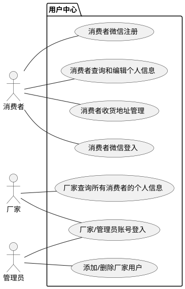
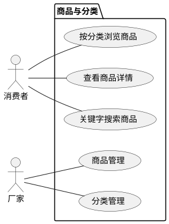
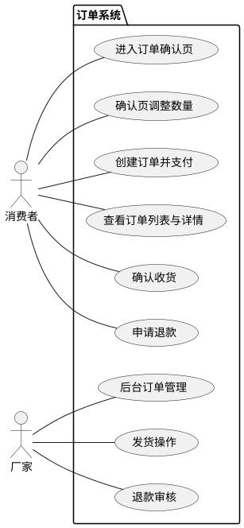
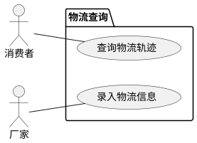

# 用例描述文档

> 对应 SRS v2.5，一期 4 模块全部用例的详细描述。
> 编号规则：`UC` + 三位数，首位=模块号，后两位=模块内序号。

---

## 模块一：用户中心

### 1.1 用例图



### 1.2 用例描述

---

#### UC101：消费者微信登入

| 属性 | 内容 |
|:---|:---|
| **用例名** | 消费者微信登入 |
| **用例标示** | UC101 |
| **主要执行者** | 消费者 |
| **目标** | 通过微信授权登入系统以获取操作权限 |
| **范围** | 湘西果王油微信小程序 |
| **前置条件** | 消费者持有安装微信的手机，微信版本支持小程序 |

**交互动作**：

1. **消费者** 访问小程序中需登录的页面（如"我的"、"下单"等）
2. **系统** 检测请求未携带有效 token → 返回 HTTP 401
3. **前端** 检测到 401 → 引导消费者进入微信授权流程
4. **消费者** 确认微信授权（静默授权 + 手机号授权）
5. **前端** 调用 `wx.login()` 获取临时 code，调用 `POST /api/auth/wx-login { code, phoneCode? }`
6. **系统** 调用微信 `code2session` API 换取 openid
7. **系统** 根据 openid 查询用户：
   1. 用户已存在 → 直接生成 JWT
   2. 用户不存在 → 自动创建消费者用户记录（见 UC102）
8. **系统** 生成 JWT（sub=user_id, role=CUSTOMER）
9. **系统** 返回 `{ code: 0, data: { token, user } }`
10. **前端** 存储 token → 后续请求携带 `Authorization: Bearer <token>` → **登入成功**

---

#### UC102：消费者微信注册

| 属性 | 内容 |
|:---|:---|
| **用例名** | 消费者微信注册 |
| **用例标示** | UC102 |
| **主要执行者** | 消费者 |
| **目标** | 通过微信授权注册为新用户 |
| **范围** | 湘西果王油微信小程序 |
| **前置条件** | 消费者首次使用小程序，未注册过 |

**交互动作**：

1. **消费者** 首次授权微信登录（同 UC101 的 1~5）
2. **系统** 通过 openid 查询 → 用户不存在
3. **系统** 自动创建用户记录：
   - openid（加密存储）
   - 昵称（微信昵称）
   - 头像（微信头像 URL）
   - phone（手机号授权获取，加密存储）
   - role = CUSTOMER
4. **系统** 生成 JWT
5. **系统** 返回 `{ code: 0, data: { token, user } }` → **注册并登入成功**

---

#### UC103：厂家/管理员账号登入

| 属性 | 内容 |
|:---|:---|
| **用例名** | 厂家/管理员账号登入 |
| **用例标示** | UC103 |
| **主要执行者** | 厂家、管理员 |
| **目标** | 通过合法身份登入系统以获取操作权限 |
| **范围** | 湘西果王油后台管理 H5 软件 |
| **前置条件** | 管理员已在后台创建厂家用户账号或管理员账号；用户使用 Chrome/Edge/Safari 最新两个版本 |

**交互动作**：

1. **用户** 访问后台管理 H5 页面
2. **系统** 检测未登录 → 跳转到登录页面
3. **用户** 输入账号、密码和验证码（如有）
4. **系统** 验证输入格式的合法性：
   1. 如账号或密码为空 → **系统** 提示"请输入账号和密码"并要求重新输入，转到 3
   2. 如验证码存在且为空 → **系统** 提示"请输入验证码"并要求重新输入，转到 3
5. **系统** 验证账号、密码和验证码（如有）的正确性：
   1. 如账号不存在 → **系统** 提示"账号或密码错误"，转到 3
   2. 如密码错误：
      - 如连续失败次数 < 3 → **系统** 提示"账号或密码错误"，`login_attempts + 1`，转到 3
      - 如连续失败次数 ≥ 3 → **系统** 锁定账号 15 分钟（设置 `locked_until`），提示"账号已锁定，请 15 分钟后重试"，**终止**
   3. 如账号已锁定（`locked_until > now()`）→ **系统** 提示"账号已锁定，请稍后重试"，**终止**
   4. 如验证码错误 → **系统** 提示"验证码错误"，转到 3
6. **系统** 验证通过 → 重置 `login_attempts` 和 `locked_until` → 生成 JWT（sub=user_id, role=MANUFACTURER|ADMIN）
7. **系统** 返回 `{ code: 0, data: { token, user } }` → **登入成功**

**补充规则**：
- 连续失败 3 次后，后续所有登入流程强制加入验证码验证环节，直至登入成功并重置计数器
- 如果用户要求提示密码，**系统** 提示"请联系管理员重置密码"

---

#### UC104：添加/删除厂家用户

| 属性 | 内容 |
|:---|:---|
| **用例名** | 添加/删除厂家用户 |
| **用例标示** | UC104 |
| **主要执行者** | 管理员 |
| **目标** | 管理后台的厂家用户账号 |
| **范围** | 湘西果王油后台管理 H5 |
| **前置条件** | 管理员已通过 UC103 登入 |

**交互动作（添加厂家用户）**：

1. **管理员** 进入用户管理页面 → 点击"添加厂家用户"
2. **管理员** 填写账号、初始密码
3. **系统** 校验输入合法性：
   1. 账号长度 4~50 字符，字母/数字/下划线 → 不合法则提示并要求重新输入，转到 2
   2. 密码长度 ≥ 8 字符 → 不合法则提示并要求重新输入，转到 2
4. **系统** 校验账号唯一性：
   1. 如账号已存在 → 返回 HTTP 400 错误码 1002，提示"账号已存在"
5. **系统** 创建用户记录：
   - username（指定账号）
   - password_hash（BCrypt 加密）
   - role = MANUFACTURER
   - login_attempts = 0
6. **系统** 返回 `{ code: 0, data: UserDTO }` → **添加成功**

**交互动作（删除厂家用户 — 软删除）**：

1. **管理员** 在用户列表中选择目标厂家用户 → 点击"删除"
2. **系统** 弹出确认对话框 → **管理员** 确认
3. **系统** 校验：
   1. 目标用户 role ≠ MANUFACTURER → 返回 HTTP 400，提示"仅可删除厂家用户"
   2. 目标用户已被软删除 → 返回 HTTP 404
4. **系统** 设置 `is_deleted = true`
5. **系统** 返回 `{ code: 0 }` → **删除成功**（该账号无法再登入）

---

#### UC105：消费者查询和编辑个人信息

| 属性 | 内容 |
|:---|:---|
| **用例名** | 消费者查询和编辑个人信息 |
| **用例标示** | UC105 |
| **主要执行者** | 消费者 |
| **目标** | 查看和修改个人资料 |
| **范围** | 湘西果王油微信小程序 |
| **前置条件** | 消费者已通过 UC101 登入 |

**交互动作（查询个人信息）**：

1. **消费者** 进入"我的"页面
2. **前端** 调用 `GET /api/user/me`（含 JWT）
3. **系统** 从 JWT 提取 user_id → 查询用户信息
4. **系统** 返回用户昵称、头像、手机号（中间 4 位脱敏显示）

**交互动作（编辑个人信息）**：

1. **消费者** 进入个人信息编辑页
2. **消费者** 修改昵称和/或头像
3. **消费者** 提交 → 前端调用 `PUT /api/user/me { nickname?, avatar? }`
4. **系统** 校验：
   1. 昵称 ≤ 50 字符 → 超长返回 HTTP 400 错误码 1001
5. **系统** 更新用户记录
6. **系统** 返回更新后的 UserDTO → **编辑成功**

---

#### UC106：消费者收货地址管理

| 属性 | 内容 |
|:---|:---|
| **用例名** | 消费者收货地址管理 |
| **用例标示** | UC106 |
| **主要执行者** | 消费者 |
| **目标** | 管理收货地址（新增、编辑、删除、设置默认） |
| **范围** | 湘西果王油微信小程序 |
| **前置条件** | 消费者已通过 UC101 登入 |

**交互动作（新增收货地址）**：

1. **消费者** 进入地址管理页 → 点击"新增"
2. **消费者** 填写收货人姓名、手机号、省、市、区、详细地址
3. **消费者** 如需设为默认地址 → 勾选"设为默认"
4. **消费者** 提交 → 前端调用 `POST /api/addresses { name, phone, province, city, district, detail, is_default }`
5. **系统** 校验输入：
   1. 姓名 ≤ 20 字符 → 超长返回 HTTP 400 错误码 1001
   2. 手机号格式校验 → 不合法返回 HTTP 400
   3. 所有必填项均不能为空
6. **系统** 如 `is_default = true` → 将该用户其他地址 `is_default` 设为 false
7. **系统** 创建地址记录
8. **系统** 返回 AddressDTO → **新增成功**

**交互动作（编辑收货地址）**：

1. **消费者** 在地址列表中选择目标地址 → 点击"编辑"
2. **消费者** 修改任意字段后提交 → 前端调用 `PUT /api/addresses/{id} { ... }`
3. **系统** 校验输入（同新增）→ 更新记录
4. **系统** 返回更新后的 AddressDTO → **编辑成功**

**交互动作（删除收货地址 — 软删除）**：

1. **消费者** 在地址列表中选择目标地址 → 点击"删除"
2. **系统** 弹出确认对话框 → **消费者** 确认
3. **前端** 调用 `DELETE /api/addresses/{id}`
4. **系统** 校验地址归属（user_id 匹配）→ 不匹配返回 HTTP 403
5. **系统** 设置 `is_deleted = true`
6. **系统** 如该地址为默认地址 → 清除其 `is_default` 标记
7. **系统** 返回 `{ code: 0 }` → **删除成功**

**交互动作（设为默认地址）**：

1. **消费者** 在地址列表中选择目标地址 → 点击"设为默认"
2. **前端** 调用 `PUT /api/addresses/{id}/default`
3. **系统** 将该用户其他地址 `is_default` 设为 false → 当前地址 `is_default` 设为 true
4. **系统** 返回 `{ code: 0 }` → **设置成功**

---

#### UC107：厂家查询所有消费者的个人信息

| 属性 | 内容 |
|:---|:---|
| **用例名** | 厂家查询所有消费者的个人信息 |
| **用例标示** | UC107 |
| **主要执行者** | 厂家 |
| **目标** | 查看所有消费者的基本信息，用于售后联系等场景 |
| **范围** | 湘西果王油后台管理 H5 |
| **前置条件** | 厂家已通过 UC103 登入 |

**交互动作**：

1. **厂家** 进入用户列表页
2. **前端** 调用 `GET /api/admin/users?role=CUSTOMER&page=0&size=20`
3. **系统** 查询所有 role=CUSTOMER 且 `is_deleted = false` 的用户（分页）
4. **系统** 返回用户列表：昵称、手机号（中间 4 位脱敏）、注册时间
5. **厂家** 可通过手机号搜索 → `GET /api/admin/users?phone=138xxxx`
6. **系统** 返回匹配结果

---

## 模块二：商品与分类

### 2.1 用例图



### 2.2 用例描述

---

#### UC201：按分类浏览商品

| 属性 | 内容 |
|:---|:---|
| **用例名** | 按分类浏览商品 |
| **用例标示** | UC201 |
| **主要执行者** | 消费者 |
| **目标** | 通过分类树快速找到目标商品 |
| **范围** | 湘西果王油微信小程序 |
| **前置条件** | 无（无需登录） |

**交互动作**：

1. **消费者** 进入小程序首页
2. **前端** 调用 `GET /api/categories` 获取分类树
3. **系统** 返回树形 JSON 结构（顶级分类及其子分类）
4. **消费者** 点击某个分类
5. **前端** 调用 `GET /api/products?categoryId={id}&page=0&size=20`
6. **系统** 返回该分类下所有 `status=ENABLED` 的商品（分页）
7. **消费者** 在商品列表中上下滑动浏览
8. **消费者** 可点击某商品进入详情页（见 UC202）

---

#### UC202：查看商品详情

| 属性 | 内容 |
|:---|:---|
| **用例名** | 查看商品详情 |
| **用例标示** | UC202 |
| **主要执行者** | 消费者 |
| **目标** | 查看商品的完整信息（轮播图、描述、规格、价格） |
| **范围** | 湘西果王油微信小程序 |
| **前置条件** | 无（无需登录） |

**交互动作**：

1. **消费者** 在商品列表或分类页点击某商品
2. **前端** 调用 `GET /api/products/{id}`
3. **系统** 返回商品详情：
   - 商品名称、轮播图 URL 数组
   - 富文本描述
   - 所有关联规格列表（SKU 名称、价格、库存、规格图）
   - 商品状态（仅展示 ENABLED 状态商品）
4. **消费者** 浏览商品详情
5. **消费者** 可切换查看不同规格的图片

---

#### UC203：关键字搜索商品

| 属性 | 内容 |
|:---|:---|
| **用例名** | 关键字搜索商品 |
| **用例标示** | UC203 |
| **主要执行者** | 消费者 |
| **目标** | 按关键字搜索商品 |
| **范围** | 湘西果王油微信小程序 |
| **前置条件** | 无 |

**交互动作**：

1. **消费者** 在搜索框输入关键字
2. **前端** 调用 `GET /api/products?keyword=xxx&page=0&size=20`
3. **系统** 返回匹配的商品列表（名称或描述匹配）
4. **消费者** 浏览搜索结果
   > **注**：后端接口一期保留，前端接入推迟至第四期实现。一期消费者通过分类浏览（UC201）找商品。

---

#### UC204：商品管理

| 属性 | 内容 |
|:---|:---|
| **用例名** | 商品管理 |
| **用例标示** | UC204 |
| **主要执行者** | 厂家 |
| **目标** | 管理商品信息的增删改查及上下架 |
| **范围** | 湘西果王油后台管理 H5 |
| **前置条件** | 厂家已通过 UC103 登入 |

**交互动作（创建商品）**：

1. **厂家** 进入商品管理页 → 点击"新建商品"
2. **厂家** 填写：
   - 商品名称（≤ 100 字符）
   - 商品描述（支持富文本）
   - 所属分类（仅可选叶子分类）
   - 轮播图（上传多张图片）
3. **厂家** 添加规格：
   - 规格名称（如 500ml、1000ml）
   - 售价（正整数/小数，保留两位）
   - 库存数量
   - 规格图片（可选）
4. **厂家** 提交 → 前端调用 `POST /api/products { name, description, categoryId, images, skus[] }`
5. **系统** 校验输入合法性
6. **系统** 创建商品（status=DRAFT）+ 关联 SKU 记录
7. **系统** 返回 ProductDTO → **创建成功**

**交互动作（编辑商品）**：

1. **厂家** 在商品列表中选择目标商品 → 点击"编辑"
2. **厂家** 修改任意字段 → 提交 → 前端调用 `PUT /api/products/{id} { ... }`
3. **系统** 校验输入 → 更新商品及关联 SKU
4. **系统** 返回更新后的 ProductDTO → **编辑成功**

**交互动作（上架商品）**：

1. **厂家** 选择草稿或已下架状态的商品 → 点击"上架"
2. **前端** 调用 `PATCH /api/products/{id}/enable`
3. **系统** 校验：
   1. 商品必须关联至少一个叶子分类
   2. 商品必须至少有一个 SKU
4. **系统** status → ENABLED
5. **系统** 消费者端即刻可在商品列表中看到该商品 → **上架成功**

**交互动作（下架商品）**：

1. **厂家** 选择已上架状态的商品 → 点击"下架"
2. **前端** 调用 `PATCH /api/products/{id}/disable`
3. **系统** status → DISABLED
4. **系统** 消费者端即刻不可见。数据保留，可随时重新上架 → **下架成功**

---

#### UC205：分类管理

| 属性 | 内容 |
|:---|:---|
| **用例名** | 分类管理 |
| **用例标示** | UC205 |
| **主要执行者** | 厂家 |
| **目标** | 管理商品分类的树形结构 |
| **范围** | 湘西果王油后台管理 H5 |
| **前置条件** | 厂家已通过 UC103 登入 |

**交互动作（创建分类）**：

1. **厂家** 进入分类管理页 → 选择目标父分类 → 点击"新增子分类"
2. **厂家** 填写分类名称（≤ 50 字符）、描述（可选）、排序号
3. **厂家** 提交 → 前端调用 `POST /api/admin/categories { parentId, name, description, sortOrder }`
4. **系统** 校验输入 → 创建分类记录
5. **系统** 返回 CategoryDTO → **创建成功**

**交互动作（编辑分类）**：

1. **厂家** 在分类树中选择目标分类 → 点击"编辑"
2. **厂家** 修改名称、描述、排序号或启用/禁用状态 → 提交
3. **前端** 调用 `PUT /api/admin/categories/{id} { ... }`
4. **系统** 更新记录 → 返回 CategoryDTO → **编辑成功**

**交互动作（删除分类 — 软删除）**：

1. **厂家** 在分类树中选择目标分类 → 点击"删除"
2. **系统** 弹出确认对话框 → **厂家** 确认
3. **系统** 校验：
   1. 该分类下是否有 `status != DISABLED` 的商品 → 有则返回 HTTP 400 错误码 1002，提示"该分类下存在商品，无法删除"
   2. 该分类是否有子分类 → 有则级联软删除其所有子分类
4. **系统** 设置 `is_deleted = true`
5. **系统** 返回 `{ code: 0 }` → **删除成功**

---

## 模块三：订单系统

### 3.1 用例图



### 3.2 用例描述

---

#### UC301：进入订单确认页

| 属性 | 内容 |
|:---|:---|
| **用例名** | 进入订单确认页 |
| **用例标示** | UC301 |
| **主要执行者** | 消费者 |
| **目标** | 在提交订单前核对商品信息、收货地址和总价 |
| **范围** | 湘西果王油微信小程序 |
| **前置条件** | 消费者已通过 UC101 登入；在商品详情页已选择一个规格和数量 |

**交互动作**：

1. **消费者** 在商品详情页选择规格和数量后，点击"立即购买"
2. **前端** 调用 `POST /api/orders/confirm { skuId, quantity }`
3. **系统** 返回确认页预计算数据：
   - 商品名、规格名、单价、数量
   - 总价（单价 × 数量）
   - 消费者默认收货地址
   - pay_amount = total_amount（一期无优惠）
4. **消费者** 查看确认页信息
5. **消费者** 可切换或新增收货地址（见 UC106）

---

#### UC302：确认页调整数量

| 属性 | 内容 |
|:---|:---|
| **用例名** | 确认页调整数量 |
| **用例标示** | UC302 |
| **主要执行者** | 消费者 |
| **目标** | 在确认页修改购买数量，确认最终总价 |
| **范围** | 湘西果王油微信小程序 |
| **前置条件** | 消费者已在订单确认页 |

**交互动作**：

1. **消费者** 在确认页点击数量调整按钮（+/-）
2. **前端** 实时重新计算总价（单价 × 数量）
3. **前端** 校验：
   1. 如数量 ≤ 0 → 前端拦截，禁用减号按钮
   2. 如数量 > 库存 → 前端提示"库存不足"
4. **消费者** 确认数量正确 → 总价 = 单价 × 数量
5. 一期无优惠 → pay_amount = total_amount

---

#### UC303：创建订单并支付

| 属性 | 内容 |
|:---|:---|
| **用例名** | 创建订单并支付 |
| **用例标示** | UC303 |
| **主要执行者** | 消费者 |
| **目标** | 创建订单并从微信扣款完成支付 |
| **范围** | 湘西果王油微信小程序 |
| **前置条件** | 消费者已确认商品、数量、收货地址 |

**交互动作**：

1. **消费者** 在确认页点击"去支付"
2. **前端** 调用 `POST /api/orders { skuId, quantity, addressId }`
3. **系统** 创建订单（status=PENDING_PAYMENT）：
   1. Redis `DECR sku:{skuId}:stock` 原子操作
   2. 如库存不足（`result < 0`）→ Redis `INCR` 回滚 → 返回 HTTP 409 错误码 5001
   3. 扣减成功 → 写入 `orders` 表（含 address_snapshot 快照）
   4. 写入 `order_items` 表（商品名、规格名、价格快照）
   5. 整个流程包裹在同一事务中，任一步失败则全部回滚
4. **系统** 调用微信支付统一下单 API
5. **系统** 返回 JSAPI 支付参数 → 前端唤起微信支付弹窗
6. **消费者** 在微信支付弹窗中完成支付（输入密码/指纹）
7. **微信支付** 异步发送回调通知到 `POST /api/orders/wx-notify`
8. **系统** 处理回调：
   1. 验签 → 失败则拒绝
   2. 查询 `payment_records` 是否已存在 `(wx_transaction_id, order_no)` → 存在则幂等返回
   3. 写入 `payment_records` 记录
   4. 更新订单 status → PAID，记录 `paid_at`
9. **前端** 收到支付成功信号 → 跳转订单详情页 → **支付成功**

**异常流 — 超时取消**：
- 待支付订单 30 分钟内未收到支付回调
- 定时任务每 5 分钟扫描 `status=PENDING_PAYMENT AND created_at < now()-30min` 的订单
- 批量取消：订单 status → CANCELLED，Redis `INCR` 回滚库存

---

#### UC304：查看订单列表与详情

| 属性 | 内容 |
|:---|:---|
| **用例名** | 查看订单列表与详情 |
| **用例标示** | UC304 |
| **主要执行者** | 消费者 |
| **目标** | 查看自己的所有订单及单个订单详情 |
| **范围** | 湘西果王油微信小程序 |
| **前置条件** | 消费者已通过 UC101 登入 |

**交互动作（订单列表）**：

1. **消费者** 进入"我的订单"页面
2. **前端** 调用 `GET /api/orders?status=PAID&page=0&size=10`
3. **系统** 返回当前用户订单列表（分页），支持按状态筛选：
   - 全部 / 待支付 / 已支付 / 已发货 / 已完成 / 已退款
4. **消费者** 上下滑动浏览订单列表
5. **消费者** 点击某个订单进入详情

**交互动作（订单详情）**：

1. **前端** 调用 `GET /api/orders/{id}`
2. **系统** 校验订单归属（user_id 匹配）→ 不匹配返回 HTTP 403
3. **系统** 返回订单详情：
   - 商品明细列表（order_items：商品名快照、规格名快照、单价、数量、小计）
   - 收货地址快照
   - 金额拆解：total_amount、discount_amount（一期 = 0）、pay_amount
   - 当前状态
   - 物流信息（如有配送单）

---

#### UC305：确认收货

| 属性 | 内容 |
|:---|:---|
| **用例名** | 确认收货 |
| **用例标示** | UC305 |
| **主要执行者** | 消费者 |
| **目标** | 确认已收到商品，完成交易 |
| **范围** | 湘西果王油微信小程序 |
| **前置条件** | 订单状态为已发货（SHIPPED） |

**交互动作**：

1. **消费者** 在订单详情页点击"确认收货"
2. **系统** 弹出确认对话框 → **消费者** 确认
3. **前端** 调用 `POST /api/orders/{id}/confirm-receipt`
4. **系统** 校验：
   1. 订单归属 → 不匹配返回 HTTP 403
   2. 订单状态 = SHIPPED → 状态不符返回 HTTP 400
5. **系统** 更新订单 status → COMPLETED，记录 `confirm_at`
6. **系统** 返回 `{ code: 0 }` → **确认收货成功**

---

#### UC306：申请退款

| 属性 | 内容 |
|:---|:---|
| **用例名** | 申请退款 |
| **用例标示** | UC306 |
| **主要执行者** | 消费者 |
| **目标** | 对问题商品申请退款 |
| **范围** | 湘西果王油微信小程序 |
| **前置条件** | 订单状态为已支付（PAID）或已发货（SHIPPED） |

**交互动作**：

1. **消费者** 进入订单详情页 → 点击"申请退款"
2. **系统** 校验：
   1. 订单状态 = PENDING_PAYMENT → 返回 HTTP 400，提示"待支付订单超时自动取消，无需退款"
   2. 订单状态 = REFUNDING → 返回 HTTP 409，提示"已有退款申请正在处理"
   3. 订单状态 = REFUNDED → 返回 HTTP 409，提示"该订单已退款"
3. **消费者** 填写退款原因（≤ 500 字符），上传凭证图片（可选）
4. **消费者** 提交 → 前端调用 `POST /api/orders/{id}/refund { refundReason, evidenceImages? }`
5. **系统** 创建退款单（return_orders）：
   - refund_type = FULL（一期整单退款）
   - status = PENDING
6. **系统** 更新订单 status → REFUNDING
7. **系统** 返回退款单信息 → **申请成功**，等待厂家审核（见 UC309）

---

#### UC307：后台订单管理

| 属性 | 内容 |
|:---|:---|
| **用例名** | 后台订单管理 |
| **用例标示** | UC307 |
| **主要执行者** | 厂家 |
| **目标** | 查看和管理所有订单 |
| **范围** | 湘西果王油后台管理 H5 |
| **前置条件** | 厂家已通过 UC103 登入 |

**交互动作**：

1. **厂家** 进入订单管理页
2. **前端** 调用 `GET /api/admin/orders?status=PAID&page=0&size=20`
3. **系统** 返回所有用户订单列表（分页）
4. **厂家** 可按以下维度筛选和搜索：
   - 按订单状态筛选（PAID / SHIPPED / REFUNDING 等）
   - 按订单号搜索
   - 按下单时间排序
5. **厂家** 点击某个订单 → 查看订单详情（商品明细、地址、金额）
6. **厂家** 可对订单执行发货（UC308）或退款审核（UC309）

---

#### UC308：发货操作

| 属性 | 内容 |
|:---|:---|
| **用例名** | 发货操作 |
| **用例标示** | UC308 |
| **主要执行者** | 厂家 |
| **目标** | 对已支付订单进行发货并录入物流信息 |
| **范围** | 湘西果王油后台管理 H5 |
| **前置条件** | 厂家已通过 UC103 登入；订单状态为已支付（PAID） |

**交互动作**：

1. **厂家** 在订单详情页点击"发货"
2. **系统** 校验：
   1. 订单状态 ≠ PAID → 返回 HTTP 400，提示"仅已支付订单可发货"
   2. 该订单已有配送单 → 返回 HTTP 409 错误码 5002，提示"该订单已有配送单"
3. **厂家** 填写快递公司名称（如顺丰速运）和快递单号
4. **厂家** 提交 → 前端调用 `POST /api/admin/orders/{id}/deliveries { expressCompany, expressNo }`
5. **系统** 校验快递公司及单号不为空 → 为空返回 HTTP 400
6. **系统** 创建 `delivery_orders` 记录（status=PENDING → SHIPPED）
7. **系统** 更新订单 status → SHIPPED，记录发货时间
8. **系统** 清除该配送单的物流缓存（Redis）
9. **系统** 返回 `{ code: 0, data: DeliveryOrderDTO }` → **发货成功**

---

#### UC309：退款审核

| 属性 | 内容 |
|:---|:---|
| **用例名** | 退款审核 |
| **用例标示** | UC309 |
| **主要执行者** | 厂家 |
| **目标** | 审核消费者的退款申请，同意或拒绝 |
| **范围** | 湘西果王油后台管理 H5 |
| **前置条件** | 厂家已通过 UC103 登入；退款单状态为待审核（PENDING） |

**交互动作（同意退款）**：

1. **厂家** 在退款审核列表点击某退款单 → 查看详情（退款原因、凭证图片、订单信息）
2. **厂家** 点击"同意退款"
3. **前端** 调用 `POST /api/admin/returns/{id}/review { action: "APPROVE", reviewComment? }`
4. **系统** 校验：
   1. 退款单 status ≠ PENDING → 返回 HTTP 409（幂等保护，重复审核返回已有结果）
5. **系统** 更新退款单：
   - status → APPROVED
   - reviewed_by = 当前厂家 user_id
   - review_comment = 审核意见
   - reviewed_at = 当前时间
6. **系统** 更新订单 status → REFUNDED
7. **系统** 回滚对应 SKU 库存（Redis INCR）
8. **系统** 返回 `{ code: 0 }` → **退款审核通过**
   > **注**：一期退款为"审核通过即完成"，实际资金退款由厂家线下操作。第四期接入微信退款 API。

**交互动作（拒绝退款）**：

1. **厂家** 查看退款单详情 → 点击"拒绝退款"
2. **厂家** 填写审核意见（必填）
3. **前端** 调用 `POST /api/admin/returns/{id}/review { action: "REJECT", reviewComment }`
4. **系统** 校验退款单状态（同同意流程）
5. **系统** 更新退款单：
   - status → REJECTED
   - reviewed_by = 当前厂家 user_id
   - review_comment = 审核意见
   - reviewed_at = 当前时间
6. **系统** 恢复订单原状态（PAID 或 SHIPPED）
7. **系统** 返回 `{ code: 0 }` → **退款申请已拒绝**

---

## 模块四：物流查询

### 4.1 用例图



### 4.2 用例描述

---

#### UC401：查询物流轨迹

| 属性 | 内容 |
|:---|:---|
| **用例名** | 查询物流轨迹 |
| **用例标示** | UC401 |
| **主要执行者** | 消费者 |
| **目标** | 查看已发货订单的物流派送进度 |
| **范围** | 湘西果王油微信小程序 |
| **前置条件** | 消费者已通过 UC101 登入；订单存在关联的配送单 |

**交互动作**：

1. **消费者** 在订单详情页点击"查看物流"
2. **前端** 调用 `GET /api/deliveries/{deliveryId}/express`
3. **系统** 查询配送单 → 获取快递公司和运单号
4. **系统** 如配送单不存在 → 返回空列表或提示"暂无物流信息"
5. **系统** 以 `(express_company, express_no)` 为 key 查询 Redis 缓存：
   1. 缓存命中 → 直接返回缓存的轨迹数据
   2. 缓存未命中 → 调用第三方物流 API（快递100/快递鸟）→ 查询结果存入 Redis：
      - 未签收：TTL = 5 分钟
      - 已签收：TTL = 24 小时
6. **系统** 返回物流轨迹时间线：
```json
[
  { "time": "2026-05-01 08:00", "status": "已揽收", "location": "长沙市" },
  { "time": "2026-05-01 12:00", "status": "运输中", "location": "武汉市" },
  { "time": "2026-05-02 09:00", "status": "派送中", "location": "北京市朝阳区" }
]
```

---

#### UC402：录入物流信息

| 属性 | 内容 |
|:---|:---|
| **用例名** | 录入物流信息 |
| **用例标示** | UC402 |
| **主要执行者** | 厂家 |
| **目标** | 发货时录入快递公司和运单号 |
| **范围** | 湘西果王油后台管理 H5 |
| **前置条件** | 厂家已通过 UC103 登入；订单状态为已支付（PAID） |

**交互动作**：

1. **厂家** 在发货时填写快递公司名称和快递单号
2. **前端** 调用 `POST /api/admin/orders/{id}/deliveries { expressCompany, expressNo }`
3. **系统** 创建 `delivery_orders` 记录 → 关联订单
4. **系统** 更新订单 status → SHIPPED
5. **系统** 清除该配送单的物流缓存
6. **系统** 返回 `{ code: 0, data: DeliveryOrderDTO }` → **录入成功**
   > **注**：本用例与 UC308 发货操作为同一业务流程。UC308 侧重订单角度的发货动作，UC402 侧重物流数据的录入和后续轨迹查询的触发。

---

## 附录：用例编号索引

| 编号 | 用例名称 | 主要执行者 | 模块 |
|:---|:---|:---|:---|
| UC101 | 消费者微信登入 | 消费者 | 用户中心 |
| UC102 | 消费者微信注册 | 消费者 | 用户中心 |
| UC103 | 厂家/管理员账号登入 | 厂家、管理员 | 用户中心 |
| UC104 | 添加/删除厂家用户 | 管理员 | 用户中心 |
| UC105 | 消费者查询和编辑个人信息 | 消费者 | 用户中心 |
| UC106 | 消费者收货地址管理 | 消费者 | 用户中心 |
| UC107 | 厂家查询所有消费者的个人信息 | 厂家 | 用户中心 |
| UC201 | 按分类浏览商品 | 消费者 | 商品与分类 |
| UC202 | 查看商品详情 | 消费者 | 商品与分类 |
| UC203 | 关键字搜索商品 | 消费者 | 商品与分类 |
| UC204 | 商品管理 | 厂家 | 商品与分类 |
| UC205 | 分类管理 | 厂家 | 商品与分类 |
| UC301 | 进入订单确认页 | 消费者 | 订单系统 |
| UC302 | 确认页调整数量 | 消费者 | 订单系统 |
| UC303 | 创建订单并支付 | 消费者 | 订单系统 |
| UC304 | 查看订单列表与详情 | 消费者 | 订单系统 |
| UC305 | 确认收货 | 消费者 | 订单系统 |
| UC306 | 申请退款 | 消费者 | 订单系统 |
| UC307 | 后台订单管理 | 厂家 | 订单系统 |
| UC308 | 发货操作 | 厂家 | 订单系统 |
| UC309 | 退款审核 | 厂家 | 订单系统 |
| UC401 | 查询物流轨迹 | 消费者 | 物流查询 |
| UC402 | 录入物流信息 | 厂家 | 物流查询 |

---

> **对应 SRS 版本**：v2.5
> **编写日期**：2026-05-01
> **编写人**：opencode
