# 软件需求规格说明书（一期）

## 湘西果王油商城系统

---

## 1. 引言

### 1.1 编写目的

本文档为「湘西果王油商城系统」第一期的软件需求规格说明书（Software Requirements Specification,
SRS），旨在完整、清晰、可验证地定义系统的功能需求与非功能需求，作为后续设计、开发、测试、验收的统一依据，确保项目干系人对系统行为达成共识。

**目标读者**：

- 项目负责人：把控需求范围和验收基准
- 开发人员：理解功能细节和交互规范
- 测试人员：据此编写测试用例和验收方案

### 1.2 范围

本文档覆盖第一期「交易闭环」的完整范围：

- **用户中心**：微信授权登录、个人信息管理、收货地址管理
- **商品与分类**：商品列表展示、商品详情、后台商品和分类管理
- **订单系统**：立即购买、订单创建、微信支付、订单状态流转、退款申请与审核
- **物流查询**：发货录入物流单号、买家查询物流轨迹

**本期不包含**：优惠、拼单、分销体系、佣金计算、Banner/公告、统计报表、第二件打折（第四期）。

### 1.3 定义、缩写和术语

| 术语 | 说明 |
|:---|:---|
| SRS | 软件需求规格说明书（Software Requirements Specification） |
| SKU | 库存量单位，此处指商品规格（如 500ml / 1000ml） |
| openid | 微信用户在小程序中的唯一标识 |
| JSAPI | 微信小程序内唤起支付的方式 |
| PWA | 可将 H5 网页安装到手机桌面的技术 |
| UAT | 用户验收测试 |

### 1.4 参考文献

| 文档 | 说明 |
|:---|:---|
| 《需求调研问答记录》 | 15 轮 QA 原始对话，业务决策记录 |
| 《湘西果王油软件开发可行性分析》 | 技术/时间/资源可行性自检 |
| ISO/IEC 25010:2011 | 系统与软件质量模型（参考） |

### 1.5 文档结构

本文档按模块化结构组织：

- 第 1 章：引言
- 第 2 章：总体描述
- 第 3 章：功能需求
- 第 4 章：非功能需求
- 第 5 章：其他需求
- 附录

---

## 2. 总体描述

### 2.1 产品愿景

湘西果王油是一款面向重视健康的中产家庭的健康食品（食品类别销售）。本项目旨在开发一套支持自营电商及多级分销体系的小程序商城系统，帮助厂家完成商品展示、在线交易、订单管理、分销结算等核心业务流程。

第一期目标：构建稳定、高效、安全的纯交易闭环，实现浏览 → 下单 → 支付 → 发货 → 收货的完整流程。

### 2.2 项目分期

| 分期 | 主题 | 目标 |
|:---|:---|:---|
| 第一期 | 交易闭环 | 单人完成浏览→下单→支付→发货→收货全流程 |
| 第二期 | 内容运营 + 分销基础 | Banner/公告管理、分享裂变、关系绑定 |
| 第三期 | 完整分销体系 | 等级晋升、佣金引擎、提现审核 |
| 第四期 | 统计与增强 | 报表、多支付方式记录、物流轨迹聚合、关键字搜索、第二件打折 |

### 2.3 用户特征

| 用户类型 | 技能水平 | 使用频率 | 设备 | 核心关注点 |
|:---|:---|:---|:---|:---|
| 消费者 | 普通微信用户，无需培训 | 偶尔（每周 1-2 次） | 手机（微信小程序） | 浏览流畅、下单快、物流可见 |
| 厂家 | 需基础培训（后台操作） | 日常（每日） | PC 网页 + 手机浏览器（响应式布局） | 订单处理效率、库存准确、退款审核 |
| 管理员 | 基本运维基础 | 按需（不定期） | PC 网页 + 手机浏览器 | 添加或删除厂家用户 |

> 注：第一期不实现分销商等级体系，所有已购买用户统称为「客户」，无前台等级区分。

### 2.4 系统概览图

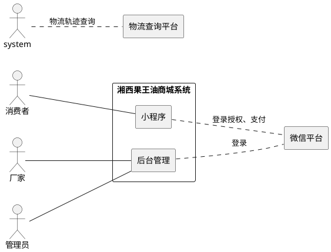

##### UC201：查看商品详情

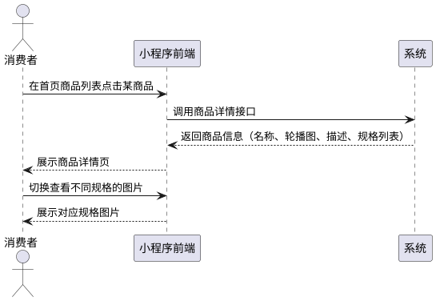

##### UC203：分类管理

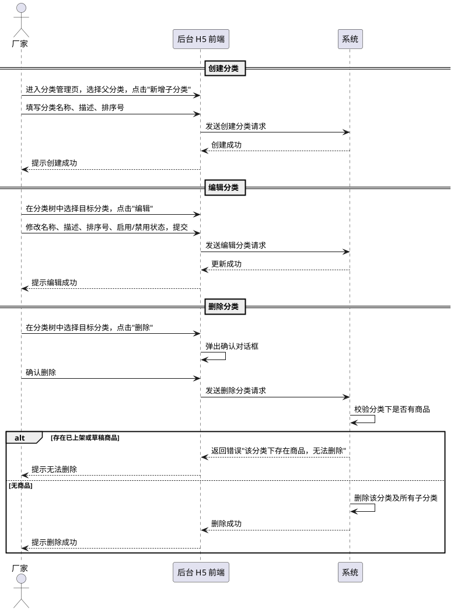

---

### 3.3 模块三：订单系统

#### 3.3.1 功能描述

| 编号 | 用例名称 | 角色 | 用例描述 |
|:---|:---|:---|:---|
| UC301 | 进入订单确认页 | 消费者 | 在商品详情页选择规格和数量后点击购买，进入订单确认页查看商品信息、总价、选择收货地址 |
| UC302 | 确认页调整数量 | 消费者 | 在确认页修改购买数量，数量实时计算总价 |
| UC303 | 创建订单并支付 | 消费者 | 点击支付按钮后创建订单，系统调用微信支付，支付成功后订单生效 |
| UC304 | 查看订单列表与详情 | 消费者 | 订单列表分页，支持按状态筛选；详情页展示商品明细、收货地址、金额、当前状态 |
| UC305 | 确认收货 | 消费者 | 收到货后确认收货，完成交易 |
| UC306 | 申请退款 | 消费者 | 提交退款申请（商品有问题），查看审核结果 |
| UC307 | 后台订单管理 | 厂家 | 在后台查看所有订单，按状态筛选、按订单号搜索；可进行发货和退款审核操作 |
| UC308 | 发货操作 | 厂家 | 对已支付订单进行发货操作（填写物流公司和单号），订单状态变更为已发货 |
| UC309 | 退款审核 | 厂家 | 审核买家的退款申请，同意或拒绝 |

#### 3.3.2 业务流程

```
浏览商品 → 选择规格/数量 → 点击「立即购买」
   → 订单确认页（展示商品、数量、总价、地址）
   → 用户点击「去支付」
       → 系统创建订单，锁定相关规格库存
       → 调用微信支付
       → 返回支付参数给前端
   → 用户支付（微信支付弹窗）
   → 支付成功 → 订单状态变更为「已支付」
   → 管理员在后台发货 → 状态变更为「已发货」
   → 用户确认收货 → 状态变更为「已完成」
   → （可选）用户申请退款 → 管理员审核 → 同意或拒绝
```

#### 3.3.3 订单状态流转

```
待支付 ──(30分钟超时)──→ 已取消
待支付 ──(支付成功)──→ 已支付
已支付 ──(发货)──────→ 已发货
已发货 ──(确认收货)──→ 已完成
已支付 ──(申请退款)──→ 退款中
已发货 ──(申请退款)──→ 退款中
退款中 ──(审核通过)──→ 已退款
退款中 ──(审核拒绝)──→ 恢复原状态（已支付 / 已发货）
```

#### 3.3.4 业务流程描述

##### UC301：进入订单确认页

| 属性 | 内容 |
|:---|:---|
| **用例名** | 进入订单确认页 |
| **用例标示** | UC301 |
| **主要执行者** | 消费者 |
| **目标** | 在提交订单前核对商品信息、收货地址和总价 |
| **范围** | 湘西果王油微信小程序 |
| **前置条件** | 消费者已通过 UC101 登入；在商品详情页已选择一个规格和数量 |

**交互动作**：

1. **消费者** 在商品详情页选择规格和数量后，点击"立即购买"
2. **前端** 调用订单确认接口
3. **系统** 返回确认页预计算数据：
   - 商品名、规格名、单价、数量
   - 总价（单价 × 数量）
   - 消费者默认收货地址
   - 实际支付金额 = 总价（一期无优惠）
4. **消费者** 查看确认页信息
5. **消费者** 可切换或新增收货地址（见 UC106）

---

##### UC302：确认页调整数量

| 属性 | 内容 |
|:---|:---|
| **用例名** | 确认页调整数量 |
| **用例标示** | UC302 |
| **主要执行者** | 消费者 |
| **目标** | 在确认页修改购买数量，确认最终总价 |
| **范围** | 湘西果王油微信小程序 |
| **前置条件** | 消费者已在订单确认页 |

**交互动作**：

1. **消费者** 在确认页点击数量调整按钮（+/-）
2. **前端** 实时重新计算总价（单价 × 数量）
3. **前端** 校验：
   1. 如数量 ≤ 0 → 禁用减号按钮
   2. 如数量 > 库存 → 提示"库存不足"
4. **消费者** 确认数量正确 → 总价 = 单价 × 数量
5. 一期无优惠 → 实际支付金额 = 总价

---

##### UC303：创建订单并支付

| 属性 | 内容 |
|:---|:---|
| **用例名** | 创建订单并支付 |
| **用例标示** | UC303 |
| **主要执行者** | 消费者 |
| **目标** | 创建订单并从微信扣款完成支付 |
| **范围** | 湘西果王油微信小程序 |
| **前置条件** | 消费者已确认商品、数量、收货地址 |

**交互动作**：

1. **消费者** 在确认页点击"去支付"
2. **前端** 调用创建订单接口
3. **系统** 创建订单（状态=待支付）：
   1. 锁定相关规格库存
   2. 如库存不足 → 回滚操作 → 提示"库存不足"
   3. 扣减成功 → 写入订单记录（含收货地址快照）
   4. 写入订单商品明细（商品名、规格名、价格快照）
4. **系统** 调用微信支付
5. **系统** 返回支付参数 → 前端唤起微信支付弹窗
6. **消费者** 在微信支付弹窗中完成支付
7. **微信** 异步发送支付成功的消息到系统
8. **系统** 处理支付成功消息：
   1. 验证签名 → 失败则拒绝
   2. 检查是否已处理过本次支付 → 已处理则忽略
   3. 记录支付流水
   4. 更新订单状态为"已支付"，记录支付时间
9. **前端** 收到支付成功信号 → 跳转订单详情页 → **支付成功**

**超时取消**：
- 待支付订单 30 分钟内未支付，系统自动取消该订单并恢复库存

---

##### UC304：查看订单列表与详情

| 属性 | 内容 |
|:---|:---|
| **用例名** | 查看订单列表与详情 |
| **用例标示** | UC304 |
| **主要执行者** | 消费者 |
| **目标** | 查看自己的所有订单及单个订单详情 |
| **范围** | 湘西果王油微信小程序 |
| **前置条件** | 消费者已通过 UC101 登入 |

**交互动作（订单列表）**：

1. **消费者** 进入"我的订单"页面
2. **前端** 调用订单列表查询接口
3. **系统** 返回当前用户订单列表（分页），支持按状态筛选：
   - 全部 / 待支付 / 已支付 / 已发货 / 已完成 / 已退款
4. **消费者** 浏览订单列表
5. **消费者** 点击某个订单进入详情

**交互动作（订单详情）**：

1. **前端** 调用订单详情接口
2. **系统** 校验订单属于当前用户 → 不属于则拒绝
3. **系统** 返回订单详情：
   - 商品明细列表（商品名快照、规格名快照、单价、数量、小计）
   - 收货地址快照
   - 金额拆解：原价合计、优惠金额（一期=0）、实际支付金额
   - 当前状态
   - 物流信息（如有配送单）

---

##### UC305：确认收货

| 属性 | 内容 |
|:---|:---|
| **用例名** | 确认收货 |
| **用例标示** | UC305 |
| **主要执行者** | 消费者 |
| **目标** | 确认已收到商品，完成交易 |
| **范围** | 湘西果王油微信小程序 |
| **前置条件** | 订单状态为已发货 |

**交互动作**：

1. **消费者** 在订单详情页点击"确认收货"
2. **系统** 弹出确认对话框 → **消费者** 确认
3. **前端** 调用确认收货接口
4. **系统** 校验：
   1. 订单属于当前用户 → 不属于则拒绝
   2. 订单状态 = 已发货 → 状态不符则提示
5. **系统** 更新订单状态为"已完成"，记录确认时间
6. **系统** 提示确认收货成功

---

##### UC306：申请退款

| 属性 | 内容 |
|:---|:---|
| **用例名** | 申请退款 |
| **用例标示** | UC306 |
| **主要执行者** | 消费者 |
| **目标** | 对问题商品申请退款 |
| **范围** | 湘西果王油微信小程序 |
| **前置条件** | 订单状态为已支付或已发货 |

**交互动作**：

1. **消费者** 进入订单详情页 → 点击"申请退款"
2. **系统** 校验当前状态是否允许退款：
   1. 订单仍为待支付 → 提示"订单未支付，超时自动取消"
   2. 已申请过退款正在处理 → 提示"已有退款申请正在处理"
   3. 已退款完成 → 提示"该订单已退款"
3. **消费者** 填写退款原因（≤ 500 字符），上传凭证图片（可选）
4. **消费者** 提交 → 调用申请退款接口
5. **系统** 创建退款单（整单退款），状态 = 待审核
6. **系统** 更新订单状态为"退款中"
7. **系统** 提示申请成功，等待厂家审核（见 UC309）

---

##### UC307：后台订单管理

| 属性 | 内容 |
|:---|:---|
| **用例名** | 后台订单管理 |
| **用例标示** | UC307 |
| **主要执行者** | 厂家 |
| **目标** | 查看和管理所有订单 |
| **范围** | 湘西果王油后台管理 H5 |
| **前置条件** | 厂家已通过 UC103 登入 |

**交互动作**：

1. **厂家** 进入订单管理页
2. **前端** 调用后台订单列表接口
3. **系统** 返回所有用户订单列表（分页）
4. **厂家** 可按以下维度筛选和搜索：
   - 按订单状态筛选（已支付 / 已发货 / 退款中等）
   - 按订单号搜索
   - 按下单时间排序
5. **厂家** 点击某个订单 → 查看订单详情（商品明细、地址、金额）
6. **厂家** 可对订单执行发货（UC308）或退款审核（UC309）

---

##### UC308：发货操作

| 属性 | 内容 |
|:---|:---|
| **用例名** | 发货操作 |
| **用例标示** | UC308 |
| **主要执行者** | 厂家 |
| **目标** | 对已支付订单进行发货并录入物流信息 |
| **范围** | 湘西果王油后台管理 H5 |
| **前置条件** | 厂家已通过 UC103 登入；订单状态为已支付 |

**交互动作**：

1. **厂家** 在订单详情页点击"发货"
2. **系统** 校验：
   1. 订单状态 ≠ 已支付 → 提示"仅已支付订单可发货"
   2. 该订单已有配送记录 → 提示"该订单已发货"
3. **厂家** 填写快递公司名称和快递单号
4. **厂家** 提交 → 调用发货接口
5. **系统** 校验快递公司及单号不为空 → 为空则提示
6. **系统** 创建配送记录
7. **系统** 更新订单状态为"已发货"，记录发货时间
8. **系统** 清除该订单的物流缓存
9. **系统** 提示发货成功

---

##### UC309：退款审核

| 属性 | 内容 |
|:---|:---|
| **用例名** | 退款审核 |
| **用例标示** | UC309 |
| **主要执行者** | 厂家 |
| **目标** | 审核消费者的退款申请，同意或拒绝 |
| **范围** | 湘西果王油后台管理 H5 |
| **前置条件** | 厂家已通过 UC103 登入；退款单状态为待审核 |

**交互动作（同意退款）**：

1. **厂家** 在退款审核列表点击某退款单 → 查看详情（退款原因、凭证图片、订单信息）
2. **厂家** 点击"同意退款"
3. **系统** 校验退款单状态是否为待审核 → 不是则提示（防止重复操作）
4. **系统** 更新退款单：
   - 状态 → 审核通过
   - 记录审核人、审核时间
5. **系统** 更新订单状态为"已退款"
6. **系统** 恢复对应规格库存
7. **系统** 提示退款审核通过
   > 注：一期退款为"审核通过即完成"，实际资金退款由厂家线下操作。第四期接入微信自动退款。

**交互动作（拒绝退款）**：

1. **厂家** 查看退款单详情 → 点击"拒绝退款"
2. **厂家** 填写审核意见（必填）
3. **系统** 校验退款单状态（同同意流程）
4. **系统** 更新退款单：
   - 状态 → 审核拒绝
   - 记录审核人、审核意见、审核时间
5. **系统** 恢复订单原状态（已支付或已发货）
6. **系统** 提示退款申请已拒绝

---

#### 3.3.5 交互模型

##### UC303：创建订单并支付

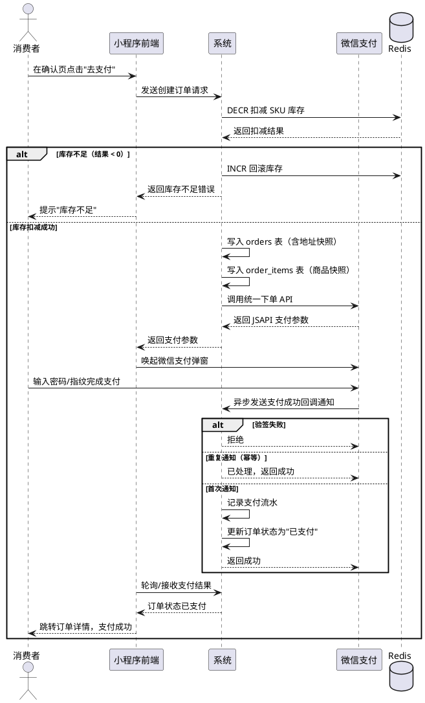

##### UC309：退款审核

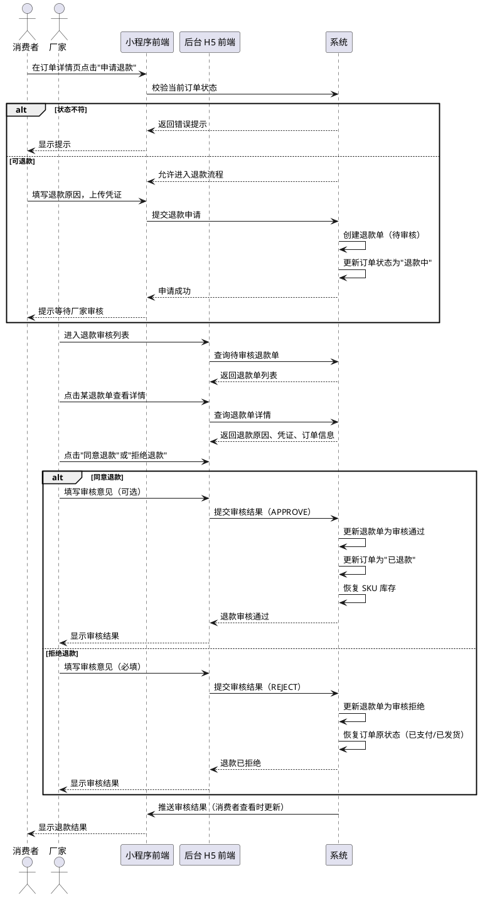

##### UC301：进入订单确认页

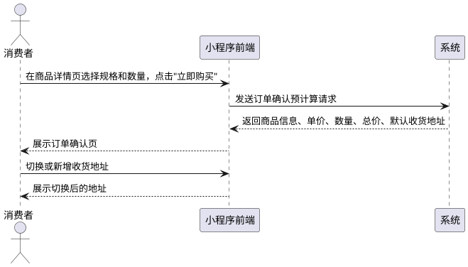

##### UC302：确认页调整数量

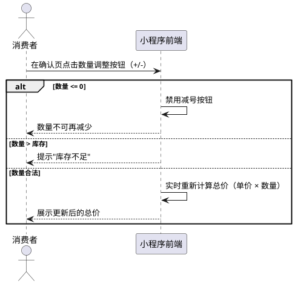

##### UC304：查看订单列表与详情

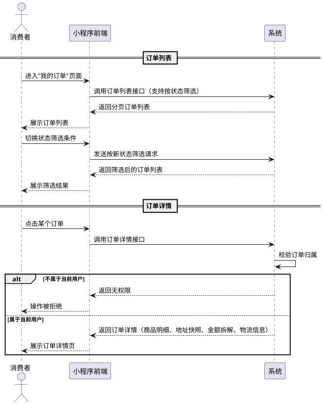

##### UC305：确认收货

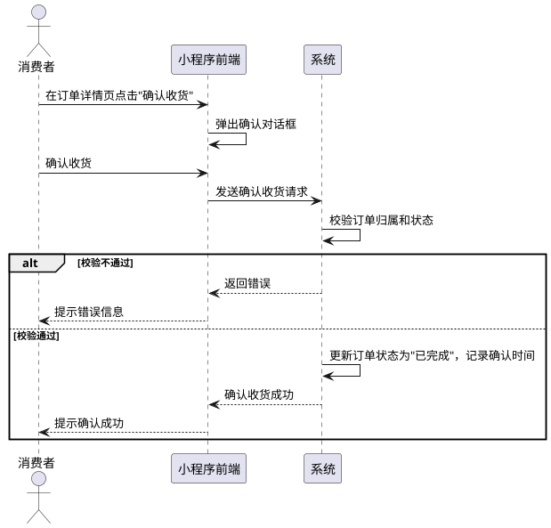

##### UC306：申请退款

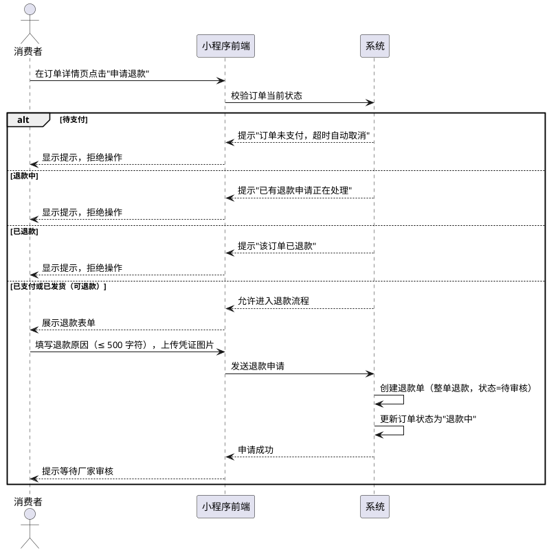

##### UC307：后台订单管理

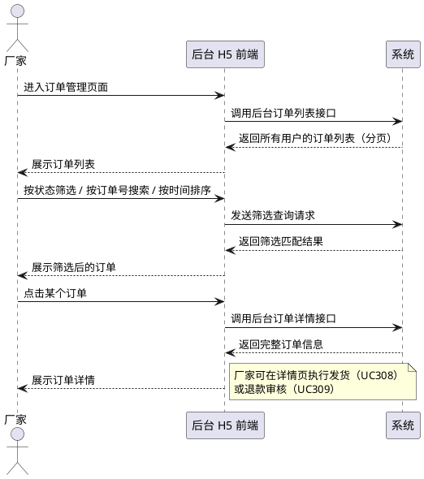

##### UC308：发货操作

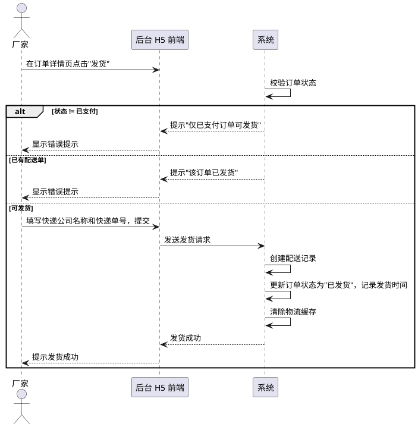

---

### 3.4 模块四：物流查询

#### 3.4.1 功能描述

| 编号 | 用例名称 | 角色 | 用例描述 |
|:---|:---|:---|:---|
| UC401 | 查询物流轨迹 | 消费者 | 在订单详情页查看物流轨迹（时间线格式），系统调用第三方物流平台获取 |
| UC402 | 录入物流信息 | 厂家 | 发货时录入快递公司 + 快递单号，创建配送记录，订单状态同步变更为已发货 |

#### 3.4.2 业务流程

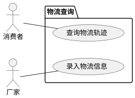

#### 3.4.3 业务规则

- 物流轨迹查询结果缓存一段时间，已签收的物流轨迹缓存更长时间。
- 发货后清除对应的物流缓存，下次查询时重新获取最新轨迹。
- 一期仅支持单个快递单号的轨迹查询，不聚合多个包裹。

#### 3.4.4 业务流程描述

##### UC401：查询物流轨迹

| 属性 | 内容 |
|:---|:---|
| **用例名** | 查询物流轨迹 |
| **用例标示** | UC401 |
| **主要执行者** | 消费者 |
| **目标** | 查看已发货订单的物流派送进度 |
| **范围** | 湘西果王油微信小程序 |
| **前置条件** | 消费者已通过 UC101 登入；订单存在关联的配送单 |

**交互动作**：

1. **消费者** 在订单详情页点击"查看物流"
2. **前端** 调用物流轨迹查询接口
3. **系统** 查询配送单 → 获取快递公司和运单号
4. **系统** 如配送单不存在 → 提示"暂无物流信息"
5. **系统** 以快递公司和运单号为组合，查询缓存：
   1. 缓存中有数据 → 直接返回
   2. 缓存中没有 → 调用第三方物流平台查询 → 结果存入缓存
6. **系统** 返回物流轨迹时间线（包含时间、状态、地点）

---

##### UC402：录入物流信息

| 属性 | 内容 |
|:---|:---|
| **用例名** | 录入物流信息 |
| **用例标示** | UC402 |
| **主要执行者** | 厂家 |
| **目标** | 发货时录入快递公司和运单号 |
| **范围** | 湘西果王油后台管理 H5 |
| **前置条件** | 厂家已通过 UC103 登入；订单状态为已支付 |

**交互动作**：

1. **厂家** 在发货时填写快递公司名称和快递单号
2. **前端** 调用发货接口
3. **系统** 创建配送记录 → 关联订单
4. **系统** 更新订单状态为"已发货"
5. **系统** 清除该配送单的物流缓存
6. **系统** 提示录入成功
   > 注：本用例与 UC308 发货操作为同一业务流程。UC308 侧重订单角度的发货动作，UC402 侧重物流数据的录入。

---

#### 3.4.5 交互模型

##### UC401：查询物流轨迹

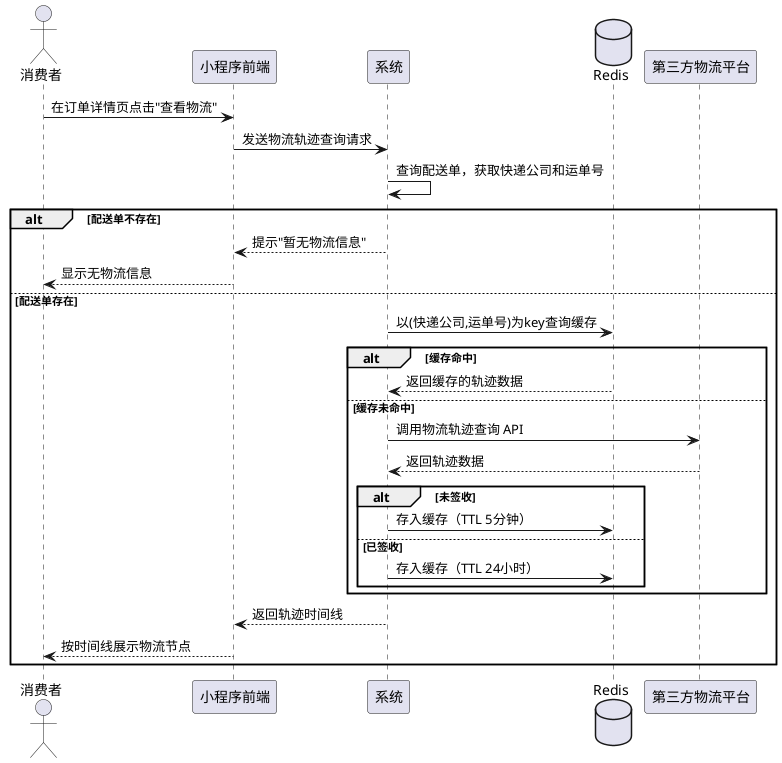

##### UC402：录入物流信息

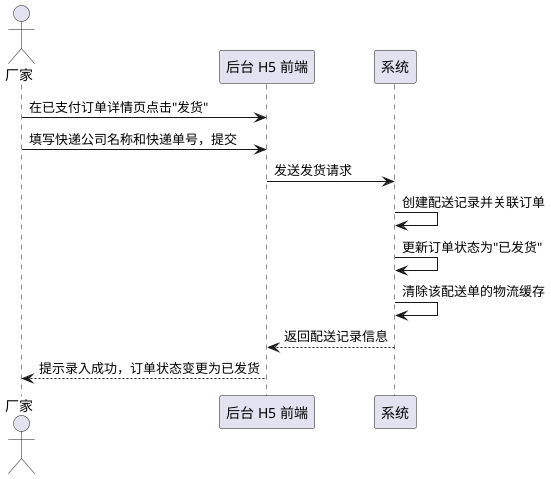

---

## 4. 非功能需求

### 4.1 性能

| 指标 | 要求 |
|:---|:---|
| 并发用户数 | 支持 500 并发用户（一期，单实例） |
| 列表类页面响应时间 | 95% 请求 ≤ 500ms |
| 下单/支付响应时间 | ≤ 2s |
| 支付回调处理 | ≤ 1s（防止微信重试） |
| 小程序页面首屏加载 | ≤ 2s（4G 网络） |

### 4.2 安全

| 类型 | 要求 |
|:---|:---|
| 认证 | 所有非公开功能必须携带有效登录凭证；越权请求被拒绝 |
| 敏感数据加密 | 微信唯一标识、手机号加密存储，日志中不出现明文 |
| 支付防重复 | 同一笔支付通知只处理一次，不产生重复状态变更 |
| 库存防超卖 | 高并发下单同一规格时，扣减数量不超过库存量，不出现超卖 |
| 数据注入防护 | 所有数据操作使用参数化查询，禁止拼接字符串 |
| 跨站脚本防护 | 用户输入的内容在显示时做转义处理 |
| 支付通知验签 | 收到微信支付通知后，先验证签名再处理业务逻辑 |

### 4.3 可用性

| 指标 | 要求 |
|:---|:---|
| 系统可用性 | ≥ 99.5%（按月统计） |
| 故障恢复 | 服务宕机后自动重启，数据库数据持久化不丢失 |

### 4.4 可维护性

| 要求 | 说明 |
|:---|:---|
| 操作日志 | 关键操作（订单状态变更、退款审核、库存修改）记录操作人和时间 |
| 删除标记 | 数据不真正删除，保留审计追踪能力 |
| 身份溯源 | 日志可追溯到具体用户 |

### 4.5 兼容性

| 类型 | 要求 |
|:---|:---|
| 消费者端 | 微信小程序（最新版本及前两个大版本） |
| 管理端浏览器 | Chrome / Edge / Safari 最新两个版本 |
| 管理端移动端 | H5 响应式适配，支持添加到手机桌面 |

---

## 5. 其他需求

### 5.1 合规性

- 符合《网络安全法》关于用户数据保护的要求
- 用户手机号等个人信息需加密存储，不得明文落盘
- 微信支付相关场景需遵守《微信支付商户平台服务协议》

### 5.2 部署约束

- 开发环境：Docker Compose 单机部署
- 生产环境：云服务器，HTTPS 域名

### 5.3 国际化

- 一期仅支持简体中文

### 5.4 数据保留

- 业务数据：长期保留，不做自动清理（已删除的数据除外）
- 日志数据：保留 30 天滚动覆盖
- 已删除数据：定期清理周期 ≥ 90 天

---

## 附录

### 附录 A：术语表

| 术语 | 说明 |
|:---|:---|
| SRS | 软件需求规格说明书 |
| SKU | 库存量单位，此处指商品规格 |
| openid | 微信用户在小程序中的唯一标识 |
| JSAPI | 微信小程序内唤起支付的方式 |
| PWA | 可将 H5 网页安装到手机桌面的技术 |
| UAT | 用户验收测试 |

### 附录 B：变更记录

| 版本 | 日期 | 修改人 | 说明 |
|:---|:---|:---|:---|
| v1.0 | 2026-04-27 | opencode | 初稿，基于 15 轮 QA 调研 |
| v1.1 | 2026-04-28 | opencode | 修正：新增退款单和配送单，库存扣减方案调整 |
| v2.0 | 2026-04-30 | opencode | 按 SRS 标准模板重构 |
| v2.1 | 2026-05-01 | opencode | 甲方批阅修正：删除排序筛选；关键字搜索后端保留前端留至第四期；第二件打折延至第四期 |
| v2.2 | 2026-05-01 | opencode | 用户中心重构：拆分角色为消费者/厂家/管理员三级 |
| v2.3 | 2026-05-01 | opencode | 删除验收标准；功能描述表格统一格式 |
| v2.4 | 2026-05-01 | opencode | 登录方式拆分：消费者微信登入 + 厂家/管理员账号密码登入 |
| v2.5 | 2026-05-01 | opencode | 统一用例编号 |
| v2.6 | 2026-05-02 | opencode | SRS 审查修正：UC103 typo、登录简化、权限修正、融合用例描述 |
| **v3.0** | **2026-05-02** | **opencode** | **甲方批阅修正：UC105 条件反写；UC106 补查列表；3.2 删前端分类/搜索、商品平铺；JWT 去 role；ADMIN 权限缩小** |
| **v4.0** | **2026-05-02** | **opencode** | **SRS 去技术化 + 新增交互模型：删除接口需求（第 5 章）和数据需求（第 6 章），移至概要设计；用例交互动作中的 API 路径改为自然语言描述；2.6 约束条件去技术化；新增 3.1.4（UC101/UC103 登录序列）、3.2.5（UC202 商品上下架活动图）、3.3.5（UC303 下单支付序列 + UC309 退款审核序列）、3.4.5（UC401 物流轨迹序列）交互模型** |

---

> **文档版本**：v4.2
> **编写日期**：2026-05-02
> **编写人**：opencode
