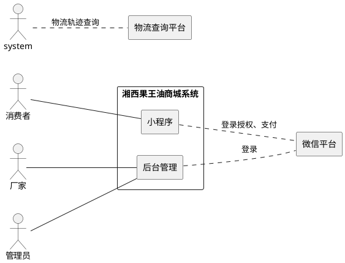
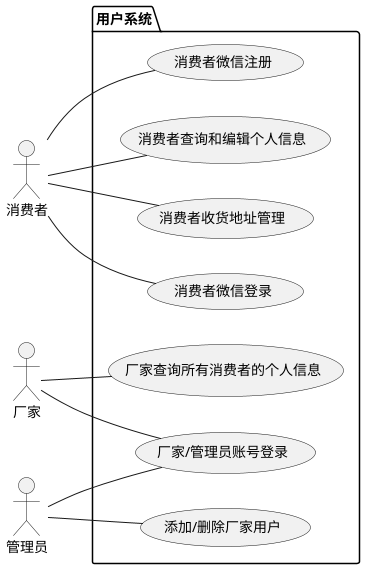

# 软件需求规格说明书（一期）

## 湘西果王油商城系统

---

## 1. 引言

### 1.1 编写目的

本文档为「湘西果王油商城系统」第一期的软件需求规格说明书（Software Requirements Specification,
SRS），旨在完整、清晰、可验证地定义系统的功能需求与非功能需求，作为后续概要设计、详细设计、开发、测试、验收的统一依据，确保项目干系人对系统行为达成共识。

**目标读者**：

- 项目负责人（甲方 lonG）：把控需求范围和验收基准
- 开发人员：理解功能细节和接口规范
- 测试人员：据此编写测试用例和验收方案

### 1.2 范围

本文档覆盖第一期「交易闭环」的完整范围：

- **用户中心**：微信授权登录、个人信息管理、收货地址管理
- **商品与分类**：树形分类浏览、商品列表/详情、后台商品和分类管理
- **订单系统**：立即购买、订单创建与库存锁定、微信支付、订单状态流转、退款申请与审核
- **物流查询**：发货录入物流单号、买家查询物流轨迹

**本期不包含**：优惠、拼单、分销体系、佣金计算、Banner/公告、统计报表、第二件打折（第四期）。

### 1.3 定义、缩写和术语

| 术语     | 说明                                                  |
|:-------|:----------------------------------------------------|
| SRS    | 软件需求规格说明书（Software Requirements Specification）      |
| SKU    | 库存量单位（Stock Keeping Unit），此处指商品规格（如 500ml / 1000ml） |
| JWT    | JSON Web Token，用于无状态 API 认证                         |
| openid | 微信用户在小程序中的唯一标识                                      |
| JSAPI  | 微信支付 JSAPI 支付，小程序内唤起支付                              |
| PWA    | Progressive Web App，H5 管理端支持 manifest 安装            |
| UAT    | 用户验收测试（User Acceptance Testing）                     |

### 1.4 参考文献

| 文档                 | 说明                  |
|:-------------------|:--------------------|
| 《需求调研问答记录》         | 15 轮 QA 原始对话，业务决策记录 |
| 《湘西果王油软件开发可行性分析》   | 技术/时间/资源可行性自检       |
| ISO/IEC 25010:2011 | 系统与软件质量模型（参考）       |

### 1.5 文档结构

本文档按模块化结构组织，便于阅读与追踪：

- 第 1 章：引言
- 第 2 章：总体描述
- 第 3 章：功能需求
- 第 4 章：非功能需求
- 第 5 章：其他需求
- 第 6 章：附录

---

## 2. 总体描述

### 2.1 产品愿景

湘西果王油是一款面向重视健康的中产家庭的健康食品（食品类别销售）。本项目旨在开发一套支持自营电商及多级分销体系的小程序商城系统，帮助厂家完成商品展示、在线交易、订单管理、分销结算等核心业务流程。

第一期目标：构建稳定、高效、安全的纯交易闭环，实现浏览 → 下单 → 支付 → 发货 → 收货的完整流程。

### 2.2 项目分期

| 分期  | 主题          | 目标                            |
|:----|:------------|:------------------------------|
| 第一期 | 交易闭环        | 单人完成浏览→下单→支付→发货→收货全流程         |
| 第二期 | 内容运营 + 分销基础 | Banner/公告管理、分享裂变、关系绑定         |
| 第三期 | 完整分销体系      | 等级晋升、佣金引擎、提现审核                |
| 第四期 | 统计与增强       | 报表、多支付方式记录、物流轨迹聚合、关键字搜索、第二件打折 |

### 2.3 用户特征

| 用户类型 | 技能水平        | 使用频率         | 设备                                     | 核心关注点            |
|:-----|:------------|:-------------|:---------------------------------------|:-----------------|
| 消费者  | 普通微信用户，无需培训 | 偶尔（每周 1-2 次） | 手机（微信小程序）                              | 浏览流畅、下单快、物流可见    |
| 厂家   | 需基础培训（后台操作） | 日常（每日）       | PC 网页 + 移动端 H5（响应式，支持 PWA manifest 安装） | 订单处理效率、库存准确、退款审核 |
| 管理员  | 基本运维基础      | 按需（不定期）      | PC 网页 + 移动端 H5（响应式，支持 PWA manifest 安装） | 添加或删除厂家用户        |

> 注：第一期不实现分销商等级体系，所有已购买用户统称为「客户」，无前台等级区分。

### 2.4 系统概览图



### 2.5 假设与依赖

| 类型 | 条目                                  |
|:---|:------------------------------------|
| 依赖 | 微信开放平台登录授权功能稳定可用        |
| 依赖 | 微信支付 JSAPI 功能可用，商户号已开通     |
| 依赖 | 第三方物流聚合平台（快递100/快递鸟）稳定返回轨迹      |
| 依赖 | 服务器可访问公网（HTTPS），域名已备案           |
| 假设 | 用户持有安装微信的手机，且微信版本支持小程序              |
| 假设 | 管理员使用 Chrome / Edge / Safari 最新两个版本 |
| 假设 | 网络延迟：小程序端 ≤ 500ms，管理端 ≤ 200ms       |

### 2.6 约束条件

- **登录策略**：首次进入小程序无需登录，可浏览商品。当访问需登录的页面时，系统提示用户先登录。触发登录引导的时机由各业务模块的前端逻辑承担。
- **模块职责边界**：用户模块只处理认证授权交互本身，不承担"何时触发登录流程"的决策。
- **消费者登录**：小程序端使用微信授权登录，不需要账号密码。
- **厂家/管理员登录**：后台管理端使用账号 + 密码登录。账号由管理员创建。
- **支付渠道**：仅微信支付。一期退款为"审核通过即完成"，实际资金退款由厂家线下操作，第四期接入微信自动退款。
- **"无条件仅退款"政策**：公司允许购买并体验后无条件仅退款（每人限一次），一期不实现风控机制。二期通过实名认证接口实现同一个人仅享一次。该条款写入用户协议。
- **权限管控**：不同角色只能访问各自权限范围内的功能，越权操作会被系统拒绝。
- **删除标记**：所有需要删除的数据不真正物理删除，改为"标记已删除"，数据保留备查。
- **通信安全**：所有网络通信使用加密传输。

---

## 3. 功能需求

### 3.1 模块一：用户中心

#### 3.1.1 功能描述

| 编号    | 用例名称                       | 角色         | 用例描述                 |  
|:------|:---------------------------|------------|:---------------------|
| UC101 | 消费者微信登录                   | 消费者        | 在微信小程序中通过微信授权登录系统                                                        |
| UC102 | 消费者微信注册                   | 消费者        | 通过微信授权注册为新用户                                                               |
| UC103 | 厂家/管理员账号登录               | 厂家、管理员      | 在 H5 后台通过账号+密码登录系统                                                    |
| UC104 | 添加/删除厂家用户                | 管理员        | 添加或删除厂家用户账号                                                                |
| UC105 | 消费者查询和编辑个人信息              | 消费者        | 查询和编辑个人信息（昵称、头像、手机号）                                                     |
| UC106 | 消费者收货地址管理（新增、编辑、删除、设默认） | 消费者        | 新增、编辑、删除收货地址，设置默认地址                                                      |
| UC107 | 厂家查询所有消费者的个人信息           | 厂家         | 查询所有消费者的基本信息                                                              | 

### 3.1.2 业务流程



### 3.1.3 业务流程描述

##### UC101：消费者微信登录

| 属性 | 内容 |
|:---|:---|
| **用例名** | 消费者微信登录 |
| **用例标示** | UC101 |
| **主要执行者** | 消费者 |
| **目标** | 通过微信授权登录系统以获取操作权限 |
| **范围** | 湘西果王油微信小程序 |
| **前置条件** | 消费者持有安装微信的手机，微信版本支持小程序 |

**交互动作**：

1. **消费者** 进入微信授权登录页面
2. **消费者** 确认微信授权（静默授权 + 手机号授权）
3. **前端** 调用微信接口获取临时凭证，调用系统登录接口
4. **系统** 联系微信平台验证临时凭证，获取用户的微信唯一标识
5. **系统** 根据微信标识查询用户：
   1. 用户已存在 → 直接生成登录凭证
   2. 用户不存在 → 自动创建用户记录（见 UC102）
6. **系统** 生成登录凭证
7. **系统** 返回登录凭证和用户信息
8. **前端** 存储登录凭证 → 后续请求携带此凭证 → **登录成功**

---

##### UC103：厂家/管理员账号登录

| 属性 | 内容 |
|:---|:---|
| **用例名** | 厂家/管理员账号登录 |
| **用例标示** | UC103 |
| **主要执行者** | 厂家、管理员 |
| **目标** | 通过合法身份登录系统以获取操作权限 |
| **范围** | 湘西果王油后台管理 H5 软件 |
| **前置条件** | 管理员已在后台创建厂家用户账号或管理员账号；用户使用 Chrome/Edge/Safari 最新两个版本 |

**交互动作**：

1. **用户** 访问后台管理页面
2. **系统** 检测未登录 → 跳转到登录页面
3. **用户** 输入账号和密码
4. **系统** 验证输入格式的合法性：
   1. 如账号或密码为空 → 提示"请输入账号和密码"并要求重新输入，转到 3
5. **系统** 验证账号和密码的正确性：
   1. 如账号不存在 → 提示"账号或密码错误"，记录一次失败，转到 3
   2. 如密码错误：
      - 如连续失败次数 < 3 → 提示"账号或密码错误"，记录一次失败，转到 3
      - 如连续失败次数 ≥ 3 → 锁定账号 15 分钟，提示"账号已锁定，请 15 分钟后重试"，**终止**
   3. 如账号已锁定 → 提示"账号已锁定，请稍后重试"，**终止**
6. **系统** 验证通过 → 重置失败计数和锁定状态 → 生成登录凭证
7. **系统** 返回登录凭证和用户信息 → **登录成功**

**补充规则**：
- 连续失败 3 次后锁定 15 分钟，期间无法登录。15 分钟后自动恢复可登录状态
- 如遗忘密码，需联系管理员重置密码（见 UC104）


### 3.2 模块二：商品与分类

#### 3.2.1 功能描述

| 编号    | 用例名称     | 角色  | 用例描述                                                                |
|:------|:---------|:----|:--------------------------------------------------------------------|
| UC201 | 查看商品详情   | 消费者 | 查看商品轮播图、富文本描述、所有规格（名称/价格/库存），仅展示已上架商品                               |
| UC202 | 商品管理     | 厂家  | 在后台对商品进行增删改查、上下架管理，上架后消费者端可见，下架后数据保留                                |
| UC203 | 分类管理     | 厂家  | 对分类进行增删改查管理（树形结构，无限层级），删除分类前校验其下无商品                                |

#### 3.2.2 业务规则

- **分类规则**：分类采用树形结构，可无限级扩展。**商品只能挂在叶子分类（最末级分类）下**。分类管理仅后台厂家使用，消费者前端不展示分类树。
- **商品状态**：`DRAFT`（草稿）→ `ENABLED`（已上架）→ `DISABLED`（已下架）。消费者端仅展示 `ENABLED` 状态的商品。
- **商品列表**：消费者端首页直接展示所有已上架商品，按上架时间倒序排列，不分页（一期商品数量少）。
- **库存管理**：厂家可在后台查看 SKU 库存列表，支持低库存筛选，修改库存后缓存同步更新。

---

### 3.3 模块三：订单系统

#### 3.3.1 功能描述

| 编号    | 用例名称      | 角色  | 用例描述                                                                                             |
|:------|:----------|:----|:-------------------------------------------------------------------------------------------------|
| UC301 | 进入订单确认页   | 消费者 | 在商品详情页选择规格和数量后点击购买，进入订单确认页查看商品信息、总价、选择收货地址，地址可切换和新增                                      |
| UC302 | 确认页调整数量   | 消费者 | 在确认页修改购买数量，数量实时计算总价（单价 × 数量）；一期无折扣，实际支付金额 = 总价                               |
| UC303 | 创建订单并支付   | 消费者 | 点击支付按钮后创建订单（状态=待支付），系统调用微信支付，支付成功后状态变更为已支付                             |
| UC304 | 查看订单列表与详情 | 消费者 | 订单列表分页，支持按状态筛选；详情页展示商品明细、收货地址快照、金额拆解、当前状态                                             |
| UC305 | 确认收货      | 消费者 | 收到货后确认收货，完成交易，状态变更为已完成                                                                    |
| UC306 | 申请退款      | 消费者 | 提交退款申请（商品有问题），查看审核结果；审核通过状态变更为已退款，审核拒绝恢复原状态                                                |
| UC307 | 后台订单管理    | 厂家  | 在后台查看所有订单，按状态筛选、按订单号搜索；可进行发货和退款审核操作                                                       |
| UC308 | 发货操作      | 厂家  | 对已支付订单进行发货操作（填写物流公司和单号），创建配送记录，订单状态变更为已发货                                  |
| UC309 | 退款审核      | 厂家  | 审核买家的退款申请，同意或拒绝                                                             |

#### 3.3.2 业务流程

```
浏览商品 → 选择规格/数量 → 点击「立即购买」
   → 订单确认页（展示商品、数量、总价、地址）
   → 用户点击「去支付」
       → 系统创建订单，锁定相关规格库存
       → 调用微信支付
       → 返回支付参数给前端
   → 用户支付（微信支付弹窗）
   → 支付成功 → 订单状态变更为「已支付」
   → 管理员在后台发货 → 状态变更为「已发货」
   → 用户确认收货 → 状态变更为「已完成」
    → （可选）用户申请退款 → 管理员审核 → 退/拒
```

**补充规则 — 回调丢失兜底**：
- 如微信支付回调因网络原因丢失，前端在用户支付成功跳转后，每 5 秒轮询订单状态，持续最多 2 分钟
- 如 2 分钟内状态仍为"待支付"，前端提示"支付遇到延迟，请联系客服确认"
- 后端保留补单接口，供客服手动确认订单并变更状态

#### 3.3.3 订单状态流转

```
待支付 ──(30分钟超时)──→ 已取消
待支付 ──(支付成功)──→ 已支付
已支付 ──(发货)──────→ 已发货
已发货 ──(确认收货)──→ 已完成
已支付 ──(申请退款)──→ 退款中
已发货 ──(申请退款)──→ 退款中
退款中 ──(审核通过)──→ 已退款
退款中 ──(审核拒绝)──→ 恢复原状态（已支付 / 已发货）
```

**超时取消规则**：超时取消仅作用于 status = 待支付的订单。退款中、已支付等状态的订单不参与超时取消。

### 3.4 模块四：物流查询

#### 3.4.1 功能描述

| 编号    | 用例名称    | 角色  | 用例描述                                                                  |
|:------|:--------|:----|:----------------------------------------------------------------------|
| UC401 | 查询物流轨迹  | 消费者 | 在订单详情页查看物流轨迹（时间线格式 `[{time, status, location}]`），调用第三方物流平台 API          |
| UC402 | 录入物流信息  | 厂家  | 发货时录入快递公司 + 快递单号，创建 `delivery_orders` 记录，订单状态同步变更为已发货                     |

#### 3.4.2 业务规则

- 物流轨迹查询结果缓存到 Redis，TTL 5 分钟（已签收轨迹缓存 24 小时）。
- 管理员发货后主动清除对应配送单的物流缓存。
- 一期仅支持单个快递单号的轨迹查询，不聚合多个包裹。

---

## 4. 非功能需求

### 4.1 性能

| 指标              | 要求                           |
|:----------------|:-----------------------------|
| 并发用户数           | 支持 500 并发用户（一期，单实例）          |
| 列表类页面响应时间   | 95% 请求 ≤ 500ms               |
| 下单/支付响应时间 | ≤ 2s                         |
| 支付回调处理        | ≤ 1s（防止微信重试） |
| 小程序页面首屏加载       | ≤ 2s（4G 网络）                  |

### 4.2 安全

| 类型           | 要求                                                          |
|:-------------|:------------------------------------------------------------|
| **认证**       | 所有非公开功能必须携带有效登录凭证；越权请求被拒绝                             |
| **敏感数据加密**   | 微信唯一标识、手机号加密存储，日志中不出现明文               |
| **支付防重复**     | 同一笔支付通知只处理一次，不产生重复状态变更 |
| **库存防超卖**   | 高并发下单同一规格时，扣减数量不超过库存量，不出现超卖                                 |
| **数据注入防护** | 所有数据操作使用参数化查询，禁止拼接字符串                             |
| **跨站脚本防护**   | 用户输入的内容在显示时做转义处理                            |
| **支付通知验签**   | 收到微信支付通知后，先验证签名再处理业务逻辑                                      |

### 4.3 可用性

| 指标    | 要求                                                                  |
|:------|:--------------------------------------------------------------------|
| 系统可用性 | ≥ 99.5%（按月统计）                                       |
| 故障恢复  | 服务宕机后自动重启，数据库数据持久化不丢失 |

### 4.4 可维护性

| 要求   | 说明                                        |
|:-----|:------------------------------------------|
| 操作日志 | 关键操作（订单状态变更、退款审核、库存修改）记录操作人和时间           |
| 删除标记  | 所有数据不真正删除，保留审计追踪能力                        |
| 身份溯源 | 日志可追溯到具体用户 |

### 4.5 兼容性

| 类型     | 要求                            |
|:-------|:------------------------------|
| 消费者端   | 微信小程序（最新版本及前两个大版本）          |
| 管理端浏览器 | Chrome / Edge / Safari 最新两个版本 |
| 管理端移动端 | H5 响应式适配，支持添加到手机桌面   |

---

## 5. 其他需求

### 5.1 合规性

- 符合《网络安全法》关于用户数据保护的要求
- 用户手机号等个人信息需加密存储，不得明文落盘
- 微信支付相关场景需遵守《微信支付商户平台服务协议》

### 5.2 部署约束

- 开发环境：Docker Compose 单机部署
- 生产环境：云服务器，HTTPS 域名

### 5.3 国际化

- 一期仅支持简体中文

### 5.4 数据保留

- 业务数据：长期保留，不做自动清理
- 日志数据：保留 30 天滚动覆盖
- 已删除数据：定期清理周期 ≥ 90 天

---

## 6. 附录

### 附录 A：术语表

| 术语     | 说明                                        |
|:-------|:------------------------------------------|
| SRS    | 软件需求规格说明书                                 |
| SKU    | 库存量单位，此处指商品规格                             |
| openid | 微信用户在小程序中的唯一标识 |
| JSAPI  | 微信小程序内唤起支付的方式                           |
| PWA    | 可将 H5 网页安装到手机桌面的技术 |
| UAT    | 用户验收测试                                    |

### 附录 B：PlantUML 图索引

| 文件                                    | 说明        |
|:--------------------------------------|:----------|
| `docs/diagrams/use-case.puml`         | 用例图       |
| `docs/diagrams/order-state.puml`      | 订单状态机     |
| `docs/diagrams/class.puml`            | 核心数据实体关系图 |
| `docs/diagrams/order-flow.puml`       | 购买流程活动图   |
| `docs/diagrams/payment-sequence.puml` | 支付序列图     |

### 附录 C：变更记录

| 版本   | 日期         | 修改人      | 说明                                                                                           |
|:-----|:-----------|:---------|:---------------------------------------------------------------------------------------------|
| v1.0 | 2026-04-27 | opencode | 初稿，基于 15 轮 QA 调研                                                                             |
| v1.1 | 2026-04-28 | opencode | 修正：新增 return_orders / delivery_orders 表，库存扣减方案调整，API 路径修正                                    |
| v2.0 | 2026-04-30 | opencode | 按 SRS 标准模板重构：新增引言、总体描述、接口需求、数据需求、其他需求、验收标准章节；功能需求嵌入验收标准；移除技术栈（归属概要设计）                        |
| v2.1 | 2026-05-01 | opencode | 甲方批阅修正：删除排序筛选；关键字搜索后端保留接口、前端留至第四期；第二件打折延至第四期；金额拆解释义；相关数据字典、验收标准同步更新 |
| v2.2 | 2026-05-01 | opencode | 用户中心重构：拆分角色为消费者/厂家/管理员三级；UC101~UC106 重新编排；新增厂家用户管理 API；权限矩阵细化；role ENUM 扩展                   |
| v2.3 | 2026-05-01 | opencode | 删除验收标准：移除第 8 章验收标准总览及所有模块验收标准明细；3.2~3.4 功能描述表格对齐 3.1 格式（编号/用例名称/角色/用例描述）；后台管理操作角色从管理员修正为厂家 |
| v2.4 | 2026-05-01 | opencode | 登录方式拆分：消费者微信授权登录（UC101）+ 厂家/管理员账号密码登录（UC103）；users 表新增 username、password_hash、login_attempts、locked_until 字段；新增 /api/auth/login 接口及 1003/1004 错误码 |
| v2.5 | 2026-05-01 | opencode | 统一用例编号：PR-01~05 → UC201~205、OR-01~09 → UC301~309、LO-01~02 → UC401~402 |
| **v5.0** | **2026-05-02** | **opencode** | **SRS 去技术化重构：删除第 5 章接口需求和第 6 章数据需求；2.6 约束条件/2.4 系统图/4.2 安全/附录术语去技术化；3.3 补充回调丢失轮询兜底和超时取消规则；3.3.3 更名为"订单状态流转"并补充退款中免超时说明；术语统一（登入→登录、优惠→折扣）** |

---

> **文档版本**：v5.0
> **编写日期**：2026-05-02
> **编写人**：opencode
> **审核人**：lonG（甲方，待审核）
