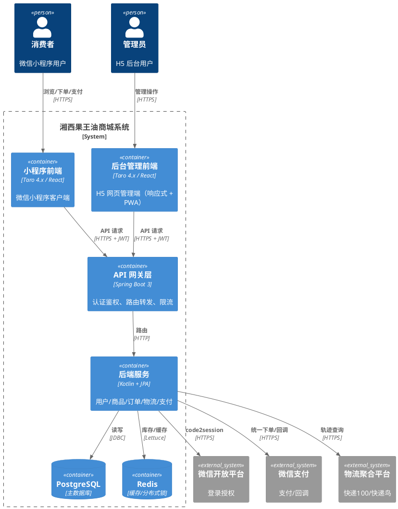
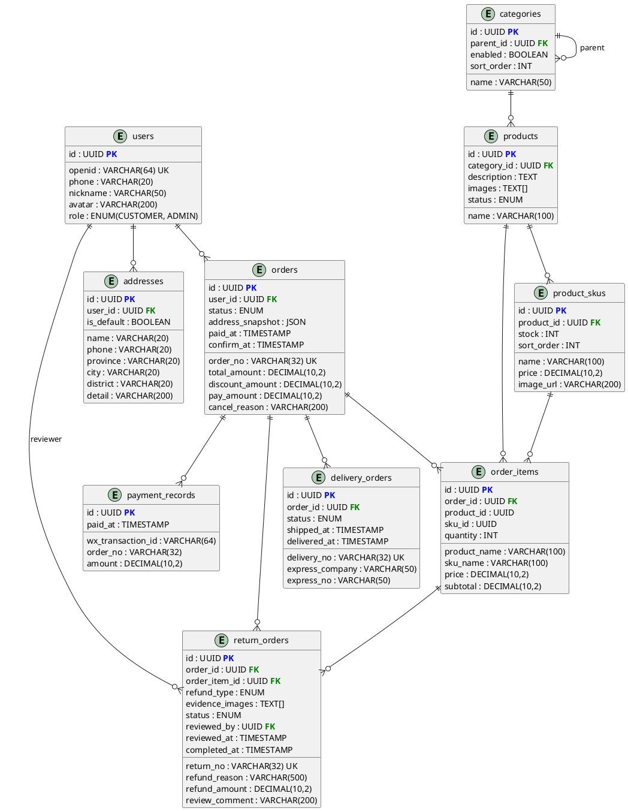

# 软件需求规格说明书（一期）

## 湘西果王油商城系统

---

## 1. 引言

### 1.1 编写目的

本文档为「湘西果王油商城系统」第一期的软件需求规格说明书（Software Requirements Specification, SRS），旨在完整、清晰、可验证地定义系统的功能需求与非功能需求，作为后续概要设计、详细设计、开发、测试、验收的统一依据，确保项目干系人对系统行为达成共识。

**目标读者**：

- 项目负责人（甲方 lonG）：把控需求范围和验收基准
- 开发人员：理解功能细节和接口规范
- 测试人员：据此编写测试用例和验收方案

### 1.2 范围

本文档覆盖第一期「交易闭环」的完整范围：

- **用户中心**：微信授权登录、个人信息管理、收货地址管理
- **商品与分类**：树形分类浏览、商品列表/详情、后台商品和分类管理
- **订单系统**：立即购买、订单创建与库存锁定、微信支付、订单状态流转、退款申请与审核
- **物流查询**：发货录入物流单号、买家查询物流轨迹

**本期不包含**：购物车、拼单、分销体系、佣金计算、Banner/公告、统计报表。

### 1.3 定义、缩写和术语

| 术语 | 说明 |
|:---|:---|
| SRS | 软件需求规格说明书（Software Requirements Specification） |
| SKU | 库存量单位（Stock Keeping Unit），此处指商品规格（如 500ml / 1000ml） |
| JWT | JSON Web Token，用于无状态 API 认证 |
| openid | 微信用户在小程序中的唯一标识 |
| JSAPI | 微信支付 JSAPI 支付，小程序内唤起支付 |
| PWA | Progressive Web App，H5 管理端支持 manifest 安装 |
| UAT | 用户验收测试（User Acceptance Testing） |

### 1.4 参考文献

| 文档 | 说明 |
|:---|:---|
| 《需求调研问答记录》 | 15 轮 QA 原始对话，业务决策记录 |
| 《湘西果王油软件开发可行性分析》 | 技术/时间/资源可行性自检 |
| `CONVENTIONS.md` | 编码规范（命名、提交、JPA、API 响应、Kotlin 风格） |
| `ARCHITECTURE.md` | 分层架构、模块划分、数据流、安全设计 |
| `docs/diagrams/class.puml` | 核心数据实体关系图 |
| `docs/diagrams/use-case.puml` | 用例图 |
| `docs/diagrams/order-state.puml` | 订单状态机 |
| `docs/diagrams/order-flow.puml` | 购买流程活动图 |
| `docs/diagrams/payment-sequence.puml` | 支付序列图 |
| ISO/IEC 25010:2011 | 系统与软件质量模型（参考） |

### 1.5 文档结构

本文档按模块化结构组织，便于阅读与追踪：

- 第 1 章：引言
- 第 2 章：总体描述
- 第 3 章：功能需求（每个模块包含验收标准）
- 第 4 章：非功能需求
- 第 5 章：接口需求
- 第 6 章：数据需求
- 第 7 章：其他需求
- 第 8 章：验收标准（总览汇总）
- 第 9 章：附录

---

## 2. 总体描述

### 2.1 产品愿景

湘西果王油是一款面向重视健康的中产家庭的健康食品（食品类别销售）。本项目旨在开发一套支持自营电商及多级分销体系的小程序商城系统，帮助厂家完成商品展示、在线交易、订单管理、分销结算等核心业务流程。

第一期目标：构建稳定、高效、安全的纯交易闭环，实现浏览 → 下单 → 支付 → 发货 → 收货的完整流程。

### 2.2 项目分期

| 分期 | 主题 | 目标 |
|:---|:---|:---|
| 第一期 | 交易闭环 | 单人完成浏览→下单→支付→发货→收货全流程 |
| 第二期 | 内容运营 + 分销基础 | Banner/公告管理、分享裂变、关系绑定 |
| 第三期 | 完整分销体系 | 等级晋升、佣金引擎、提现审核 |
| 第四期 | 统计与增强 | 报表、多支付方式记录、物流轨迹聚合 |

### 2.3 用户特征

| 用户类型 | 技能水平 | 使用频率 | 设备 | 核心关注点 |
|:---|:---|:---|:---|:---|
| 消费者 | 普通微信用户，无需培训 | 偶尔（每周 1-2 次） | 手机（微信小程序） | 浏览流畅、下单快、物流可见 |
| 厂家/管理员 | 需基础培训（后台操作） | 日常（每日） | PC 网页 + 移动端 H5（响应式，支持 PWA manifest 安装） | 订单处理效率、库存准确、退款审核 |

> 注：第一期不实现分销商等级体系，所有已购买用户统称为「客户」，无前台等级区分。

### 2.4 系统上下文图



### 2.5 假设与依赖

| 类型 | 条目 |
|:---|:---|
| 依赖 | 微信开放平台 API（code2session）稳定可用 |
| 依赖 | 微信支付 JSAPI 统一下单 + 回调通知可用，商户号已开通 |
| 依赖 | 第三方物流聚合平台（快递100/快递鸟）API 稳定返回轨迹 |
| 依赖 | 生产环境服务端可访问公网（HTTPS），域名已备案 |
| 假设 | 用户持有安装微信的手机，且微信版本支持小程序 |
| 假设 | 管理员使用 Chrome / Edge / Safari 最新两个版本 |
| 假设 | 网络延迟：小程序端 ≤ 500ms，管理端 ≤ 200ms |

### 2.6 约束条件

- **登录策略**：首次进入小程序无需登录，可浏览商品和分类。当访问需登录/授权的页面时，后端返回 401，前端检测后引导用户进行微信授权登录。
- **登录方式**：仅微信静默授权 + 手机号授权，不支持账号密码注册登录。
- **支付渠道**：仅微信支付（JSAPI）。
- **权限管控**：后端基于 Spring Security 做接口级权限校验，返回标准 HTTP 状态码与错误码，前端根据响应码控制页面跳转或展示登录引导。
- **软删除**：所有数据表均不执行物理 DELETE 操作，统一使用 `is_deleted BOOLEAN DEFAULT FALSE` 标记删除状态。删除操作仅将标记设为 true，数据保留以供后续审计和恢复。
- **通信安全**：所有外部通信必须使用 HTTPS。

---

## 3. 功能需求

### 3.1 模块一：用户中心

#### 3.1.1 功能描述

| 编号 | 角色 | 用户故事 | 验收标准 |
|:---|:---|:---|:---|
| UC-01 | 消费者 | 通过微信授权登录，获得完整的购物体验 | 调用微信 code2session 接口，系统创建/绑定用户账号，生成 JWT 并返回，后续请求携带 JWT 可访问需登录的接口 |
| UC-02 | 消费者 | 查看和编辑个人信息（昵称、头像、手机号） | `GET /api/user/me` 返回当前用户信息；`PUT /api/user/me` 支持更新昵称和头像，手机号仅可从微信授权获取 |
| UC-03 | 消费者 | 新增、编辑、删除收货地址，设置默认地址 | 地址 CRUD 接口完整可用，默认地址唯一约束（设置新默认时旧默认自动取消），最多 20 个地址 |
| UC-04 | 管理员 | 在后台查看注册用户列表 | `GET /api/admin/users` 返回分页用户列表，支持按手机号搜索 |

#### 3.1.2 验收标准明细

- **UC-01**：未登录访问需登录接口 → 返回 401；微信授权后获取 JWT → 携带 token 可正常访问
- **UC-02**：更新个人信息后 `GET /api/user/me` 返回最新数据
- **UC-03**：新建地址 → 列表中出现新地址；删除地址 → 列表中消失（软删除）；设置默认 → `GET /api/addresses` 返回的列表中仅一个 `is_default=true`
- **UC-04**：管理员登录后可访问 `/api/admin/users`，普通用户返回 403

---

### 3.2 模块二：商品与分类

#### 3.2.1 功能描述

| 编号 | 角色 | 用户故事 | 验收标准                                                    |
|:---|:---|:---|:--------------------------------------------------------|
| PR-01 | 消费者 | 在首页按分类浏览商品，快速找到目标商品 | 展示树形分类列表，点击进入该分类下的商品列表                                  |
| PR-02 | 消费者 | 查看商品详情（轮播图、描述、规格、价格） | 商品详情页展示轮播图、富文本描述、所有规格（名称/价格/库存）、商品状态仅展示已上架              |
| PR-03 | 消费者 | 按销量或价格筛选排序 | 商品列表支持 `sort=price,asc` / `sort=sales,desc` 等排序参数       |
| PR-04 | 消费者 | 按关键字搜索商品 | 商品列表支持 `keyword` 参数，匹配商品名称和描述                           |
| PR-05 | 管理员 | 在后台对商品进行增删改查、上下架管理 | 后台商品 CRUD 完整；上架后商品在消费者端可见,下架后不可见但数据保留                   |
| PR-06 | 管理员 | 对分类进行增删改查管理（树形结构） | 后台分类 CRUD 支持无限层级；删除分类前校验其下无商品；分类树结构通过 `parent_id` 自引用实现 |

#### 3.2.2 业务规则

- **分类规则**：分类采用树形结构，可无限级扩展。**商品只能挂在叶子分类（最末级分类）下**。
- **商品状态**：`DRAFT`（草稿）→ `ENABLED`（已上架）→ `DISABLED`（已下架）。消费者端仅展示 `ENABLED` 状态的商品。
- **库存管理**：管理员可在后台查看 SKU 库存列表，支持低库存筛选，修改库存后 Redis 缓存同步更新。

#### 3.2.3 验收标准明细

- **PR-01**：`GET /api/categories` 返回树形 JSON；展开任意分类能看到其子分类和商品数量
- **PR-02**：已下架的商品 `GET /api/products/{id}` 仍返回数据（可见），但在列表接口中不出现
- **PR-05**：上架操作 → `PATCH /api/products/{id}/enable` → 状态变为 ENABLED → 消费者端可见
- **PR-06**：删除有商品的分类 → 返回 400 错误码 `1002`，提示"该分类下存在商品，无法删除"

---

### 3.3 模块三：订单系统

#### 3.3.1 功能描述

| 编号 | 角色 | 用户故事 | 验收标准 |
|:---|:---|:---|:---|
| OR-01 | 消费者 | 在商品详情页选择规格和数量后点击购买，进入订单确认页查看商品信息、总价、选择收货地址 | 确认页展示商品名、规格名、数量、单价、优惠、总价、收货地址；地址可切换和新增 |
| OR-02 | 消费者 | 在确认页修改数量，并看到第二件打折的优惠计算，确认总价后点击支付 | 数量可调，优惠实时计算；最终 `pay_amount = total_amount - discount_amount` |
| OR-03 | 消费者 | 点击支付按钮后，系统创建订单并唤起微信支付，支付成功后跳转订单详情 | 点击后创建订单（状态=待支付），返回 JSAPI 支付参数，前端唤起支付弹窗，支付成功回调后状态变更为已支付 |
| OR-04 | 消费者 | 在订单列表中看到所有订单状态，并可查看详情 | 订单列表分页，支持按状态筛选；详情页展示商品明细、收货地址快照、金额拆解、当前状态 |
| OR-05 | 消费者 | 收到货后确认收货，完成交易 | 点击确认收货 → `POST /api/orders/{id}/confirm-receipt` → 状态变更为已完成 |
| OR-06 | 消费者 | 申请退款（商品有问题），并查看审核结果 | 提交退款申请 → 状态变更为退款中；管理员审核通过 → 状态变更为已退款；审核拒绝 → 恢复原状态 |
| OR-07 | 管理员 | 在后台查看所有订单，按状态筛选，处理发货和退款 | 订单列表支持按状态筛选、按订单号搜索；可进行发货和退款审核操作 |
| OR-08 | 管理员 | 对已支付订单进行发货操作（填写物流公司和单号） | 发货 → 创建 `delivery_orders` 记录 → 订单状态变更为已发货 → 买家可查物流 |
| OR-09 | 管理员 | 审核买家的退款申请，同意或拒绝 | 同意 → `POST /api/admin/returns/{id}/review` → 状态变更为已退款；拒绝 → 订单恢复原状态 |

#### 3.3.2 业务流程

```
浏览商品 → 选择规格/数量 → 点击「立即购买」
   → 订单确认页（展示商品、数量、总价、优惠、地址）
   → 用户点击「去支付」
       → 系统创建订单，Redis DECR 锁定相关 SKU 库存
       → 调用微信支付统一下单 API
       → 返回 JSAPI 支付参数给前端
   → 用户支付（微信支付弹窗）
   → 支付成功回调 → 订单状态变更为「已支付」
   → 管理员在后台发货 → 状态变更为「已发货」
   → 用户确认收货 → 状态变更为「已完成」
   → （可选）用户申请退款 → 管理员审核 → 退/拒
```

#### 3.3.3 订单状态机

```
待支付 ──(30分钟超时)──→ 已取消
待支付 ──(支付成功)──→ 已支付
已支付 ──(发货)──────→ 已发货
已发货 ──(确认收货)──→ 已完成
已支付 ──(申请退款)──→ 退款中
已发货 ──(申请退款)──→ 退款中
退款中 ──(审核通过)──→ 已退款
退款中 ──(审核拒绝)──→ 恢复原状态（已支付 / 已发货）
```

#### 3.3.4 优惠规则：第二件打折

- 第一期唯一优惠类型：同商品同规格第二件打折（折扣百分比可配置，例如 `second_item_discount = 0.8`，即第二件 8 折）。
- 折扣规则：第 2、4、6... 件享受折扣（`discountCount = quantity / 2`，整数除法下取整）。
- **不改 SKU 原价**：`order_items.price` 和 `order_items.subtotal` 始终快照 SKU 原价和原价小计。折扣金额集中存入 `orders.discount_amount`。
- 计算示例：SKU 原价 ¥100，第二件 8 折，用户购买 3 件：
  - `order_items.subtotal` = 3 × ¥100 = ¥300（原价小计）
  - `orders.discount_amount` = ¥20（第 2 件打折，¥100 × 20%）
  - `orders.pay_amount` = ¥280

#### 3.3.5 库存规则

- 订单创建时（点击支付按钮）即锁定对应 SKU 库存，使用 Redis `DECR` 原子扣减。
- DECR 后若库存 < 0（已透支），立即 `INCR` 回滚已扣减的 SKU，返回 HTTP 409。
- 支付超时（30 分钟）由定时任务自动取消订单，`INCR` 回滚库存。
- 事务提交失败时，`INCR` 回滚所有已扣减的 SKU 库存。

#### 3.3.6 验收标准明细

- **OR-01**：确认页价格计算与最终订单一致，不可多算/少算
- **OR-02**：数量调整为 0 或负数时前端拦截，后端返回 400
- **OR-03**：库存不足时返回 409；支付参数正确，微信弹窗可正常唤起
- **OR-05**：已发货状态才能确认收货，其他状态返回 400
- **OR-06**：待支付状态不可退款（整单未支付，超时会自动取消）；仅已支付/已发货可申请
- **OR-08**：仅已支付状态可发货；快递公司和单号均为必填
- **OR-09**：审核通过但订单状态非退款中 → 返回 409；幂等：重复审核同一退款单返回已有结果

---

### 3.4 模块四：物流查询

#### 3.4.1 功能描述

| 编号 | 角色 | 用户故事 | 验收标准 |
|:---|:---|:---|:---|
| LO-01 | 消费者 | 在订单详情页查看物流轨迹（时间线） | 调用第三方物流平台 API，返回时间线格式 `[{time, status, location}]` |
| LO-02 | 管理员 | 发货时录入快递公司 + 快递单号 | 创建 `delivery_orders` 记录，关联订单，订单状态同步变更为已发货 |

#### 3.4.2 业务规则

- 物流轨迹查询结果缓存到 Redis，TTL 5 分钟（已签收轨迹缓存 24 小时）。
- 管理员发货后主动清除对应配送单的物流缓存。
- 一期仅支持单个快递单号的轨迹查询，不聚合多个包裹。

#### 3.4.3 验收标准明细

- **LO-01**：无物流单号的订单查询物流 → 返回空列表或提示"暂无物流信息"
- **LO-02**：重复发货同一订单 → 返回 409，提示"该订单已有配送单"

---

## 4. 非功能需求

### 4.1 性能

| 指标 | 要求 |
|:---|:---|
| 并发用户数 | 支持 500 并发用户（一期，单实例） |
| API 响应时间（列表类） | 95% 请求 ≤ 500ms |
| API 响应时间（下单/支付） | ≤ 2s |
| 微信支付回调处理 | ≤ 1s 内返回 200 SUCCESS（防止微信重试） |
| 小程序页面首屏加载 | ≤ 2s（4G 网络） |

### 4.2 安全

| 类型 | 要求 |
|:---|:---|
| **认证** | 所有非公开 API 必须携带有效 JWT；越权请求返回 403 |
| **敏感数据加密** | openid、手机号使用 AES-256-CBC 加密存储，API 响应和日志中不出现明文 |
| **支付幂等** | 微信支付回调基于 `(wx_transaction_id, order_no)` 唯一约束，重复回调不产生重复状态变更 |
| **库存超卖防护** | 高并发下单同一 SKU 库存扣减数 = 订单数，无超卖 |
| **SQL 注入防护** | 所有数据库操作使用 JPA 参数化查询，禁止字符串拼接 SQL |
| **XSS 防护** | 后端输出 HTML 实体编码；前端使用 React 默认转义机制 |
| **CSRF** | 纯 JSON API + JWT Bearer 认证，天然免疫 CSRF |
| **支付回调验签** | 收到微信支付回调后，先校验签名再处理业务逻辑 |

### 4.3 可用性

| 指标 | 要求 |
|:---|:---|
| 系统可用性 | ≥ 99.5%（按月统计，一期单实例可接受计划内维护窗口） |
| 故障恢复 | 服务宕机后 Docker 自动重启（`restart: unless-stopped`），Redis/PostgreSQL 数据持久化 |

### 4.4 可维护性

| 要求 | 说明 |
|:---|:---|
| 操作日志 | 关键操作（订单状态变更、退款审核、库存修改）记录操作人和时间戳 |
| 软删除 | 所有数据不物理删除，保留审计追踪能力 |
| 身份溯源 | JWT 中包含 `sub`（user_id）和 `role`，日志可追溯到具体用户 |

### 4.5 兼容性

| 类型 | 要求 |
|:---|:---|
| 消费者端 | 微信小程序（微信最新版本及前两个大版本） |
| 管理端浏览器 | Chrome / Edge / Safari 最新两个版本 |
| 管理端移动端 | H5 响应式适配，支持 PWA manifest 安装 |

---

## 5. 接口需求

### 5.1 用户界面

- **消费者端**：微信小程序，移动端竖屏布局，遵循微信小程序设计规范。
- **管理端**：H5 网页，响应式设计（PC 端宽屏布局 + 移动端自适应折叠），支持 PWA manifest 添加到主屏幕。

### 5.2 软件接口

#### 5.2.1 统一规范

- **路径前缀**：所有 API 统一使用 `/api/` 前缀
- **资源命名**：复数名词，kebab-case（如 `/api/order-items`）
- **HTTP 方法**：
  - `GET`：查询（读）
  - `POST`：创建（写）
  - `PUT`：全量更新
  - `PATCH`：部分更新 / 状态变更
  - `DELETE`：软删除
- **管理端接口**：以 `/api/admin/` 为前缀

#### 5.2.2 统一响应格式

```json
{
  "code": 0,
  "message": "success",
  "data": { ... }
}
```

| 字段 | 类型 | 说明 |
|:---|:---|:---|
| code | Integer | 业务状态码，0 表示成功，非 0 表示错误 |
| message | String | 可读提示信息 |
| data | Object/Array/null | 响应数据体 |

**分页响应**：

```json
{
  "code": 0,
  "message": "success",
  "data": {
    "content": [...],
    "page": 0,
    "size": 10,
    "totalElements": 100,
    "totalPages": 10
  }
}
```

**分页通用参数**：

| 参数 | 类型 | 默认值 | 说明 |
|:---|:---|:---|:---|
| page | int | 0 | 页码，从 0 开始 |
| size | int | 10 | 每页条数，最大 100 |
| sort | string | "created_at,desc" | 格式 `field,direction` |

#### 5.2.3 错误码体系

| HTTP 状态码 | code | 含义 | 使用场景 |
|:---|:---|:---|:---|
| 200 | 0 | 成功 | 正常响应 |
| 400 | 1001 | 参数校验失败 | 请求体字段不符合约束 |
| 400 | 1002 | 业务规则校验失败 | 商品已下架、分类下有商品无法删除 |
| 401 | 2001 | 未登录 | 访问需登录接口但未携带有效 token |
| 401 | 2002 | token 过期 | JWT 过期，需重新登录 |
| 403 | 3001 | 无权限 | 非管理员访问后台接口 |
| 404 | 4001 | 资源不存在 | 订单/商品/用户不存在或已删除 |
| 409 | 5001 | 库存不足 | 下单时 SKU 库存不够 |
| 409 | 5002 | 支付冲突 | 重复支付回调 / 重复发货 |
| 500 | 9999 | 服务器内部错误 | 未预期的异常 |

#### 5.2.4 认证鉴权方案

```
首次访问小程序（无需登录）→ 浏览商品/分类
    ↓
访问需登录页面（下单/我的/地址等）
    ↓ 后端返回 401
前端检测 401 → 引导微信授权登录
    ↓
wx.login() 获取 code
    ↓
POST /api/auth/wx-login { code, phoneCode? }
    ↓
后端 code2session 换取 openid → 创建/查询用户 → 生成 JWT
    ↓
返回 { code: 0, data: { token, user } }
    ↓
前端存入 storage
    ↓
后续请求携带 Header: Authorization: Bearer <token>
    ↓
Spring Security JwtFilter 解析验证 → 注入 SecurityContext
```

**JWT 结构**：

```
Header: { "alg": "HS256", "typ": "JWT" }
Payload: { "sub": "<user_id>", "role": "CUSTOMER|ADMIN", "iat": ..., "exp": ... }
Signature: HMAC-SHA256(header + "." + payload, secret_key)
```

**角色权限矩阵**：

| 角色 | 可访问接口 |
|:---|:---|
| 匿名（未登录） | `/api/categories`（GET）、`/api/products`（GET）、`/api/auth/wx-login`、`/api/orders/wx-notify` |
| CUSTOMER | `/api/user/me`、`/api/addresses/**`、`/api/orders/**`（自己的订单）、`/api/deliveries/**` |
| ADMIN | `/api/admin/**`、`/api/products`（POST/PUT/PATCH） |

#### 5.2.5 API 接口清单

##### 用户中心模块

| 方法 | 路径 | 说明 | 权限 | 请求体 | 响应体 |
|:---|:---|:---|:---|:---|:---|
| POST | `/api/auth/wx-login` | 微信登录 | 公开 | `{ code, encryptedData?, iv? }` | `{ token, user }` |
| GET | `/api/user/me` | 获取当前用户信息 | 登录 | — | `UserDTO` |
| PUT | `/api/user/me` | 更新个人信息 | 登录 | `{ nickname?, avatar? }` | `UserDTO` |
| GET | `/api/addresses` | 地址列表 | 登录 | — | `[AddressDTO]` |
| POST | `/api/addresses` | 新增地址 | 登录 | `{ name, phone, province, city, district, detail, is_default? }` | `AddressDTO` |
| PUT | `/api/addresses/{id}` | 编辑地址 | 登录 | 同上 | `AddressDTO` |
| DELETE | `/api/addresses/{id}` | 删除地址 | 登录 | — | — |
| PUT | `/api/addresses/{id}/default` | 设为默认地址 | 登录 | — | — |
| GET | `/api/admin/users` | 用户列表（后台） | ADMIN | — | `Page<UserDTO>` |

##### 商品与分类模块

| 方法 | 路径 | 说明 | 权限 |
|:---|:---|:---|:---|
| GET | `/api/categories` | 分类树 | 公开 |
| GET | `/api/products` | 商品列表（分页、筛选、排序） | 公开 |
| GET | `/api/products/{id}` | 商品详情（含规格列表） | 公开 |
| POST | `/api/admin/categories` | 创建分类 | ADMIN |
| PUT | `/api/admin/categories/{id}` | 编辑分类 | ADMIN |
| DELETE | `/api/admin/categories/{id}` | 删除分类 | ADMIN |
| POST | `/api/products` | 创建商品 | ADMIN |
| PUT | `/api/products/{id}` | 编辑商品 | ADMIN |
| PATCH | `/api/products/{id}/enable` | 上架 | ADMIN |
| PATCH | `/api/products/{id}/disable` | 下架 | ADMIN |
| GET | `/api/admin/stock` | 库存列表 | ADMIN |
| PUT | `/api/admin/stock/skus/{id}` | 修改规格库存 | ADMIN |

##### 订单系统模块

| 方法 | 路径 | 说明 | 权限 |
|:---|:---|:---|:---|
| POST | `/api/orders/confirm` | 订单确认页预计算 | 登录 |
| POST | `/api/orders` | 创建订单 + 返回支付参数 | 登录 |
| POST | `/api/orders/wx-notify` | 微信支付回调通知 | 公开（微信服务器） |
| GET | `/api/orders` | 我的订单列表（分页、按状态筛选） | 登录 |
| GET | `/api/orders/{id}` | 订单详情 | 登录 |
| POST | `/api/orders/{id}/confirm-receipt` | 确认收货 | 登录 |
| POST | `/api/orders/{id}/refund` | 申请退款 | 登录 |
| GET | `/api/admin/orders` | 后台订单列表 | ADMIN |
| GET | `/api/admin/orders/{id}` | 后台订单详情 | ADMIN |
| POST | `/api/admin/orders/{id}/deliveries` | 发货 | ADMIN |
| POST | `/api/admin/returns/{id}/review` | 退款审核 | ADMIN |

##### 物流查询模块

| 方法 | 路径 | 说明 | 权限 |
|:---|:---|:---|:---|
| GET | `/api/deliveries/{id}/express` | 物流轨迹查询 | 登录 |

> **`POST /api/orders` 实现要点**：
> 1. 使用 Redis `DECR` 原子扣减 SKU 库存，判断 `result < 0` 则回滚并返回 HTTP 409
> 2. 扣减成功后才写入 `orders` + `order_items` 记录
> 3. 整个流程包裹在同一事务中，任一步失败则全部回滚（含 Redis `INCR` 回滚）
> 4. 支付超时（30 分钟）由定时任务扫描 `status=待支付 AND created_at < now()-30min` 的订单，批量取消并回滚库存
> 5. 商品信息（名称、规格名、价格）快照到 `order_items`，不受后续调价影响

### 5.3 通信接口

- 协议：HTTPS（TLS 1.2+）
- 认证：JWT Bearer（详见 5.2.4）
- 数据格式：JSON（`Content-Type: application/json`）
- 编码：UTF-8

---

## 6. 数据需求

### 6.1 数据字典

> 所有表均继承 `BaseEntity`，含 `id`（UUID PK）、`is_deleted`（BOOLEAN DEFAULT FALSE）、`created_at`、`updated_at` 字段。以下仅列出业务字段。

#### users（用户表）

| 字段 | 类型 | 约束 | 说明 |
|:---|:---|:---|:---|
| openid | VARCHAR(64) | UNIQUE, NOT NULL | 微信 openid（加密存储） |
| phone | VARCHAR(20) | | 手机号（加密存储） |
| nickname | VARCHAR(50) | | 微信昵称 |
| avatar | VARCHAR(200) | | 微信头像 URL |
| role | ENUM | NOT NULL | CUSTOMER / ADMIN |

#### addresses（收货地址表）

| 字段 | 类型 | 约束 | 说明 |
|:---|:---|:---|:---|
| user_id | UUID | FK → users, NOT NULL | 所属用户 |
| name | VARCHAR(20) | NOT NULL | 收货人姓名 |
| phone | VARCHAR(20) | NOT NULL | 收货人电话（加密存储） |
| province | VARCHAR(20) | NOT NULL | 省 |
| city | VARCHAR(20) | NOT NULL | 市 |
| district | VARCHAR(20) | NOT NULL | 区 |
| detail | VARCHAR(200) | NOT NULL | 详细地址 |
| is_default | BOOLEAN | DEFAULT FALSE | 是否默认地址 |

#### categories（分类表）

| 字段 | 类型 | 约束 | 说明 |
|:---|:---|:---|:---|
| parent_id | UUID | FK → categories | 父分类，NULL 表示一级分类 |
| name | VARCHAR(50) | NOT NULL | 分类名称 |
| description | VARCHAR(200) | | 分类描述 |
| sort_order | INT | DEFAULT 0 | 排序号 |
| enabled | BOOLEAN | DEFAULT TRUE | 启用/禁用 |

#### products（商品表）

| 字段 | 类型 | 约束 | 说明 |
|:---|:---|:---|:---|
| name | VARCHAR(100) | NOT NULL | 商品名称 |
| description | TEXT | | 商品描述（支持富文本） |
| category_id | UUID | FK → categories, NOT NULL | 所属叶子分类 |
| images | TEXT[] | | 轮播图 URL 数组 |
| status | ENUM | NOT NULL | DRAFT / ENABLED / DISABLED |

#### product_skus（商品规格表）

| 字段 | 类型 | 约束 | 说明 |
|:---|:---|:---|:---|
| product_id | UUID | FK → products, NOT NULL | 所属商品 |
| name | VARCHAR(100) | NOT NULL | 规格名称（如 500ml） |
| price | DECIMAL(10,2) | NOT NULL | 售价 |
| stock | INT | NOT NULL, DEFAULT 0 | 库存数量 |
| image_url | VARCHAR(200) | | 规格专属图片 |
| sort_order | INT | DEFAULT 0 | 排序号 |

#### orders（订单主表）

| 字段 | 类型 | 约束 | 说明 |
|:---|:---|:---|:---|
| order_no | VARCHAR(32) | UNIQUE, NOT NULL | 订单号（业务可读） |
| user_id | UUID | FK → users, NOT NULL | 下单用户 |
| status | ENUM | NOT NULL | PENDING_PAYMENT / PAID / SHIPPED / COMPLETED / REFUNDING / REFUNDED / CANCELLED |
| total_amount | DECIMAL(10,2) | NOT NULL | 订单总金额（原价合计） |
| discount_amount | DECIMAL(10,2) | DEFAULT 0 | 优惠金额（第二件打折） |
| pay_amount | DECIMAL(10,2) | NOT NULL | 实付金额 = total_amount - discount_amount |
| address_snapshot | JSONB | NOT NULL | 收货地址快照 |
| paid_at | TIMESTAMP | | 支付时间 |
| confirm_at | TIMESTAMP | | 确认收货时间 |
| cancel_reason | VARCHAR(200) | | 取消原因 |

#### order_items（订单商品明细表）

| 字段 | 类型 | 约束 | 说明 |
|:---|:---|:---|:---|
| order_id | UUID | FK → orders, NOT NULL | 所属订单 |
| product_id | UUID | NOT NULL | 商品 ID（快照用） |
| sku_id | UUID | NOT NULL | 规格 ID（快照用） |
| product_name | VARCHAR(100) | NOT NULL | 商品名快照 |
| sku_name | VARCHAR(100) | NOT NULL | 规格名快照 |
| price | DECIMAL(10,2) | NOT NULL | 下单时单价（快照） |
| quantity | INT | NOT NULL | 数量 |
| subtotal | DECIMAL(10,2) | NOT NULL | 小计 = price × quantity（原价） |

#### return_orders（退款单表）

| 字段 | 类型 | 约束 | 说明 |
|:---|:---|:---|:---|
| return_no | VARCHAR(32) | UNIQUE, NOT NULL | 退款单号 |
| order_id | UUID | FK → orders, NOT NULL | 关联订单 |
| order_item_id | UUID | FK → order_items | 关联明细（一期可 NULL，整单退款；二期启用） |
| refund_type | ENUM | NOT NULL | FULL（整单）/ PARTIAL（部分，二期启用） |
| refund_reason | VARCHAR(500) | NOT NULL | 退款原因（买家填写） |
| refund_amount | DECIMAL(10,2) | NOT NULL | 退款金额 |
| evidence_images | TEXT[] | | 凭证图片 |
| status | ENUM | NOT NULL | PENDING / APPROVED / REJECTED / COMPLETED |
| reviewed_by | UUID | FK → users | 审核人 |
| review_comment | VARCHAR(200) | | 审核意见 |
| reviewed_at | TIMESTAMP | | 审核时间 |
| completed_at | TIMESTAMP | | 退款完成时间 |

#### delivery_orders（配送单表）

| 字段 | 类型 | 约束 | 说明 |
|:---|:---|:---|:---|
| delivery_no | VARCHAR(32) | UNIQUE, NOT NULL | 配送单号 |
| order_id | UUID | FK → orders, NOT NULL | 关联订单 |
| express_company | VARCHAR(50) | NOT NULL | 快递公司 |
| express_no | VARCHAR(50) | NOT NULL | 快递单号 |
| status | ENUM | NOT NULL | PENDING / SHIPPED / DELIVERED |
| shipped_at | TIMESTAMP | | 发货时间 |
| delivered_at | TIMESTAMP | | 签收时间 |

#### payment_records（支付记录表）

| 字段 | 类型 | 约束 | 说明 |
|:---|:---|:---|:---|
| wx_transaction_id | VARCHAR(64) | NOT NULL | 微信支付单号 |
| order_no | VARCHAR(32) | NOT NULL | 商户订单号 |
| amount | DECIMAL(10,2) | NOT NULL | 支付金额 |
| paid_at | TIMESTAMP | | 支付时间 |

> `(wx_transaction_id, order_no)` 唯一复合索引，保证支付回调幂等。

### 6.2 实体关系图

引用于 `docs/diagrams/class.puml`：



**关系说明**：

- **users → addresses**：一对多，一个用户有多个收货地址
- **categories → categories**：自引用，树形结构（parent_id）
- **categories → products**：一对多，一个分类下有多个商品；商品只能挂在叶子分类
- **products → product_skus**：一对多，一个商品有多个规格
- **users → orders**：一对多，一个用户可创建多个订单
- **orders → order_items**：一对多，一个订单包含多个明细行
- **product_skus → order_items**：一个 SKU 可出现在多个订单明细中
- **orders → return_orders**：一个订单可有多条退款记录（一期整单退款）；`order_item_id` 一期可为 NULL（整单退款时不关联具体明细），二期部分退款时启用
- **orders → delivery_orders**：一个订单对应一条配送单
- **orders → payment_records**：一个订单可有多条支付记录（唯一约束保证幂等）

### 6.3 存储策略

| 数据类型 | 存储引擎 | 策略 |
|:---|:---|:---|
| 业务数据 | PostgreSQL 15+ | 主数据库，ACID 事务，行级锁 |
| 缓存 / 会话 / 库存计数 | Redis 7+ | 高性能缓存，TTL 策略，原子操作 |
| 软删除数据保留 | PostgreSQL | `is_deleted = true` 的数据保留 ≥ 90 天，之后由 DBA 定期清理 |
| 物流轨迹缓存 | Redis | TTL 5 分钟（已签收 24 小时） |
| 库存缓存预热 | Redis | 服务启动时全量写入 `SET sku:{id}:stock <value>` |

---

## 7. 其他需求

### 7.1 合规性

- 符合《网络安全法》关于用户数据保护的要求
- 用户手机号等个人信息需加密存储，不得明文落盘
- 微信支付相关场景需遵守《微信支付商户平台服务协议》

### 7.2 部署约束

- 开发环境：Docker Compose 单机部署（PostgreSQL + Redis + Spring Boot）
- 生产环境：云服务器，HTTPS 域名，独立 PostgreSQL/Redis 实例
- 管理端 H5 需与小程序共享同一 API 网关和域名（或通过反向代理统一入口）

### 7.3 国际化

- 一期仅支持简体中文，代码中预留 i18n 扩展点

### 7.4 数据保留

- 业务数据：长期保留，不做自动清理（软删除数据除外）
- 日志数据：保留 30 天滚动覆盖
- 软删除数据：物理删除周期 ≥ 90 天

---

## 8. 验收标准

### 8.1 功能验收

| 标准 | 指标 |
|:---|:---|
| 功能覆盖率 | 所有 4 模块功能需求通过测试用例验证，覆盖率 100% |
| 用户中心 | 微信登录、个人信息管理、收货地址 CRUD 通过 |
| 商品与分类 | 分类树浏览、商品列表/详情、后台管理 CRUD 通过 |
| 订单系统 | 下单→支付→发货→签收 端到端测试通过 |
| 退款流程 | 申请→审核→退款 端到端测试通过 |
| 物流查询 | 发货录入→轨迹查询 通过 |

### 8.2 性能验收

| 指标 | 目标值 | 验收条件 |
|:---|:---|:---|
| 并发用户 | 500 并发 | 系统不崩溃，响应正常 |
| 列表 API 响应 | 95% 请求 ≤ 500ms | 压测工具验证 |
| 下单/支付 API | ≤ 2s | 含库存扣减 + 微信支付统一下单 |
| 支付回调处理 | ≤ 1s | 微信要求 5s 内返回 SUCCESS |
| 小程序首屏加载 | ≤ 2s | 4G 网络环境实测 |

### 8.3 安全验收

| 标准 | 验收条件 |
|:---|:---|
| 认证鉴权 | 越权请求返回 403；未登录返回 401 |
| 支付幂等 | 重复发送支付回调请求 10 次，仅产生 1 次状态变更 |
| 库存超卖 | 300 并发下单同一 SKU，最终库存扣减数 = 订单数 |
| 敏感数据 | openid / 手机号在数据库和日志中以密文形式存储 |
| SQL 注入 | 所有接口使用参数化查询，输入 `'; DROP TABLE--` 等恶意 payload 不触发异常 |
| 支付验签 | 伪造的支付回调请求被拒绝 |

### 8.4 用户验收 (UAT)

| 标准 | 说明 |
|:---|:---|
| UAT 环境 | 生产环境或仿真环境，真实微信小程序 + H5 |
| 验收人员 | 甲方（lonG）+ 厂家代表 |
| 验收通过标准 | 核心流程全部跑通，未发现阻断级缺陷，签署验收确认 |

---

## 9. 附录

### 附录 A：术语表

| 术语 | 说明 |
|:---|:---|
| SRS | 软件需求规格说明书 |
| SKU | 库存量单位，此处指商品规格 |
| JWT | JSON Web Token |
| JSAPI | 微信支付 JSAPI 支付方式 |
| PWA | Progressive Web App |
| UAT | 用户验收测试 |
| TOCTOU | Time-of-check to time-of-use，检查和使用之间的竞态窗口 |

### 附录 B：PlantUML 图索引

| 文件 | 说明 |
|:---|:---|
| `docs/diagrams/use-case.puml` | 用例图 |
| `docs/diagrams/order-state.puml` | 订单状态机 |
| `docs/diagrams/class.puml` | 核心数据实体关系图 |
| `docs/diagrams/order-flow.puml` | 购买流程活动图 |
| `docs/diagrams/payment-sequence.puml` | 支付序列图 |

### 附录 C：变更记录

| 版本 | 日期 | 修改人 | 说明 |
|:---|:---|:---|:---|
| v1.0 | 2026-04-27 | opencode | 初稿，基于 15 轮 QA 调研 |
| v1.1 | 2026-04-28 | opencode | 修正：新增 return_orders / delivery_orders 表，库存扣减方案调整，API 路径修正 |
| v2.0 | 2026-04-30 | opencode | 按 SRS 标准模板重构：新增引言、总体描述、接口需求、数据需求、其他需求、验收标准章节；功能需求嵌入验收标准；移除技术栈（归属概要设计） |

---

> **文档版本**：v2.0
> **编写日期**：2026-04-30
> **编写人**：opencode
> **审核人**：lonG（甲方，待审核）
