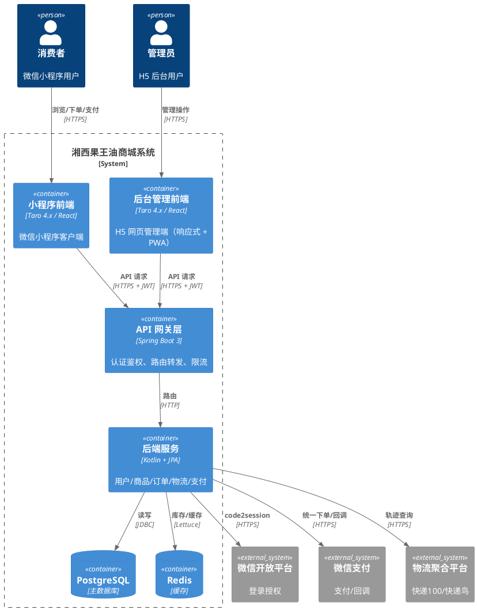
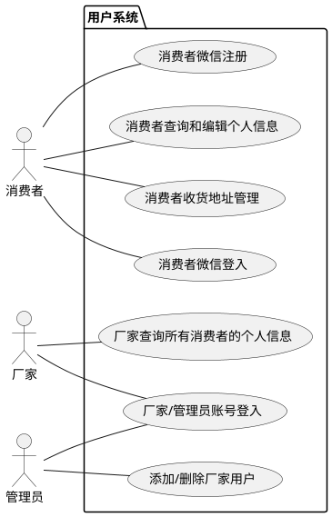
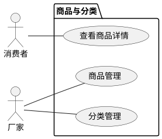
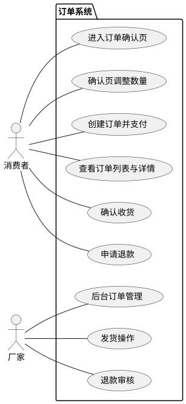
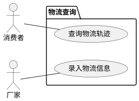
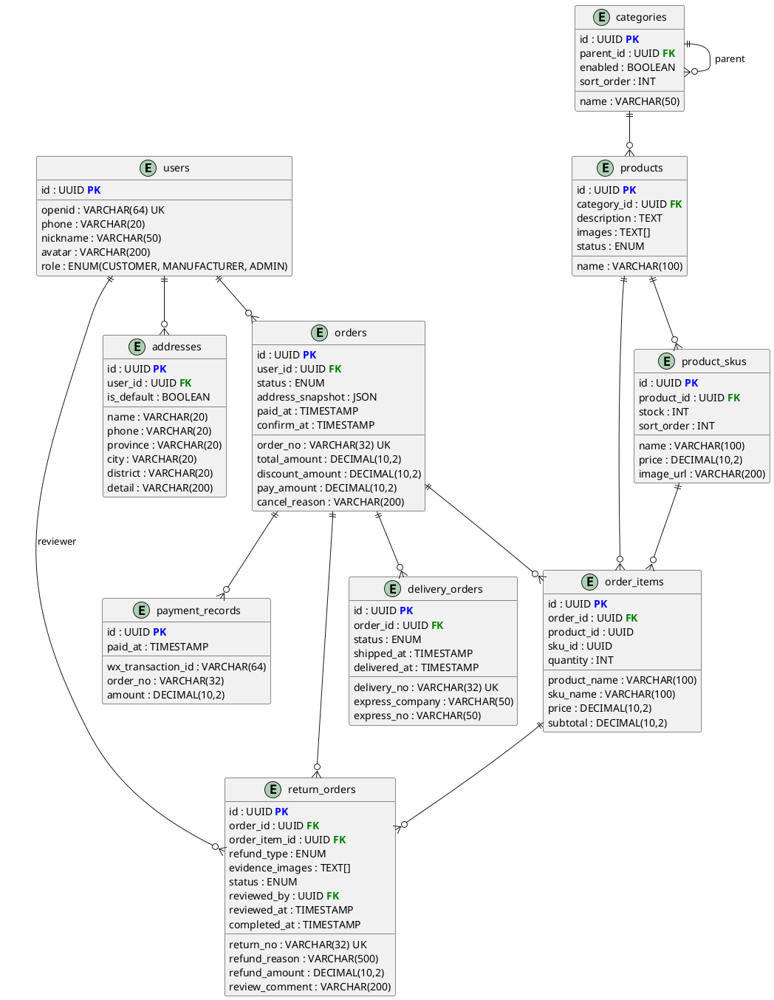

# 软件需求规格说明书（一期）

## 湘西果王油商城系统

---

## 1. 引言

### 1.1 编写目的

本文档为「湘西果王油商城系统」第一期的软件需求规格说明书（Software Requirements Specification,
SRS），旨在完整、清晰、可验证地定义系统的功能需求与非功能需求，作为后续概要设计、详细设计、开发、测试、验收的统一依据，确保项目干系人对系统行为达成共识。

**目标读者**：

- 项目负责人（甲方 lonG）：把控需求范围和验收基准
- 开发人员：理解功能细节和接口规范
- 测试人员：据此编写测试用例和验收方案

### 1.2 范围

本文档覆盖第一期「交易闭环」的完整范围：

- **用户中心**：微信授权登录、个人信息管理、收货地址管理
- **商品与分类**：商品列表展示、商品详情、后台商品和分类管理
- **订单系统**：立即购买、订单创建与库存锁定、微信支付、订单状态流转、退款申请与审核
- **物流查询**：发货录入物流单号、买家查询物流轨迹

**本期不包含**：优惠、拼单、分销体系、佣金计算、Banner/公告、统计报表、第二件打折（第四期）。

### 1.3 定义、缩写和术语

| 术语     | 说明                                                  |
|:-------|:----------------------------------------------------|
| SRS    | 软件需求规格说明书（Software Requirements Specification）      |
| SKU    | 库存量单位（Stock Keeping Unit），此处指商品规格（如 500ml / 1000ml） |
| JWT    | JSON Web Token，用于无状态 API 认证                         |
| openid | 微信用户在小程序中的唯一标识                                      |
| JSAPI  | 微信支付 JSAPI 支付，小程序内唤起支付                              |
| PWA    | Progressive Web App，H5 管理端支持 manifest 安装            |
| UAT    | 用户验收测试（User Acceptance Testing）                     |

### 1.4 参考文献

| 文档                 | 说明                  |
|:-------------------|:--------------------|
| 《需求调研问答记录》         | 15 轮 QA 原始对话，业务决策记录 |
| 《湘西果王油软件开发可行性分析》   | 技术/时间/资源可行性自检       |
| ISO/IEC 25010:2011 | 系统与软件质量模型（参考）       |

### 1.5 文档结构

本文档按模块化结构组织，便于阅读与追踪：

- 第 1 章：引言
- 第 2 章：总体描述
- 第 3 章：功能需求
- 第 4 章：非功能需求
- 第 5 章：接口需求
- 第 6 章：数据需求
- 第 7 章：其他需求
- 第 8 章：附录

---

## 2. 总体描述

### 2.1 产品愿景

湘西果王油是一款面向重视健康的中产家庭的健康食品（食品类别销售）。本项目旨在开发一套支持自营电商及多级分销体系的小程序商城系统，帮助厂家完成商品展示、在线交易、订单管理、分销结算等核心业务流程。

第一期目标：构建稳定、高效、安全的纯交易闭环，实现浏览 → 下单 → 支付 → 发货 → 收货的完整流程。

### 2.2 项目分期

| 分期  | 主题          | 目标                            |
|:----|:------------|:------------------------------|
| 第一期 | 交易闭环        | 单人完成浏览→下单→支付→发货→收货全流程         |
| 第二期 | 内容运营 + 分销基础 | Banner/公告管理、分享裂变、关系绑定         |
| 第三期 | 完整分销体系      | 等级晋升、佣金引擎、提现审核                |
| 第四期 | 统计与增强       | 报表、多支付方式记录、物流轨迹聚合、关键字搜索、第二件打折 |

### 2.3 用户特征

| 用户类型 | 技能水平        | 使用频率         | 设备                                     | 核心关注点            |
|:-----|:------------|:-------------|:---------------------------------------|:-----------------|
| 消费者  | 普通微信用户，无需培训 | 偶尔（每周 1-2 次） | 手机（微信小程序）                              | 浏览流畅、下单快、物流可见    |
| 厂家   | 需基础培训（后台操作） | 日常（每日）       | PC 网页 + 移动端 H5（响应式，支持 PWA manifest 安装） | 订单处理效率、库存准确、退款审核 |
| 管理员  | 基本运维基础      | 按需（不定期）      | PC 网页 + 移动端 H5（响应式，支持 PWA manifest 安装） | 添加或删除厂家用户        |

> 注：第一期不实现分销商等级体系，所有已购买用户统称为「客户」，无前台等级区分。

### 2.4 系统上下文图



### 2.5 假设与依赖

| 类型 | 条目                                  |
|:---|:------------------------------------|
| 依赖 | 微信开放平台 API（code2session）稳定可用        |
| 依赖 | 微信支付 JSAPI 统一下单 + 回调通知可用，商户号已开通     |
| 依赖 | 第三方物流聚合平台（快递100/快递鸟）API 稳定返回轨迹      |
| 依赖 | 生产环境服务端可访问公网（HTTPS），域名已备案           |
| 假设 | 用户持有安装微信的手机，且微信版本支持小程序              |
| 假设 | 管理员使用 Chrome / Edge / Safari 最新两个版本 |
| 假设 | 网络延迟：小程序端 ≤ 500ms，管理端 ≤ 200ms       |

### 2.6 约束条件

- **登录策略**：首次进入小程序无需登录，可浏览商品和分类。当访问需登录/授权的页面时（如下单、"我的"），后端返回 401，前端检测后引导用户进行微信授权登录。触发登录引导的时机由各业务模块的前端逻辑承担，用户模块（UC101）仅处理授权交互本身。
- **模块职责边界**：用户模块用例只处理认证授权交互本身，不承担"何时触发登入流程"的决策。触发决策归属于各业务模块的前端路由/页面逻辑。
- **消费者登录**：微信小程序端使用微信静默授权 + 手机号授权，不支持账号密码注册登录。
- **厂家/管理员登录**：H5 后台管理端使用账号 + 密码 + 验证码登录。帐号由管理员在后台创建并分配初始密码，首次登录后建议修改密码。
- **支付渠道**：仅微信支付（JSAPI）。当期一期退款为"审核通过即完成"，实际资金退款由厂家线下操作，第四期接入微信退款 API。
- **"无条件仅退款"政策**：公司允许购买并体验后无条件仅退款（每人限一次），但一期不实现该政策的风控机制。二期通过微信支付实名认证接口 + 公安实名认证（第三方）双重校验，配合微信账号唯一性，实现同一自然人仅享一次。该条款写入用户协议。
- **权限管控**：后端基于 Spring Security 做接口级权限校验，返回标准 HTTP 状态码与错误码，前端根据响应码控制页面跳转或展示登录引导。
- **软删除**：所有数据表均不执行物理 DELETE 操作，统一使用 `is_deleted BOOLEAN DEFAULT FALSE` 标记删除状态。删除操作仅将标记设为
  true，数据保留以供后续审计和恢复。
- **通信安全**：所有外部通信必须使用 HTTPS。

---

## 3. 功能需求

### 3.1 模块一：用户中心

#### 3.1.1 功能描述

| 编号    | 用例名称                       | 角色         | 用例描述                 |  
|:------|:---------------------------|------------|:---------------------|
| UC101 | 消费者微信登入                   | 消费者        | 在微信小程序中通过微信授权登录系统                                                        |
| UC102 | 消费者微信注册                   | 消费者        | 通过微信授权注册为新用户                                                               |
| UC103 | 厂家/管理员账号登入               | 厂家、管理员      | 在 H5 后台通过账号+密码登录系统                                                    |
| UC104 | 添加/删除厂家用户                | 管理员        | 添加或删除厂家用户账号                                                                |
| UC105 | 消费者查询和编辑个人信息              | 消费者        | 查询和编辑个人信息（昵称、头像、手机号）                                                     |
| UC106 | 消费者收货地址管理（新增、编辑、删除、设默认） | 消费者        | 新增、编辑、删除收货地址，设置默认地址                                                      |
| UC107 | 厂家查询所有消费者的个人信息           | 厂家         | 查询所有消费者的基本信息                                                              | 

#### 3.1.2 业务流程



#### 3.1.3 业务流程描述
##### UC101：消费者微信登入

| 属性 | 内容 |
|:---|:---|
| **用例名** | 消费者微信登入 |
| **用例标示** | UC101 |
| **主要执行者** | 消费者 |
| **目标** | 通过微信授权登入系统以获取操作权限 |
| **范围** | 湘西果王油微信小程序 |
| **前置条件** | 消费者持有安装微信的手机，微信版本支持小程序 |

**交互动作**：

1. **消费者** 进入微信授权登录页面
2. **消费者** 确认微信授权（静默授权 + 手机号授权）
3. **前端** 调用 `wx.login()` 获取临时 code，调用 `POST /api/auth/wx-login { code, phoneCode? }`
6. **系统** 调用微信 `code2session` API 换取 openid
7. **系统** 根据 openid 查询用户：
    1. 用户已存在 → 直接生成 JWT
    2. 用户不存在 → 自动创建消费者用户（见 UC102）,并生成 JWT
8. **系统** 生成 JWT（sub=user_id, role=CUSTOMER）
9. **系统** 返回 `{ code: 0, data: { token, user } }`
10. **前端** 存储 token → 后续请求携带 `Authorization: Bearer <token>` → **登入成功**

---

##### UC102：消费者微信注册

| 属性 | 内容 |
|:---|:---|
| **用例名** | 消费者微信注册 |
| **用例标示** | UC102 |
| **主要执行者** | 消费者 |
| **目标** | 通过微信授权注册为新用户 |
| **范围** | 湘西果王油微信小程序 |
| **前置条件** | 消费者首次使用小程序，未注册过 |

**交互动作**：

1. **消费者** 首次授权微信登录（同 UC101 的 1~5）
2. **系统** 通过 openid 查询 → 用户不存在
3. **系统** 自动创建用户记录：
    - openid（加密存储）
    - 昵称（微信昵称）
    - 头像（微信头像 URL）
    - phone（手机号授权获取，加密存储）
    - role = CUSTOMER
4. **系统** 生成 JWT
5. **系统** 返回 `{ code: 0, data: { token, user } }` → **注册并登入成功**

---

##### UC103：厂家/管理员账号登入

| 属性 | 内容 |
|:---|:---|
| **用例名** | 厂家/管理员账号登入 |
| **用例标示** | UC103 |
| **主要执行者** | 厂家、管理员 |
| **目标** | 通过合法身份登入系统以获取操作权限 |
| **范围** | 湘西果王油后台管理 H5 软件 |
| **前置条件** | 管理员已在后台创建厂家用户账号或管理员账号；用户使用 Chrome/Edge/Safari 最新两个版本 |

**交互动作**：

1. **用户** 访问后台管理 H5 页面
2. **系统** 检测未登录 → 跳转到登录页面
3. **用户** 输入账号和密码
4. **系统** 验证输入格式的合法性：
    1. 如账号或密码为空 → **系统** 提示"请输入账号和密码"并要求重新输入，转到 3
5. **系统** 验证账号和密码的正确性：
    1. 如账号不存在 → **系统** 提示"账号或密码错误"，`login_attempts + 1`，转到 3
    2. 如密码错误：
        - 如连续失败次数 < 3 → **系统** 提示"账号或密码错误"，`login_attempts + 1`，转到 3
        - 如连续失败次数 ≥ 3 → **系统** 锁定账号 15 分钟（设置 `locked_until`），提示"账号已锁定，请 15 分钟后重试"，**终止**
    3. 如账号已锁定（`locked_until > now()`）→ **系统** 提示"账号已锁定，请稍后重试"，**终止**
6. **系统** 验证通过 → 重置 `login_attempts` 和 `locked_until` → 生成 JWT（sub=user_id, role=MANUFACTURER|ADMIN）
7. **系统** 返回 `{ code: 0, data: { token, user } }` → **登入成功**

**补充规则**：
- 连续失败 3 次后锁定 15 分钟，期间无法登录。15 分钟后 `locked_until` 过期，自动恢复可登录状态
- 锁定流程不涉及验证码验证机制，一期仅靠账号密码 + 失败计数 + 锁定时间控制
- 如遗忘密码，**用户** 需联系管理员重置密码（见 UC104）

---

##### UC104：添加/删除厂家用户

| 属性 | 内容 |
|:---|:---|
| **用例名** | 添加/删除厂家用户 |
| **用例标示** | UC104 |
| **主要执行者** | 管理员 |
| **目标** | 管理后台的厂家用户账号 |
| **范围** | 湘西果王油后台管理 H5 |
| **前置条件** | 管理员已通过 UC103 登入 |

**交互动作（添加厂家用户）**：

1. **管理员** 进入用户管理页面 → 点击"添加厂家用户"
2. **管理员** 填写账号、初始密码
3. **系统** 校验输入合法性：
    1. 账号长度 4~50 字符，字母/数字/下划线 → 不合法则提示并要求重新输入，转到 2
    2. 密码长度 ≥ 8 字符 → 不合法则提示并要求重新输入，转到 2
4. **系统** 校验账号唯一性：
    1. 如账号已存在 → 返回 HTTP 400 错误码 1002，提示"账号已存在"
5. **系统** 创建用户记录：
    - username（指定账号）
    - password_hash（BCrypt 加密）
    - role = MANUFACTURER
    - login_attempts = 0
6. **系统** 返回 `{ code: 0, data: UserDTO }` → **添加成功**

**交互动作（删除厂家用户 — 软删除）**：

1. **管理员** 在用户列表中选择目标厂家用户 → 点击"删除"
2. **系统** 弹出确认对话框 → **管理员** 确认
3. **系统** 校验：
    1. 目标用户 role ≠ MANUFACTURER → 返回 HTTP 400，提示"仅可删除厂家用户"
    2. 目标用户已被软删除 → 返回 HTTP 404
4. **系统** 设置 `is_deleted = true`
5. **系统** 返回 `{ code: 0 }` → **删除成功**（该账号无法再登入）

---

##### UC105：消费者查询和编辑个人信息

| 属性 | 内容 |
|:---|:---|
| **用例名** | 消费者查询和编辑个人信息 |
| **用例标示** | UC105 |
| **主要执行者** | 消费者 |
| **目标** | 查看和修改个人资料 |
| **范围** | 湘西果王油微信小程序 |
| **前置条件** | 消费者已通过 UC101 登入 |

**交互动作（查询个人信息）**：

1. **消费者** 进入"我的"页面
2. **前端** 调用 `GET /api/user/me`（含 JWT）
3. **系统** 从 JWT 提取 user_id → 查询用户信息
4. **系统** 返回用户昵称、头像、手机号（中间 4 位脱敏显示）

**交互动作（编辑个人信息）**：

1. **消费者** 进入个人信息编辑页
2. **消费者** 修改昵称和/或头像
3. **消费者** 提交 → 前端调用 `PUT /api/user/me { nickname?, avatar? }`
4. **系统** 校验：
    1. 昵称超过 50 字符 → 返回 HTTP 400 错误码 1001
5. **系统** 更新用户记录
6. **系统** 返回更新后的 UserDTO → **编辑成功**

---

##### UC106：消费者收货地址管理

| 属性 | 内容 |
|:---|:---|
| **用例名** | 消费者收货地址管理 |
| **用例标示** | UC106 |
| **主要执行者** | 消费者 |
| **目标** | 管理收货地址（新增、编辑、删除、查列表、设置默认） |
| **范围** | 湘西果王油微信小程序 |
| **前置条件** | 消费者已通过 UC101 登入 |

**交互动作（查看收货地址列表）**：

1. **消费者** 进入地址管理页面
2. **前端** 调用 `GET /api/addresses`
3. **系统** 返回当前用户所有 `is_deleted=false` 的地址列表
4. **消费者** 查看地址列表，可选择某个地址进行编辑、删除或设为默认

**交互动作（新增收货地址）**：

1. **消费者** 进入地址管理页 → 点击"新增"
2. **消费者** 填写收货人姓名、手机号、省、市、区、详细地址
3. **消费者** 如需设为默认地址 → 勾选"设为默认"
4. **消费者** 提交 → 前端调用 `POST /api/addresses { name, phone, province, city, district, detail, is_default }`
5. **系统** 校验输入：
    1. 姓名 ≤ 20 字符 → 超长返回 HTTP 400 错误码 1001
    2. 手机号格式校验 → 不合法返回 HTTP 400
    3. 所有必填项均不能为空
6. **系统** 如 `is_default = true` → 将该用户其他地址 `is_default` 设为 false
7. **系统** 创建地址记录
8. **系统** 返回 AddressDTO → **新增成功**

**交互动作（编辑收货地址）**：

1. **消费者** 在地址列表中选择目标地址 → 点击"编辑"
2. **消费者** 修改任意字段后提交 → 前端调用 `PUT /api/addresses/{id} { ... }`
3. **系统** 校验输入（同新增）→ 更新记录
4. **系统** 返回更新后的 AddressDTO → **编辑成功**

**交互动作（删除收货地址 — 软删除）**：

1. **消费者** 在地址列表中选择目标地址 → 点击"删除"
2. **系统** 弹出确认对话框 → **消费者** 确认
3. **前端** 调用 `DELETE /api/addresses/{id}`
4. **系统** 校验地址归属（user_id 匹配）→ 不匹配返回 HTTP 403
5. **系统** 设置 `is_deleted = true`
6. **系统** 如该地址为默认地址 → 清除其 `is_default` 标记
7. **系统** 返回 `{ code: 0 }` → **删除成功**

**交互动作（设为默认地址）**：

1. **消费者** 在地址列表中选择目标地址 → 点击"设为默认"
2. **前端** 调用 `PUT /api/addresses/{id}/default`
3. **系统** 将该用户其他地址 `is_default` 设为 false → 当前地址 `is_default` 设为 true
4. **系统** 返回 `{ code: 0 }` → **设置成功**

---

##### UC107：厂家查询所有消费者的个人信息

| 属性 | 内容 |
|:---|:---|
| **用例名** | 厂家查询所有消费者的个人信息 |
| **用例标示** | UC107 |
| **主要执行者** | 厂家 |
| **目标** | 查看所有消费者的基本信息，用于售后联系等场景 |
| **范围** | 湘西果王油后台管理 H5 |
| **前置条件** | 厂家已通过 UC103 登入 |

**交互动作**：

1. **厂家** 进入用户列表页
2. **前端** 调用 `GET /api/admin/users?role=CUSTOMER&page=0&size=20`
3. **系统** 查询所有 role=CUSTOMER 且 `is_deleted = false` 的用户（分页）
4. **系统** 返回用户列表：昵称、手机号（中间 4 位脱敏）、注册时间
5. **厂家** 可通过手机号搜索 → `GET /api/admin/users?phone=138xxxx`
6. **系统** 返回匹配结果


### 3.2 模块二：商品与分类

#### 3.2.1 功能描述

| 编号    | 用例名称     | 角色  | 用例描述                                                                |
|:------|:---------|:----|:--------------------------------------------------------------------|
| UC201 | 查看商品详情   | 消费者 | 查看商品轮播图、富文本描述、所有规格（名称/价格/库存），仅展示已上架商品                               |
| UC202 | 商品管理     | 厂家  | 在后台对商品进行增删改查、上下架管理，上架后消费者端可见，下架后数据保留                                |
| UC203 | 分类管理     | 厂家  | 对分类进行增删改查管理（树形结构，无限层级），删除分类前校验其下无商品                                |

#### 3.2.2 业务规则

- **分类规则**：分类采用树形结构，可无限级扩展。**商品只能挂在叶子分类（最末级分类）下**。分类管理仅后台厂家使用，消费者前端不展示分类树。
- **商品状态**：`DRAFT`（草稿）→ `ENABLED`（已上架）→ `DISABLED`（已下架）。消费者端仅展示 `ENABLED` 状态的商品。
- **商品列表**：消费者端首页直接展示所有已上架商品，按上架时间倒序排列，不分页（一期商品数量少）。
- **库存管理**：管理员可在后台查看 SKU 库存列表，支持低库存筛选，修改库存后 Redis 缓存同步更新。
#### 3.2.3 业务流程

#### 3.2.4 业务流程描述

##### UC201：查看商品详情

| 属性 | 内容 |
|:---|:---|
| **用例名** | 查看商品详情 |
| **用例标示** | UC202 |
| **主要执行者** | 消费者 |
| **目标** | 查看商品的完整信息（轮播图、描述、规格、价格） |
| **范围** | 湘西果王油微信小程序 |
| **前置条件** | 无（无需登录） |

**交互动作（查看商品详情）**：

1. **消费者** 在首页商品列表点击某商品
2. **前端** 调用 `GET /api/products/{id}`
3. **系统** 返回商品详情：
    - 商品名称、轮播图 URL 数组
    - 富文本描述
    - 所有关联规格列表（SKU 名称、价格、库存、规格图）
    - 商品状态（仅展示 ENABLED 状态商品）
4. **消费者** 浏览商品详情
5. **消费者** 可切换查看不同规格的图片

---

##### UC202：商品管理

| 属性 | 内容 |
|:---|:---|
| **用例名** | 商品管理 |
| **用例标示** | UC204 |
| **主要执行者** | 厂家 |
| **目标** | 管理商品信息的增删改查及上下架 |
| **范围** | 湘西果王油后台管理 H5 |
| **前置条件** | 厂家已通过 UC103 登入 |

**交互动作（创建商品）**：

1. **厂家** 进入商品管理页 → 点击"新建商品"
2. **厂家** 填写：
    - 商品名称（≤ 100 字符）
    - 商品描述（支持富文本）
    - 所属分类（仅可选叶子分类）
    - 轮播图（上传多张图片）
3. **厂家** 添加规格：
    - 规格名称（如 500ml、1000ml）
    - 售价（正整数/小数，保留两位）
    - 库存数量
    - 规格图片（可选）
4. **厂家** 提交 → 前端调用 `POST /api/products { name, description, categoryId, images, skus[] }`
5. **系统** 校验输入合法性
6. **系统** 创建商品（status=DRAFT）+ 关联 SKU 记录
7. **系统** 返回 ProductDTO → **创建成功**

**交互动作（编辑商品）**：

1. **厂家** 在商品列表中选择目标商品 → 点击"编辑"
2. **厂家** 修改任意字段 → 提交 → 前端调用 `PUT /api/products/{id} { ... }`
3. **系统** 校验输入 → 更新商品及关联 SKU
4. **系统** 返回更新后的 ProductDTO → **编辑成功**

**交互动作（上架商品）**：

1. **厂家** 选择草稿或已下架状态的商品 → 点击"上架"
2. **前端** 调用 `PATCH /api/products/{id}/enable`
3. **系统** 校验：
    1. 商品必须关联至少一个叶子分类
    2. 商品必须至少有一个 SKU
4. **系统** status → ENABLED
5. **系统** 消费者端即刻可在商品列表中看到该商品 → **上架成功**

**交互动作（下架商品）**：

1. **厂家** 选择已上架状态的商品 → 点击"下架"
2. **前端** 调用 `PATCH /api/products/{id}/disable`
3. **系统** status → DISABLED
4. **系统** 消费者端即刻不可见。数据保留，可随时重新上架 → **下架成功**

---

##### UC203：分类管理

| 属性 | 内容 |
|:---|:---|
| **用例名** | 分类管理 |
| **用例标示** | UC205 |
| **主要执行者** | 厂家 |
| **目标** | 管理商品分类的树形结构 |
| **范围** | 湘西果王油后台管理 H5 |
| **前置条件** | 厂家已通过 UC103 登入 |

**交互动作（创建分类）**：

1. **厂家** 进入分类管理页 → 选择目标父分类 → 点击"新增子分类"
2. **厂家** 填写分类名称（≤ 50 字符）、描述（可选）、排序号
3. **厂家** 提交 → 前端调用 `POST /api/admin/categories { parentId, name, description, sortOrder }`
4. **系统** 校验输入 → 创建分类记录
5. **系统** 返回 CategoryDTO → **创建成功**

**交互动作（编辑分类）**：

1. **厂家** 在分类树中选择目标分类 → 点击"编辑"
2. **厂家** 修改名称、描述、排序号或启用/禁用状态 → 提交
3. **前端** 调用 `PUT /api/admin/categories/{id} { ... }`
4. **系统** 更新记录 → 返回 CategoryDTO → **编辑成功**

**交互动作（删除分类 — 软删除）**：

1. **厂家** 在分类树中选择目标分类 → 点击"删除"
2. **系统** 弹出确认对话框 → **厂家** 确认
3. **系统** 校验：
    1. 该分类下是否有 `status != DISABLED` 的商品 → 有则返回 HTTP 400 错误码 1002，提示"该分类下存在商品，无法删除"
    2. 该分类是否有子分类 → 有则级联软删除其所有子分类
4. **系统** 设置 `is_deleted = true`
5. **系统** 返回 `{ code: 0 }` → **删除成功**


### 3.3 模块三：订单系统

#### 3.3.1 功能描述

| 编号    | 用例名称      | 角色  | 用例描述                                                                                             |
|:------|:----------|:----|:-------------------------------------------------------------------------------------------------|
| UC301 | 进入订单确认页   | 消费者 | 在商品详情页选择规格和数量后点击购买，进入订单确认页查看商品信息、总价、选择收货地址，地址可切换和新增                                      |
| UC302 | 确认页调整数量   | 消费者 | 在确认页修改购买数量，数量实时计算总价（单价 × 数量）；一期无优惠，`pay_amount = total_amount`                               |
| UC303 | 创建订单并支付   | 消费者 | 点击支付按钮后创建订单（状态=待支付），返回 JSAPI 支付参数，前端唤起微信支付弹窗，支付成功后状态变更为已支付                             |
| UC304 | 查看订单列表与详情 | 消费者 | 订单列表分页，支持按状态筛选；详情页展示商品明细、收货地址快照、金额拆解、当前状态                                             |
| UC305 | 确认收货      | 消费者 | 收到货后确认收货，完成交易，状态变更为已完成                                                                    |
| UC306 | 申请退款      | 消费者 | 提交退款申请（商品有问题），查看审核结果；审核通过状态变更为已退款，审核拒绝恢复原状态                                                |
| UC307 | 后台订单管理    | 厂家  | 在后台查看所有订单，按状态筛选、按订单号搜索；可进行发货和退款审核操作                                                       |
| UC308 | 发货操作      | 厂家  | 对已支付订单进行发货操作（填写物流公司和单号），创建 `delivery_orders` 记录，订单状态变更为已发货                                  |
| UC309 | 退款审核      | 厂家  | 审核买家的退款申请，同意或拒绝                                                             |

#### 3.3.2 业务流程




#### 3.3.3 业务规则
**业务状态机**

```
待支付 ──(30分钟超时)──→ 已取消
待支付 ──(支付成功)──→ 已支付
已支付 ──(发货)──────→ 已发货
已发货 ──(确认收货)──→ 已完成
已支付 ──(申请退款)──→ 退款中
已发货 ──(申请退款)──→ 退款中
退款中 ──(审核通过)──→ 已退款
退款中 ──(审核拒绝)──→ 恢复原状态（已支付 / 已发货）
```
#### 3.3.4 业务流程描述


##### UC301：进入订单确认页

| 属性 | 内容 |
|:---|:---|
| **用例名** | 进入订单确认页 |
| **用例标示** | UC301 |
| **主要执行者** | 消费者 |
| **目标** | 在提交订单前核对商品信息、收货地址和总价 |
| **范围** | 湘西果王油微信小程序 |
| **前置条件** | 消费者已通过 UC101 登入；在商品详情页已选择一个规格和数量 |

**交互动作**：

1. **消费者** 在商品详情页选择规格和数量后，点击"立即购买"
2. **前端** 调用 `POST /api/orders/confirm { skuId, quantity }`
3. **系统** 返回确认页预计算数据：
    - 商品名、规格名、单价、数量
    - 总价（单价 × 数量）
    - 消费者默认收货地址
    - pay_amount = total_amount（一期无优惠）
4. **消费者** 查看确认页信息
5. **消费者** 可切换或新增收货地址（见 UC106）

---

##### UC302：确认页调整数量

| 属性 | 内容 |
|:---|:---|
| **用例名** | 确认页调整数量 |
| **用例标示** | UC302 |
| **主要执行者** | 消费者 |
| **目标** | 在确认页修改购买数量，确认最终总价 |
| **范围** | 湘西果王油微信小程序 |
| **前置条件** | 消费者已在订单确认页 |

**交互动作**：

1. **消费者** 在确认页点击数量调整按钮（+/-）
2. **前端** 实时重新计算总价（单价 × 数量）
3. **前端** 校验：
    1. 如数量 ≤ 0 → 前端拦截，禁用减号按钮
    2. 如数量 > 库存 → 前端提示"库存不足"
4. **消费者** 确认数量正确 → 总价 = 单价 × 数量
5. 一期无优惠 → pay_amount = total_amount

---

##### UC303：创建订单并支付

| 属性 | 内容 |
|:---|:---|
| **用例名** | 创建订单并支付 |
| **用例标示** | UC303 |
| **主要执行者** | 消费者 |
| **目标** | 创建订单并从微信扣款完成支付 |
| **范围** | 湘西果王油微信小程序 |
| **前置条件** | 消费者已确认商品、数量、收货地址 |

**交互动作**：

1. **消费者** 在确认页点击"去支付"
2. **前端** 调用 `POST /api/orders { skuId, quantity, addressId }`
3. **系统** 创建订单（status=PENDING_PAYMENT）：
    1. Redis `DECR sku:{skuId}:stock` 原子操作
    2. 如库存不足（`result < 0`）→ Redis `INCR` 回滚 → 返回 HTTP 409 错误码 5001
    3. 扣减成功 → 写入 `orders` 表（含 address_snapshot 快照）
    4. 写入 `order_items` 表（商品名、规格名、价格快照）
    5. 整个流程包裹在同一事务中，任一步失败则全部回滚
4. **系统** 调用微信支付统一下单 API
5. **系统** 返回 JSAPI 支付参数 → 前端唤起微信支付弹窗
6. **消费者** 在微信支付弹窗中完成支付（输入密码/指纹）
7. **微信支付** 异步发送回调通知到 `POST /api/orders/wx-notify`
8. **系统** 处理回调：
    1. 验签 → 失败则拒绝
    2. 查询 `payment_records` 是否已存在 `(wx_transaction_id, order_no)` → 存在则幂等返回
    3. 写入 `payment_records` 记录
    4. 更新订单 status → PAID，记录 `paid_at`
9. **前端** 收到支付成功信号 → 跳转订单详情页 → **支付成功**

**异常流 — 超时取消**：
- 待支付订单 30 分钟内未收到支付回调
- 定时任务每 5 分钟扫描 `status=PENDING_PAYMENT AND created_at < now()-30min` 的订单
- 批量取消：订单 status → CANCELLED，Redis `INCR` 回滚库存

---

##### UC304：查看订单列表与详情

| 属性 | 内容 |
|:---|:---|
| **用例名** | 查看订单列表与详情 |
| **用例标示** | UC304 |
| **主要执行者** | 消费者 |
| **目标** | 查看自己的所有订单及单个订单详情 |
| **范围** | 湘西果王油微信小程序 |
| **前置条件** | 消费者已通过 UC101 登入 |

**交互动作（订单列表）**：

1. **消费者** 进入"我的订单"页面
2. **前端** 调用 `GET /api/orders?status=PAID&page=0&size=10`
3. **系统** 返回当前用户订单列表（分页），支持按状态筛选：
    - 全部 / 待支付 / 已支付 / 已发货 / 已完成 / 已退款
4. **消费者** 上下滑动浏览订单列表
5. **消费者** 点击某个订单进入详情

**交互动作（订单详情）**：

1. **前端** 调用 `GET /api/orders/{id}`
2. **系统** 校验订单归属（user_id 匹配）→ 不匹配返回 HTTP 403
3. **系统** 返回订单详情：
    - 商品明细列表（order_items：商品名快照、规格名快照、单价、数量、小计）
    - 收货地址快照
    - 金额拆解：total_amount、discount_amount（一期 = 0）、pay_amount
    - 当前状态
    - 物流信息（如有配送单）

---

##### UC305：确认收货

| 属性 | 内容 |
|:---|:---|
| **用例名** | 确认收货 |
| **用例标示** | UC305 |
| **主要执行者** | 消费者 |
| **目标** | 确认已收到商品，完成交易 |
| **范围** | 湘西果王油微信小程序 |
| **前置条件** | 订单状态为已发货（SHIPPED） |

**交互动作**：

1. **消费者** 在订单详情页点击"确认收货"
2. **系统** 弹出确认对话框 → **消费者** 确认
3. **前端** 调用 `POST /api/orders/{id}/confirm-receipt`
4. **系统** 校验：
    1. 订单归属 → 不匹配返回 HTTP 403
    2. 订单状态 = SHIPPED → 状态不符返回 HTTP 400
5. **系统** 更新订单 status → COMPLETED，记录 `confirm_at`
6. **系统** 返回 `{ code: 0 }` → **确认收货成功**

---

##### UC306：申请退款

| 属性 | 内容 |
|:---|:---|
| **用例名** | 申请退款 |
| **用例标示** | UC306 |
| **主要执行者** | 消费者 |
| **目标** | 对问题商品申请退款 |
| **范围** | 湘西果王油微信小程序 |
| **前置条件** | 订单状态为已支付（PAID）或已发货（SHIPPED） |

**交互动作**：

1. **消费者** 进入订单详情页 → 点击"申请退款"
2. **系统** 校验：
    1. 订单状态 = PENDING_PAYMENT → 返回 HTTP 400，提示"待支付订单超时自动取消，无需退款"
    2. 订单状态 = REFUNDING → 返回 HTTP 409，提示"已有退款申请正在处理"
    3. 订单状态 = REFUNDED → 返回 HTTP 409，提示"该订单已退款"
3. **消费者** 填写退款原因（≤ 500 字符），上传凭证图片（可选）
4. **消费者** 提交 → 前端调用 `POST /api/orders/{id}/refund { refundReason, evidenceImages? }`
5. **系统** 创建退款单（return_orders）：
    - refund_type = FULL（一期整单退款）
    - status = PENDING
6. **系统** 更新订单 status → REFUNDING
7. **系统** 返回退款单信息 → **申请成功**，等待厂家审核（见 UC309）

---

##### UC307：后台订单管理

| 属性 | 内容 |
|:---|:---|
| **用例名** | 后台订单管理 |
| **用例标示** | UC307 |
| **主要执行者** | 厂家 |
| **目标** | 查看和管理所有订单 |
| **范围** | 湘西果王油后台管理 H5 |
| **前置条件** | 厂家已通过 UC103 登入 |

**交互动作**：

1. **厂家** 进入订单管理页
2. **前端** 调用 `GET /api/admin/orders?status=PAID&page=0&size=20`
3. **系统** 返回所有用户订单列表（分页）
4. **厂家** 可按以下维度筛选和搜索：
    - 按订单状态筛选（PAID / SHIPPED / REFUNDING 等）
    - 按订单号搜索
    - 按下单时间排序
5. **厂家** 点击某个订单 → 查看订单详情（商品明细、地址、金额）
6. **厂家** 可对订单执行发货（UC308）或退款审核（UC309）

---

##### UC308：发货操作

| 属性 | 内容 |
|:---|:---|
| **用例名** | 发货操作 |
| **用例标示** | UC308 |
| **主要执行者** | 厂家 |
| **目标** | 对已支付订单进行发货并录入物流信息 |
| **范围** | 湘西果王油后台管理 H5 |
| **前置条件** | 厂家已通过 UC103 登入；订单状态为已支付（PAID） |

**交互动作**：

1. **厂家** 在订单详情页点击"发货"
2. **系统** 校验：
    1. 订单状态 ≠ PAID → 返回 HTTP 400，提示"仅已支付订单可发货"
    2. 该订单已有配送单 → 返回 HTTP 409 错误码 5002，提示"该订单已有配送单"
3. **厂家** 填写快递公司名称（如顺丰速运）和快递单号
4. **厂家** 提交 → 前端调用 `POST /api/admin/orders/{id}/deliveries { expressCompany, expressNo }`
5. **系统** 校验快递公司及单号不为空 → 为空返回 HTTP 400
6. **系统** 创建 `delivery_orders` 记录（status=PENDING → SHIPPED）
7. **系统** 更新订单 status → SHIPPED，记录发货时间
8. **系统** 清除该配送单的物流缓存（Redis）
9. **系统** 返回 `{ code: 0, data: DeliveryOrderDTO }` → **发货成功**

---

##### UC309：退款审核

| 属性 | 内容 |
|:---|:---|
| **用例名** | 退款审核 |
| **用例标示** | UC309 |
| **主要执行者** | 厂家 |
| **目标** | 审核消费者的退款申请，同意或拒绝 |
| **范围** | 湘西果王油后台管理 H5 |
| **前置条件** | 厂家已通过 UC103 登入；退款单状态为待审核（PENDING） |

**交互动作（同意退款）**：

1. **厂家** 在退款审核列表点击某退款单 → 查看详情（退款原因、凭证图片、订单信息）
2. **厂家** 点击"同意退款"
3. **前端** 调用 `POST /api/admin/returns/{id}/review { action: "APPROVE", reviewComment? }`
4. **系统** 校验：
    1. 退款单 status ≠ PENDING → 返回 HTTP 409（幂等保护，重复审核返回已有结果）
5. **系统** 更新退款单：
    - status → APPROVED
    - reviewed_by = 当前厂家 user_id
    - review_comment = 审核意见
    - reviewed_at = 当前时间
6. **系统** 更新订单 status → REFUNDED
7. **系统** 回滚对应 SKU 库存（Redis INCR）
8. **系统** 返回 `{ code: 0 }` → **退款审核通过**
   > **注**：一期退款为"审核通过即完成"，实际资金退款由厂家线下操作。第四期接入微信退款 API。

**交互动作（拒绝退款）**：

1. **厂家** 查看退款单详情 → 点击"拒绝退款"
2. **厂家** 填写审核意见（必填）
3. **前端** 调用 `POST /api/admin/returns/{id}/review { action: "REJECT", reviewComment }`
4. **系统** 校验退款单状态（同同意流程）
5. **系统** 更新退款单：
    - status → REJECTED
    - reviewed_by = 当前厂家 user_id
    - review_comment = 审核意见
    - reviewed_at = 当前时间
6. **系统** 恢复订单原状态（PAID 或 SHIPPED）
7. **系统** 返回 `{ code: 0 }` → **退款申请已拒绝**

---

### 3.4 模块四：物流查询

#### 3.4.1 功能描述

| 编号    | 用例名称    | 角色  | 用例描述                                                                  |
|:------|:--------|:----|:----------------------------------------------------------------------|
| UC401 | 查询物流轨迹  | 消费者 | 在订单详情页查看物流轨迹（时间线格式 `[{time, status, location}]`），调用第三方物流平台 API          |
| UC402 | 录入物流信息  | 厂家  | 发货时录入快递公司 + 快递单号，创建 `delivery_orders` 记录，订单状态同步变更为已发货                     |

#### 3.4.2 业务流程



#### 3.4.3 业务规则

- 物流轨迹查询结果缓存到 Redis，TTL 5 分钟（已签收轨迹缓存 24 小时）。
- 管理员发货后主动清除对应配送单的物流缓存。
- 一期仅支持单个快递单号的轨迹查询，不聚合多个包裹。

---
#### 3.4.4 业务流程描述
##### UC401：查询物流轨迹

| 属性 | 内容 |
|:---|:---|
| **用例名** | 查询物流轨迹 |
| **用例标示** | UC401 |
| **主要执行者** | 消费者 |
| **目标** | 查看已发货订单的物流派送进度 |
| **范围** | 湘西果王油微信小程序 |
| **前置条件** | 消费者已通过 UC101 登入；订单存在关联的配送单 |

**交互动作**：

1. **消费者** 在订单详情页点击"查看物流"
2. **前端** 调用 `GET /api/deliveries/{deliveryId}/express`
3. **系统** 查询配送单 → 获取快递公司和运单号
4. **系统** 如配送单不存在 → 返回空列表或提示"暂无物流信息"
5. **系统** 以 `(express_company, express_no)` 为 key 查询 Redis 缓存：
    1. 缓存命中 → 直接返回缓存的轨迹数据
    2. 缓存未命中 → 调用第三方物流 API（快递100/快递鸟）→ 查询结果存入 Redis：
        - 未签收：TTL = 5 分钟
        - 已签收：TTL = 24 小时
6. **系统** 返回物流轨迹时间线：
```json
[
  { "time": "2026-05-01 08:00", "status": "已揽收", "location": "长沙市" },
  { "time": "2026-05-01 12:00", "status": "运输中", "location": "武汉市" },
  { "time": "2026-05-02 09:00", "status": "派送中", "location": "北京市朝阳区" }
]
```

---

##### UC402：录入物流信息

| 属性 | 内容 |
|:---|:---|
| **用例名** | 录入物流信息 |
| **用例标示** | UC402 |
| **主要执行者** | 厂家 |
| **目标** | 发货时录入快递公司和运单号 |
| **范围** | 湘西果王油后台管理 H5 |
| **前置条件** | 厂家已通过 UC103 登入；订单状态为已支付（PAID） |

**交互动作**：

1. **厂家** 在发货时填写快递公司名称和快递单号
2. **前端** 调用 `POST /api/admin/orders/{id}/deliveries { expressCompany, expressNo }`
3. **系统** 创建 `delivery_orders` 记录 → 关联订单
4. **系统** 更新订单 status → SHIPPED
5. **系统** 清除该配送单的物流缓存
6. **系统** 返回 `{ code: 0, data: DeliveryOrderDTO }` → **录入成功**
   > **注**：本用例与 UC308 发货操作为同一业务流程。UC308 侧重订单角度的发货动作，UC402 侧重物流数据的录入和后续轨迹查询的触发。

## 4. 非功能需求

### 4.1 性能

| 指标              | 要求                           |
|:----------------|:-----------------------------|
| 并发用户数           | 支持 500 并发用户（一期，单实例）          |
| API 响应时间（列表类）   | 95% 请求 ≤ 500ms               |
| API 响应时间（下单/支付） | ≤ 2s                         |
| 微信支付回调处理        | ≤ 1s 内返回 200 SUCCESS（防止微信重试） |
| 小程序页面首屏加载       | ≤ 2s（4G 网络）                  |

### 4.2 安全

| 类型           | 要求                                                          |
|:-------------|:------------------------------------------------------------|
| **认证**       | 所有非公开 API 必须携带有效 JWT；越权请求返回 403                             |
| **敏感数据加密**   | openid、手机号使用 AES-256-CBC 加密存储，API 响应和日志中不出现明文               |
| **支付幂等**     | 微信支付回调基于 `(wx_transaction_id, order_no)` 唯一约束，重复回调不产生重复状态变更 |
| **库存超卖防护**   | 高并发下单同一 SKU 库存扣减数 = 订单数，无超卖                                 |
| **SQL 注入防护** | 所有数据库操作使用 JPA 参数化查询，禁止字符串拼接 SQL                             |
| **XSS 防护**   | 后端输出 HTML 实体编码；前端使用 React 默认转义机制                            |
| **CSRF**     | 纯 JSON API + JWT Bearer 认证，天然免疫 CSRF                        |
| **支付回调验签**   | 收到微信支付回调后，先校验签名再处理业务逻辑                                      |

### 4.3 可用性

| 指标    | 要求                                                                  |
|:------|:--------------------------------------------------------------------|
| 系统可用性 | ≥ 99.5%（按月统计，一期单实例可接受计划内维护窗口）                                       |
| 故障恢复  | 服务宕机后 Docker 自动重启（`restart: unless-stopped`），Redis/PostgreSQL 数据持久化 |

### 4.4 可维护性

| 要求   | 说明                                        |
|:-----|:------------------------------------------|
| 操作日志 | 关键操作（订单状态变更、退款审核、库存修改）记录操作人和时间戳           |
| 软删除  | 所有数据不物理删除，保留审计追踪能力                        |
| 身份溯源 | JWT 中包含 `sub`（user_id）和 `role`，日志可追溯到具体用户 |

### 4.5 兼容性

| 类型     | 要求                            |
|:-------|:------------------------------|
| 消费者端   | 微信小程序（微信最新版本及前两个大版本）          |
| 管理端浏览器 | Chrome / Edge / Safari 最新两个版本 |
| 管理端移动端 | H5 响应式适配，支持 PWA manifest 安装   |

---

## 5. 接口需求

### 5.1 用户界面

- **消费者端**：微信小程序，移动端竖屏布局，遵循微信小程序设计规范。
- **管理端**：H5 网页，响应式设计（PC 端宽屏布局 + 移动端自适应折叠），支持 PWA manifest 添加到主屏幕。

### 5.2 软件接口

#### 5.2.1 统一规范

- **路径前缀**：所有 API 统一使用 `/api/` 前缀
- **资源命名**：复数名词，kebab-case（如 `/api/order-items`）
- **HTTP 方法**：
    - `GET`：查询（读）
    - `POST`：创建（写）
    - `PUT`：全量更新
    - `PATCH`：部分更新 / 状态变更
    - `DELETE`：软删除
- **管理端接口**：以 `/api/admin/` 为前缀

#### 5.2.2 统一响应格式

```json5
{
  "code": 0,
  "message": "success",
  "data": {
    // ...
  }
}
```

| 字段      | 类型                | 说明                    |
|:--------|:------------------|:----------------------|
| code    | Integer           | 业务状态码，0 表示成功，非 0 表示错误 |
| message | String            | 可读提示信息                |
| data    | Object/Array/null | 响应数据体                 |

**分页响应**：

```json
{
  "code": 0,
  "message": "success",
  "data": {
    "content": [
      ...
    ],
    "page": 0,
    "size": 10,
    "totalElements": 100,
    "totalPages": 10
  }
}
```

**分页通用参数**：

| 参数   | 类型     | 默认值               | 说明                   |
|:-----|:-------|:------------------|:---------------------|
| page | int    | 0                 | 页码，从 0 开始            |
| size | int    | 10                | 每页条数，最大 100          |
| sort | string | "created_at,desc" | 格式 `field,direction` |

#### 5.2.3 错误码体系

| HTTP 状态码 | code | 含义       | 使用场景                |
|:---------|:-----|:---------|:--------------------|
| 200      | 0    | 成功       | 正常响应                |
| 400      | 1001 | 参数校验失败   | 请求体字段不符合约束          |
| 400      | 1002 | 业务规则校验失败 | 商品已下架、分类下有商品无法删除    |
| 400      | 1003 | 登录失败      | 账号或密码错误              |
| 400      | 1004 | 账号已锁定     | 连续 3 次登录失败，账号锁定 15 分钟 |
| 401      | 2001 | 未登录       | 访问需登录接口但未携带有效 token   |
| 401      | 2002 | token 过期  | JWT 过期，需重新登录          |
| 403      | 3001 | 无权限      | 非管理员访问后台接口          |
| 404      | 4001 | 资源不存在    | 订单/商品/用户不存在或已删除     |
| 409      | 5001 | 库存不足     | 下单时 SKU 库存不够        |
| 409      | 5002 | 支付冲突     | 重复支付回调 / 重复发货       |
| 500      | 9999 | 服务器内部错误  | 未预期的异常              |

#### 5.2.4 认证鉴权方案

```
首次访问小程序（无需登录）→ 浏览商品
    ↓
访问需登录页面（下单/我的/地址等）
    ↓ 后端返回 401
前端检测 401 → 引导微信授权登录
    ↓
wx.login() 获取 code
    ↓
POST /api/auth/wx-login { code, phoneCode? }
    ↓
后端 code2session 换取 openid → 创建/查询用户 → 生成 JWT
    ↓
返回 { code: 0, data: { token, user } }
    ↓
前端存入 storage
    ↓
后续请求携带 Header: Authorization: Bearer <token>
    ↓
Spring Security JwtFilter 解析验证 → 注入 SecurityContext
```

**JWT 结构**：

```
Header: { "alg": "HS256", "typ": "JWT" }
Payload: { "sub": "<user_id>", "iat": ..., "exp": ... }
Signature: HMAC-SHA256(header + "." + payload, secret_key)
```

> Payload 不含 `role` 字段。每次请求由 Spring Security `JwtAuthenticationFilter` 解析 `sub`（user_id），从 Redis 或数据库读取用户角色权限注入 `SecurityContext`。Redis 缓存 key 格式 `user:role:{userId}`，TTL 30 分钟。

**角色权限矩阵**：

| 角色               | 可访问接口                                                                                                                                                   |
|:-----------------|:--------------------------------------------------------------------------------------------------------------------------------------------------------|
| 匿名（未登录）          | `/api/products`（GET）、`/api/auth/wx-login`、`/api/auth/login`、`/api/orders/wx-notify`                                                                |
| CUSTOMER         | `/api/user/me`、`/api/addresses/**`、`/api/orders/**`（自己的订单）、`/api/deliveries/**`                                                                         |
| MANUFACTURER（厂家） | `/api/admin/orders/**`、`/api/admin/returns/**`、`/api/admin/stock/**`、`/api/products/**`（POST/PUT/PATCH）、`/api/admin/users`（GET）、`/api/admin/categories/**` |
| ADMIN            | `/api/admin/users`（POST/DELETE，仅厂家用户管理）                                                                                                                        |

#### 5.2.5 API 接口清单

##### 用户中心模块

| 方法     | 路径                            | 说明          | 权限                  | 请求体                                                              | 响应体               |
|:-------|:------------------------------|:------------|:--------------------|:-----------------------------------------------------------------|:------------------|
| POST   | `/api/auth/wx-login`          | 消费者微信登录     | 公开                  | `{ code, encryptedData?, iv? }`                                  | `{ token, user }` |
| POST   | `/api/auth/login`             | 厂家/管理员账号登录  | 公开                  | `{ username, password, captcha? }`                               | `{ token, user }` |
| GET    | `/api/user/me`                | 获取当前用户信息    | 登录                  | —                                                                | `UserDTO`         |
| PUT    | `/api/user/me`                | 更新个人信息      | 登录                  | `{ nickname?, avatar? }`                                         | `UserDTO`         |
| GET    | `/api/addresses`              | 地址列表        | 登录                  | —                                                                | `[AddressDTO]`    |
| POST   | `/api/addresses`              | 新增地址        | 登录                  | `{ name, phone, province, city, district, detail, is_default? }` | `AddressDTO`      |
| PUT    | `/api/addresses/{id}`         | 编辑地址        | 登录                  | 同上                                                               | `AddressDTO`      |
| DELETE | `/api/addresses/{id}`         | 删除地址        | 登录                  | —                                                                | —                 |
| PUT    | `/api/addresses/{id}/default` | 设为默认地址      | 登录                  | —                                                                | —                 |
| GET    | `/api/admin/users`            | 用户列表（后台）    | ADMIN, MANUFACTURER | —                                                                | `Page<UserDTO>`   |
| POST   | `/api/admin/users`            | 创建厂家用户      | ADMIN               | `{ username, password, phone?, nickname? }`                      | `UserDTO`         |
| DELETE | `/api/admin/users/{id}`       | 删除厂家用户（软删除） | ADMIN               | —                                                                | —                 |

##### 商品与分类模块

| 方法     | 路径                           | 说明             | 权限    |
|:-------|:-----------------------------|:---------------|:------|
| GET    | `/api/categories`            | 分类树            | 公开    |
| GET    | `/api/products`              | 商品列表（全部已上架，按上架时间倒序） | 公开    |
| GET    | `/api/products/{id}`         | 商品详情（含规格列表）    | 公开    |
| POST   | `/api/admin/categories`      | 创建分类           | MANUFACTURER |
| PUT    | `/api/admin/categories/{id}` | 编辑分类           | MANUFACTURER |
| DELETE | `/api/admin/categories/{id}` | 删除分类           | MANUFACTURER |
| POST   | `/api/products`              | 创建商品           | MANUFACTURER |
| PUT    | `/api/products/{id}`         | 编辑商品           | MANUFACTURER |
| PATCH  | `/api/products/{id}/enable`  | 上架             | MANUFACTURER |
| PATCH  | `/api/products/{id}/disable` | 下架             | MANUFACTURER |
| GET    | `/api/admin/stock`           | 库存列表           | MANUFACTURER |
| PUT    | `/api/admin/stock/skus/{id}` | 修改规格库存         | MANUFACTURER |

##### 订单系统模块

| 方法   | 路径                                  | 说明               | 权限        |
|:-----|:------------------------------------|:-----------------|:----------|
| POST | `/api/orders/confirm`               | 订单确认页预计算         | 登录        |
| POST | `/api/orders`                       | 创建订单 + 返回支付参数    | 登录        |
| POST | `/api/orders/wx-notify`             | 微信支付回调通知         | 公开（微信服务器） |
| GET  | `/api/orders`                       | 我的订单列表（分页、按状态筛选） | 登录        |
| GET  | `/api/orders/{id}`                  | 订单详情             | 登录        |
| POST | `/api/orders/{id}/confirm-receipt`  | 确认收货             | 登录        |
| POST | `/api/orders/{id}/refund`           | 申请退款             | 登录        |
| GET  | `/api/admin/orders`                 | 后台订单列表           | ADMIN     |
| GET  | `/api/admin/orders/{id}`            | 后台订单详情           | ADMIN     |
| POST | `/api/admin/orders/{id}/deliveries` | 发货               | ADMIN     |
| POST | `/api/admin/returns/{id}/review`    | 退款审核             | ADMIN     |

##### 物流查询模块

| 方法  | 路径                             | 说明     | 权限 |
|:----|:-------------------------------|:-------|:---|
| GET | `/api/deliveries/{id}/express` | 物流轨迹查询 | 登录 |

> **`POST /api/orders` 实现要点**：
> 1. 使用 Redis `DECR` 原子扣减 SKU 库存，判断 `result < 0` 则回滚并返回 HTTP 409
> 2. 扣减成功后才写入 `orders` + `order_items` 记录
> 3. 整个流程包裹在同一事务中，任一步失败则全部回滚（含 Redis `INCR` 回滚）
> 4. 支付超时（30 分钟）由定时任务扫描 `status=待支付 AND created_at < now()-30min` 的订单，批量取消并回滚库存
> 5. 商品信息（名称、规格名、价格）快照到 `order_items`，不受后续调价影响

### 5.3 通信接口

- 协议：HTTPS（TLS 1.2+）
- 认证：JWT Bearer（详见 5.2.4）
- 数据格式：JSON（`Content-Type: application/json`）
- 编码：UTF-8

---

## 6. 数据需求

### 6.1 数据字典

> 所有表均继承 `BaseEntity`，含 `id`（UUID PK）、`is_deleted`（BOOLEAN DEFAULT FALSE）、`created_at`、`updated_at` 字段。以下仅列出业务字段。

#### users（用户表）

| 字段             | 类型           | 约束               | 说明                              |
|:---------------|:-------------|:-----------------|:--------------------------------|
| username       | VARCHAR(50)  | UNIQUE            | 账号（厂家/管理员后台登录用，消费者为 NULL）       |
| password_hash  | VARCHAR(255) |                   | 密码哈希（BCrypt，消费者为 NULL）           |
| openid         | VARCHAR(64)  | UNIQUE            | 微信 openid（消费者必填，加密存储）           |
| phone          | VARCHAR(20)  |                   | 手机号（加密存储）                       |
| nickname       | VARCHAR(50)  |                   | 昵称                              |
| avatar         | VARCHAR(200) |                   | 头像 URL                          |
| role           | ENUM         | NOT NULL          | CUSTOMER / MANUFACTURER / ADMIN |
| login_attempts | INT          | DEFAULT 0         | 连续登录失败次数（后台账号锁定用）               |
| locked_until   | TIMESTAMP    |                   | 账号锁定至（NULL 表示未锁定）               |

#### addresses（收货地址表）

| 字段         | 类型           | 约束                   | 说明          |
|:-----------|:-------------|:---------------------|:------------|
| user_id    | UUID         | FK → users, NOT NULL | 所属用户        |
| name       | VARCHAR(20)  | NOT NULL             | 收货人姓名       |
| phone      | VARCHAR(20)  | NOT NULL             | 收货人电话（加密存储） |
| province   | VARCHAR(20)  | NOT NULL             | 省           |
| city       | VARCHAR(20)  | NOT NULL             | 市           |
| district   | VARCHAR(20)  | NOT NULL             | 区           |
| detail     | VARCHAR(200) | NOT NULL             | 详细地址        |
| is_default | BOOLEAN      | DEFAULT FALSE        | 是否默认地址      |

#### categories（分类表）

| 字段          | 类型           | 约束              | 说明              |
|:------------|:-------------|:----------------|:----------------|
| parent_id   | UUID         | FK → categories | 父分类，NULL 表示一级分类 |
| name        | VARCHAR(50)  | NOT NULL        | 分类名称            |
| description | VARCHAR(200) |                 | 分类描述            |
| sort_order  | INT          | DEFAULT 0       | 排序号             |
| enabled     | BOOLEAN      | DEFAULT TRUE    | 启用/禁用           |

#### products（商品表）

| 字段          | 类型           | 约束                        | 说明                         |
|:------------|:-------------|:--------------------------|:---------------------------|
| name        | VARCHAR(100) | NOT NULL                  | 商品名称                       |
| description | TEXT         |                           | 商品描述（支持富文本）                |
| category_id | UUID         | FK → categories, NOT NULL | 所属叶子分类                     |
| images      | TEXT[]       |                           | 轮播图 URL 数组                 |
| status      | ENUM         | NOT NULL                  | DRAFT / ENABLED / DISABLED |

#### product_skus（商品规格表）

| 字段         | 类型            | 约束                      | 说明            |
|:-----------|:--------------|:------------------------|:--------------|
| product_id | UUID          | FK → products, NOT NULL | 所属商品          |
| name       | VARCHAR(100)  | NOT NULL                | 规格名称（如 500ml） |
| price      | DECIMAL(10,2) | NOT NULL                | 售价            |
| stock      | INT           | NOT NULL, DEFAULT 0     | 库存数量          |
| image_url  | VARCHAR(200)  |                         | 规格专属图片        |
| sort_order | INT           | DEFAULT 0               | 排序号           |

#### orders（订单主表）

| 字段               | 类型            | 约束                   | 说明                                                                              |
|:-----------------|:--------------|:---------------------|:--------------------------------------------------------------------------------|
| order_no         | VARCHAR(32)   | UNIQUE, NOT NULL     | 订单号（业务可读）                                                                       |
| user_id          | UUID          | FK → users, NOT NULL | 下单用户                                                                            |
| status           | ENUM          | NOT NULL             | PENDING_PAYMENT / PAID / SHIPPED / COMPLETED / REFUNDING / REFUNDED / CANCELLED |
| total_amount     | DECIMAL(10,2) | NOT NULL             | 订单总金额（原价合计）                                                                     |
| discount_amount  | DECIMAL(10,2) | DEFAULT 0            | 优惠金额（一期固定为 0，第四期启用第二件打折）                                                        |
| pay_amount       | DECIMAL(10,2) | NOT NULL             | 实付金额（一期 = total_amount - discount_amount）                                       |
| address_snapshot | JSONB         | NOT NULL             | 收货地址快照                                                                          |
| paid_at          | TIMESTAMP     |                      | 支付时间                                                                            |
| confirm_at       | TIMESTAMP     |                      | 确认收货时间                                                                          |
| cancel_reason    | VARCHAR(200)  |                      | 取消原因                                                                            |

#### order_items（订单商品明细表）

| 字段           | 类型            | 约束                    | 说明                        |
|:-------------|:--------------|:----------------------|:--------------------------|
| order_id     | UUID          | FK → orders, NOT NULL | 所属订单                      |
| product_id   | UUID          | NOT NULL              | 商品 ID（快照用）                |
| sku_id       | UUID          | NOT NULL              | 规格 ID（快照用）                |
| product_name | VARCHAR(100)  | NOT NULL              | 商品名快照                     |
| sku_name     | VARCHAR(100)  | NOT NULL              | 规格名快照                     |
| price        | DECIMAL(10,2) | NOT NULL              | 下单时单价（快照）                 |
| quantity     | INT           | NOT NULL              | 数量                        |
| subtotal     | DECIMAL(10,2) | NOT NULL              | 小计 = price × quantity（原价） |

#### return_orders（退款单表）

| 字段              | 类型            | 约束                    | 说明                                        |
|:----------------|:--------------|:----------------------|:------------------------------------------|
| return_no       | VARCHAR(32)   | UNIQUE, NOT NULL      | 退款单号                                      |
| order_id        | UUID          | FK → orders, NOT NULL | 关联订单                                      |
| order_item_id   | UUID          | FK → order_items      | 关联明细（一期可 NULL，整单退款；二期启用）                  |
| refund_type     | ENUM          | NOT NULL              | FULL（整单）/ PARTIAL（部分，二期启用）                |
| refund_reason   | VARCHAR(500)  | NOT NULL              | 退款原因（买家填写）                                |
| refund_amount   | DECIMAL(10,2) | NOT NULL              | 退款金额                                      |
| evidence_images | TEXT[]        |                       | 凭证图片                                      |
| status          | ENUM          | NOT NULL              | PENDING / APPROVED / REJECTED / COMPLETED |
| reviewed_by     | UUID          | FK → users            | 审核人                                       |
| review_comment  | VARCHAR(200)  |                       | 审核意见                                      |
| reviewed_at     | TIMESTAMP     |                       | 审核时间                                      |
| completed_at    | TIMESTAMP     |                       | 退款完成时间                                    |

#### delivery_orders（配送单表）

| 字段              | 类型          | 约束                    | 说明                            |
|:----------------|:------------|:----------------------|:------------------------------|
| delivery_no     | VARCHAR(32) | UNIQUE, NOT NULL      | 配送单号                          |
| order_id        | UUID        | FK → orders, NOT NULL | 关联订单                          |
| express_company | VARCHAR(50) | NOT NULL              | 快递公司                          |
| express_no      | VARCHAR(50) | NOT NULL              | 快递单号                          |
| status          | ENUM        | NOT NULL              | PENDING / SHIPPED / DELIVERED |
| shipped_at      | TIMESTAMP   |                       | 发货时间                          |
| delivered_at    | TIMESTAMP   |                       | 签收时间                          |

#### payment_records（支付记录表）

| 字段                | 类型            | 约束       | 说明     |
|:------------------|:--------------|:---------|:-------|
| wx_transaction_id | VARCHAR(64)   | NOT NULL | 微信支付单号 |
| order_no          | VARCHAR(32)   | NOT NULL | 商户订单号  |
| amount            | DECIMAL(10,2) | NOT NULL | 支付金额   |
| paid_at           | TIMESTAMP     |          | 支付时间   |

> `(wx_transaction_id, order_no)` 唯一复合索引，保证支付回调幂等。

### 6.2 实体关系图

引用于 `docs/diagrams/class.puml`：



**关系说明**：

- **users → addresses**：一对多，一个用户有多个收货地址
- **categories → categories**：自引用，树形结构（parent_id）
- **categories → products**：一对多，一个分类下有多个商品；商品只能挂在叶子分类
- **products → product_skus**：一对多，一个商品有多个规格
- **users → orders**：一对多，一个用户可创建多个订单
- **orders → order_items**：一对多，一个订单包含多个明细行
- **product_skus → order_items**：一个 SKU 可出现在多个订单明细中
- **orders → return_orders**：一个订单可有多条退款记录（一期整单退款）；`order_item_id` 一期可为
  NULL（整单退款时不关联具体明细），二期部分退款时启用
- **orders → delivery_orders**：一个订单对应一条配送单
- **orders → payment_records**：一个订单可有多条支付记录（唯一约束保证幂等）

### 6.3 存储策略

| 数据类型           | 存储引擎           | 策略                                            |
|:---------------|:---------------|:----------------------------------------------|
| 业务数据           | PostgreSQL 15+ | 主数据库，ACID 事务，行级锁                              |
| 缓存 / 会话 / 库存计数 | Redis 7+       | 高性能缓存，TTL 策略，原子操作                             |
| 软删除数据保留        | PostgreSQL     | `is_deleted = true` 的数据保留 ≥ 90 天，之后由 DBA 定期清理 |
| 物流轨迹缓存         | Redis          | TTL 5 分钟（已签收 24 小时）                           |
| 库存缓存预热         | Redis          | 服务启动时全量写入 `SET sku:{id}:stock <value>`        |

---

## 7. 其他需求

### 7.1 合规性

- 符合《网络安全法》关于用户数据保护的要求
- 用户手机号等个人信息需加密存储，不得明文落盘
- 微信支付相关场景需遵守《微信支付商户平台服务协议》

### 7.2 部署约束

- 开发环境：Docker Compose 单机部署（PostgreSQL + Redis + Spring Boot）
- 生产环境：云服务器，HTTPS 域名，独立 PostgreSQL/Redis 实例
- 管理端 H5 需与小程序共享同一 API 网关和域名（或通过反向代理统一入口）

### 7.3 国际化

- 一期仅支持简体中文，代码中预留 i18n 扩展点

### 7.4 数据保留

- 业务数据：长期保留，不做自动清理（软删除数据除外）
- 日志数据：保留 30 天滚动覆盖
- 软删除数据：物理删除周期 ≥ 90 天

---

## 8. 附录

### 附录 A：术语表

| 术语     | 说明                                        |
|:-------|:------------------------------------------|
| SRS    | 软件需求规格说明书                                 |
| SKU    | 库存量单位，此处指商品规格                             |
| JWT    | JSON Web Token                            |
| JSAPI  | 微信支付 JSAPI 支付方式                           |
| PWA    | Progressive Web App                       |
| UAT    | 用户验收测试                                    |
| TOCTOU | Time-of-check to time-of-use，检查和使用之间的竞态窗口 |

### 附录 B：PlantUML 图索引

| 文件                                    | 说明        |
|:--------------------------------------|:----------|
| `docs/diagrams/use-case.puml`         | 用例图       |
| `docs/diagrams/order-state.puml`      | 订单状态机     |
| `docs/diagrams/class.puml`            | 核心数据实体关系图 |
| `docs/diagrams/order-flow.puml`       | 购买流程活动图   |
| `docs/diagrams/payment-sequence.puml` | 支付序列图     |

### 附录 C：变更记录

| 版本   | 日期         | 修改人      | 说明                                                                                           |
|:-----|:-----------|:---------|:---------------------------------------------------------------------------------------------|
| v1.0 | 2026-04-27 | opencode | 初稿，基于 15 轮 QA 调研                                                                             |
| v1.1 | 2026-04-28 | opencode | 修正：新增 return_orders / delivery_orders 表，库存扣减方案调整，API 路径修正                                    |
| v2.0 | 2026-04-30 | opencode | 按 SRS 标准模板重构：新增引言、总体描述、接口需求、数据需求、其他需求、验收标准章节；功能需求嵌入验收标准；移除技术栈（归属概要设计）                        |
| v2.1 | 2026-05-01 | opencode | 甲方批阅修正：删除排序筛选；关键字搜索后端保留接口、前端留至第四期；第二件打折延至第四期；金额拆解释义；相关数据字典、验收标准同步更新 |
| v2.2 | 2026-05-01 | opencode | 用户中心重构：拆分角色为消费者/厂家/管理员三级；UC101~UC106 重新编排；新增厂家用户管理 API；权限矩阵细化；role ENUM 扩展                   |
| v2.3 | 2026-05-01 | opencode | 删除验收标准：移除第 8 章验收标准总览及所有模块验收标准明细；3.2~3.4 功能描述表格对齐 3.1 格式（编号/用例名称/角色/用例描述）；后台管理操作角色从管理员修正为厂家 |
| v2.4 | 2026-05-01 | opencode | 登录方式拆分：消费者微信授权登入（UC101）+ 厂家/管理员账号密码登入（UC103）；users 表新增 username、password_hash、login_attempts、locked_until 字段；新增 /api/auth/login 接口及 1003/1004 错误码 |
| v2.5 | 2026-05-01 | opencode | 统一用例编号：PR-01~05 → UC201~205、OR-01~09 → UC301~309、LO-01~02 → UC401~402，编号格式 UC+三位数（首位=模块，后两位=序号） |
| v2.6 | 2026-05-02 | opencode | SRS 审查修正：2.6 新增模块职责边界说明；3.1.3.1 UC103 用例标示 typo 修复 + 登录流程简化（去掉验证码/忘记密码，纯锁定）；5.2.4~5.2.5 分类/商品 API 权限统一改为 MANUFACTURER；融合用例描述文档全部内容至各模块 3.x.4 节 |
| **v3.0** | **2026-05-02** | **opencode** | **甲方批阅修正：UC105 条件表述反写（≤→超过）；UC106 新增"查看收货地址列表"流程；3.2 商品模块删除前端分类浏览（UC201）和关键字搜索（UC203），商品列表改为全部平铺展示；JWT Payload 移除 role 字段，改为 Redis/DB 实时读取；ADMIN 权限缩小至仅厂家用户管理 |

---

> **文档版本**：v3.0
> **编写日期**：2026-05-02
> **编写人**：opencode
> **审核人**：lonG（甲方，待审核）
